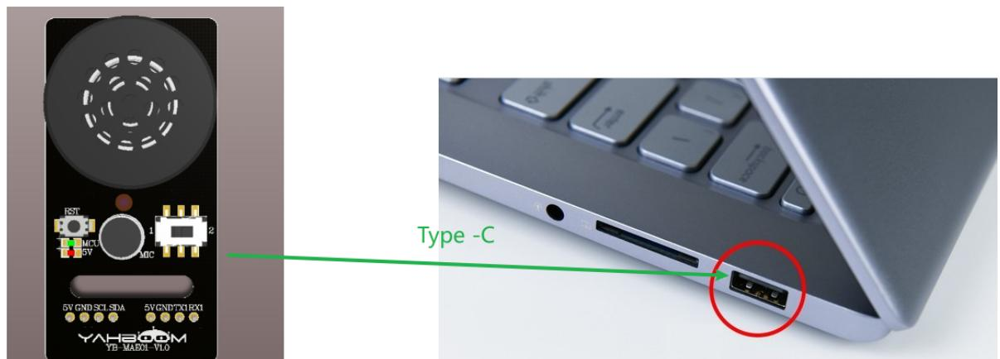

# 快速上手

出厂已烧录语音识别功能固件，用户无需烧录即可快速体验，如需增加其他识别词条，如果需要重烧其他固件，自定义词条，可前往《3.自定义协议词条制作》教程下查看如何自定义词条。

# 1.使用前准备

1. type-c数据线一根  
2. 语音交互模块

# 2.设备连接

text_image

RST
MCT
5V
1
ADC
6V GND SCI-SDA
5V GND TX1RX1
YAHBOOM
YB-MADOL-VLO
Type -C

# 3.语音识别及播报实现

给语音交互模块使用type-c供上电之后，通过“你好，小亚”唤醒词可以将模块唤醒，成功唤醒模块会回复“我在”，表示当前时间是可以识别语音状态，如果20秒内没有识别到命令词条，模块会进入休眠模式同时播报“我去休息了”。如果想重新唤醒模块可以重新说出唤醒词。

出厂固件自带了命令词和播报词，可以在提供的资料附件里查看到协议列表，下图截取了部分命令词播报词协议列表的内容，可以通过功能类型来查看对应的命令词代表什么功能，需要播报的播报词是被动的播报词，需要通过电脑串口或者其他单片机或者主控设备给语音交互模块发送对应的指令才能触发，具体可以下图。

功能词：

<table><tr><td>语义标签</td><td>命令词</td><td>功能类型</td><td>播报语句</td><td>播报模式</td><td>发送协议</td><td>接收协议</td></tr><tr><td>1</td><td>欢迎语</td><td>欢迎语</td><td>欢迎使用小亚</td><td>被</td><td>AA 55 01 00 FB</td><td>AA 55 01 00 FB</td></tr><tr><td>2</td><td>休息语</td><td>休息语</td><td>我去休息啦</td><td>主</td><td>AA 55 02 6F FB</td><td>AA 55 02 00 FB</td></tr><tr><td>3</td><td>你好小亚</td><td>唤醒词</td><td>我在</td><td>主</td><td>AA 55 03 00 FB</td><td>AA 55 03 00 FB</td></tr><tr><td>4</td><td>增大音量</td><td>增大音量</td><td>增大音量</td><td>主</td><td>AA 55 04 00 FB</td><td>AA 55 04 00 FB</td></tr><tr><td>5</td><td>减小音量</td><td>减小音量</td><td>减小音量</td><td>主</td><td>AA 55 05 00 FB</td><td>AA 55 05 00 FB</td></tr><tr><td>6</td><td>最大音量</td><td>最大音量</td><td>最大音量</td><td>主</td><td>AA 55 06 00 FB</td><td>AA 55 06 00 FB</td></tr><tr><td>7</td><td>中等音量</td><td>中等音量</td><td>中等音量</td><td>主</td><td>AA 55 07 00 FB</td><td>AA 55 07 00 FB</td></tr><tr><td>8</td><td>最小音量</td><td>最小音量</td><td>最小音量</td><td>主</td><td>AA 55 08 00 FB</td><td>AA 55 08 00 FB</td></tr><tr><td>9</td><td>开启播报</td><td>开播报</td><td>开启播报</td><td>主</td><td>AA 55 09 00 FB</td><td>AA 55 09 00 FB</td></tr><tr><td>10</td><td>关闭播报</td><td>关播报</td><td>关闭播报</td><td>主</td><td>AA 55 0A 00 FB</td><td>AA 55 0A 00 FB</td></tr><tr><td>11</td><td>小车停止</td><td>命令词</td><td>好的,已停止</td><td>主</td><td>AA 55 00 01 FB</td><td>AA 55 00 01 FB</td></tr><tr><td>12</td><td>停车</td><td>命令词</td><td>好的,已停止</td><td>主</td><td>AA 55 00 02 FB</td><td>AA 55 00 02 FB</td></tr><tr><td>13</td><td>小车休眠</td><td>命令词</td><td>好的,已休眠</td><td>主</td><td>AA 55 00 03 FB</td><td>AA 55 00 03 FB</td></tr><tr><td>14</td><td>小车前进</td><td>命令词</td><td>好的,正在前进</td><td>主</td><td>AA 55 00 04 FB</td><td>AA 55 00 04 FB</td></tr><tr><td>15</td><td>小车后退</td><td>命令词</td><td>好的,正在后退</td><td>主</td><td>AA 55 00 05 FB</td><td>AA 55 00 05 FB</td></tr><tr><td>16</td><td>小车左转</td><td>命令词</td><td>好的,正在向左转</td><td>主</td><td>AA 55 00 06 FB</td><td>AA 55 00 06 FB</td></tr><tr><td>17</td><td>小车右转</td><td>命令词</td><td>好的,正在向右转</td><td>主</td><td>AA 55 00 07 FB</td><td>AA 55 00 07 FB</td></tr><tr><td>18</td><td>小车左旋</td><td>命令词</td><td>好的,正在向左旋转</td><td>主</td><td>AA 55 00 08 FB</td><td>AA 55 00 08 FB</td></tr><tr><td>19</td><td>小车右旋</td><td>命令词</td><td>好的,正在向右旋转</td><td>主</td><td>AA 55 00 09 FB</td><td>AA 55 00 09 FB</td></tr><tr><td>20</td><td>关灯</td><td>命令词</td><td>好的,已关灯</td><td>主</td><td>AA 55 00 0A FB</td><td>AA 55 00 0A FB</td></tr><tr><td>21</td><td>亮红灯</td><td>命令词</td><td>好的,已亮红灯</td><td>主</td><td>AA 55 00 0B FB</td><td>AA 55 00 0B FB</td></tr><tr><td>22</td><td>亮绿灯</td><td>命令词</td><td>好的,已亮绿灯</td><td>主</td><td>AA 55 00 0C FB</td><td>AA 55 00 0C FB</td></tr><tr><td>23</td><td>亮蓝灯</td><td>命令词</td><td>好的,已亮蓝灯</td><td>主</td><td>AA 55 00 0D FB</td><td>AA 55 00 0D FB</td></tr><tr><td>24</td><td>亮黄灯</td><td>命令词</td><td>好的,已亮黄灯</td><td>主</td><td>AA 55 00 0E FB</td><td>AA 55 00 0E FB</td></tr><tr><td>25</td><td>打开流水灯</td><td>命令词</td><td>好的,已打开流水灯</td><td>主</td><td>AA 55 00 0F FB</td><td>AA 55 00 0F FB</td></tr><tr><td>26</td><td>打开渐变灯</td><td>命令词</td><td>好的,已打开渐变灯</td><td>主</td><td>AA 55 00 10 FB</td><td>AA 55 00 10 FB</td></tr><tr><td>27</td><td>打开呼吸灯</td><td>命令词</td><td>好的,已打开呼吸灯</td><td>主</td><td>AA 55 00 11 FB</td><td>AA 55 00 11 FB</td></tr><tr><td>28</td><td>显示电量</td><td>命令词</td><td>好的,已显示电量</td><td>主</td><td>AA 55 00 12 FB</td><td>AA 55 00 12 FB</td></tr><tr><td>29</td><td>导航去一号位</td><td>命令词</td><td>好的,正在去一号位</td><td>主</td><td>AA 55 00 13 FB</td><td>AA 55 00 13 FB</td></tr><tr><td>30</td><td>导航去二号位</td><td>命令词</td><td>好的,正在去二号位</td><td>主</td><td>AA 55 00 14 FB</td><td>AA 55 00 14 FB</td></tr><tr><td>31</td><td>导航去三号位</td><td>命令词</td><td>好的,正在去三号位</td><td>主</td><td>AA 55 00 15 FB</td><td>AA 55 00 15 FB</td></tr><tr><td>32</td><td>导航去四号位</td><td>命令词</td><td>好的,正在去四号位</td><td>主</td><td>AA 55 00 20 FB</td><td>AA 55 00 20 FB</td></tr><tr><td>33</td><td>回到原点</td><td>命令词</td><td>好的,正在回到原点</td><td>主</td><td>AA 55 00 21 FB</td><td>AA 55 00 21 FB</td></tr><tr><td>34</td><td>关闭巡线</td><td>命令词</td><td>好的,已关闭巡线功能</td><td>主</td><td>AA 55 00 16 FB</td><td>AA 55 00 16 FB</td></tr><tr><td>35</td><td>巡红线</td><td>命令词</td><td>好的,已开启巡红线功能</td><td>主</td><td>AA 55 00 17 FB</td><td>AA 55 00 17 FB</td></tr><tr><td>36</td><td>巡绿线</td><td>命令词</td><td>好的,已开启巡绿线功能</td><td>主</td><td>AA 55 00 18 FB</td><td>AA 55 00 18 FB</td></tr><tr><td>37</td><td>巡蓝线</td><td>命令词</td><td>好的,已开启巡蓝线功能</td><td>主</td><td>AA 55 00 19 FB</td><td>AA 55 00 19 FB</td></tr><tr><td>38</td><td>巡黄线</td><td>命令词</td><td>好的,已开启巡黄线功能</td><td>主</td><td>AA 55 00 1A FB</td><td>AA 55 00 1A FB</td></tr><tr><td>39</td><td>开启跟随</td><td>命令词</td><td>好的,已开启跟随功能</td><td>主</td><td>AA 55 00 1B FB</td><td>AA 55 00 1B FB</td></tr><tr><td>40</td><td>关闭跟随</td><td>命令词</td><td>好的,已关闭跟随功能</td><td>主</td><td>AA 55 00 1C FB</td><td>AA 55 00 1C FB</td></tr><tr><td>41</td><td>报警</td><td>命令词</td><td>好的,已开启报警</td><td>主</td><td>AA 55 00 26 FB</td><td>AA 55 00 26 FB</td></tr><tr><td>42</td><td>向上</td><td>命令词</td><td>好的,已控制向上</td><td>主</td><td>AA 55 00 27 FB</td><td>AA 55 00 27 FB</td></tr><tr><td>43</td><td>向下</td><td>命令词</td><td>好的,已控制向下</td><td>主</td><td>AA 55 00 28 FB</td><td>AA 55 00 28 FB</td></tr><tr><td>44</td><td>向左</td><td>命令词</td><td>好的,已控制向左</td><td>主</td><td>AA 55 00 29 FB</td><td>AA 55 00 29 FB</td></tr><tr><td>45</td><td>向右</td><td>命令词</td><td>好的,已控制向右</td><td>主</td><td>AA 55 00 2A FB</td><td>AA 55 00 2A FB</td></tr><tr><td>46</td><td>夹紧</td><td>命令词</td><td>好的,已控制夹紧</td><td>主</td><td>AA 55 00 2B FB</td><td>AA 55 00 2B FB</td></tr><tr><td>47</td><td>松开</td><td>命令词</td><td>好的,已控制松开</td><td>主</td><td>AA 55 00 2C FB</td><td>AA 55 00 2C FB</td></tr></table>

命令词：

播报词：

<table><tr><td>84</td><td>这是红色</td><td>命令词</td><td>这是红色</td><td>被</td><td>AA 55 FF 5F FB</td><td>AA 55 FF 01 FB</td></tr><tr><td>85</td><td>这是蓝色</td><td>命令词</td><td>这是蓝色</td><td>被</td><td>AA 55 FF 60 FB</td><td>AA 55 FF 02 FB</td></tr><tr><td>86</td><td>这是绿色</td><td>命令词</td><td>这是绿色</td><td>被</td><td>AA 55 FF 61 FB</td><td>AA 55 FF 03 FB</td></tr><tr><td>87</td><td>这是黄色</td><td>命令词</td><td>这是黄色</td><td>被</td><td>AA 55 FF 62 FB</td><td>AA 55 FF 04 FB</td></tr><tr><td>88</td><td>识别到黄色</td><td>命令词</td><td>识别到黄色</td><td>被</td><td>AA 55 FF 63 FB</td><td>AA 55 FF 06 FB</td></tr><tr><td>89</td><td>识别到绿色</td><td>命令词</td><td>识别到绿色</td><td>被</td><td>AA 55 FF 64 FB</td><td>AA 55 FF 07 FB</td></tr><tr><td>90</td><td>识别到蓝色</td><td>命令词</td><td>识别到蓝色</td><td>被</td><td>AA 55 FF 65 FB</td><td>AA 55 FF 08 FB</td></tr><tr><td>91</td><td>识别到红色</td><td>命令词</td><td>识别到红色</td><td>被</td><td>AA 55 FF 66 FB</td><td>AA 55 FF 09 FB</td></tr><tr><td>92</td><td>初始化完成</td><td>命令词</td><td>初始化完成</td><td>被</td><td>AA 55 FF 67 FB</td><td>AA 55 FF 0A FB</td></tr><tr><td>93</td><td>第一个要排序的颜色是</td><td>命令词</td><td>第一个要排序的颜色是</td><td>被</td><td>AA 55 FF 68 FB</td><td>AA 55 FF 0B FB</td></tr><tr><td>94</td><td>第二个要排序的颜色是</td><td>命令词</td><td>第二个要排序的颜色是</td><td>被</td><td>AA 55 FF 69 FB</td><td>AA 55 FF 0C FB</td></tr><tr><td>95</td><td>第三个要排序的颜色是</td><td>命令词</td><td>第三个要排序的颜色是</td><td>被</td><td>AA 55 FF 6A FB</td><td>AA 55 FF 0D FB</td></tr><tr><td>96</td><td>第四个要排序的颜色是</td><td>命令词</td><td>第四个要排序的颜色是</td><td>被</td><td>AA 55 FF 6B FB</td><td>AA 55 FF 0E FB</td></tr><tr><td>97</td><td>这是易拉罐,属于可回收垃圾</td><td>命令词</td><td>这是易拉罐,属于可回收垃圾</td><td>被</td><td>AA 55 FF 6C FB</td><td>AA 55 FF 5E FB</td></tr><tr><td>98</td><td>这是旧书包,属于可回收垃圾</td><td>命令词</td><td>这是旧书包,属于可回收垃圾</td><td>被</td><td>AA 55 FF 6D FB</td><td>AA 55 FF 5F FB</td></tr><tr><td>99</td><td>这是报纸,属于可回收垃圾</td><td>命令词</td><td>这是报纸,属于可回收垃圾</td><td>被</td><td>AA 55 FF 6E FB</td><td>AA 55 FF 60 FB</td></tr><tr><td>100</td><td>这是书本,属于可回收垃圾</td><td>命令词</td><td>这是书本,属于可回收垃圾</td><td>被</td><td>AA 55 FF 6F FB</td><td>AA 55 FF 61 FB</td></tr><tr><td>101</td><td>这是注射器,属于有毒垃圾</td><td>命令词</td><td>这是注射器,属于有毒垃圾</td><td>被</td><td>AA 55 FF 70 FB</td><td>AA 55 FF 62 FB</td></tr><tr><td>102</td><td>这是废旧电池,属于有毒垃圾</td><td>命令词</td><td>这是废旧电池,属于有毒垃圾</td><td>被</td><td>AA 55 FF 71 FB</td><td>AA 55 FF 63 FB</td></tr><tr><td>103</td><td>这是过期化妆品,属于有毒垃圾</td><td>命令词</td><td>这是过期化妆品,属于有毒垃圾</td><td>被</td><td>AA 55 FF 72 FB</td><td>AA 55 FF 64 FB</td></tr><tr><td>104</td><td>这是过期药品,属于有毒垃圾</td><td>命令词</td><td>这是过期药品,属于有毒垃圾</td><td>被</td><td>AA 55 FF 73 FB</td><td>AA 55 FF 65 FB</td></tr><tr><td>105</td><td>这是鱼骨,属于湿垃圾</td><td>命令词</td><td>这是鱼骨,属于湿垃圾</td><td>被</td><td>AA 55 FF 74 FB</td><td>AA 55 FF 66 FB</td></tr><tr><td>106</td><td>这是西瓜皮,属于湿垃圾</td><td>命令词</td><td>这是西瓜皮,属于湿垃圾</td><td>被</td><td>AA 55 FF 75 FB</td><td>AA 55 FF 67 FB</td></tr><tr><td>107</td><td>这是苹果核,属于湿垃圾</td><td>命令词</td><td>这是苹果核,属于湿垃圾</td><td>被</td><td>AA 55 FF 76 FB</td><td>AA 55 FF 68 FB</td></tr><tr><td>108</td><td>这是鸡蛋壳,属于湿垃圾</td><td>命令词</td><td>这是鸡蛋壳,属于湿垃圾</td><td>被</td><td>AA 55 FF 77 FB</td><td>AA 55 FF 69 FB</td></tr><tr><td>109</td><td>这是一次性筷子,属于干垃圾</td><td>命令词</td><td>这是一次性筷子,属于干垃圾</td><td>被</td><td>AA 55 FF 78 FB</td><td>AA 55 FF 6A FB</td></tr><tr><td>110</td><td>这是烟蒂,属于干垃圾</td><td>命令词</td><td>这是烟蒂,属于干垃圾</td><td>被</td><td>AA 55 FF 79 FB</td><td>AA 55 FF 6B FB</td></tr><tr><td>111</td><td>这是桃核,属于干垃圾</td><td>命令词</td><td>这是桃核,属于干垃圾</td><td>被</td><td>AA 55 FF 80 FB</td><td>AA 55 FF 6C FB</td></tr><tr><td>112</td><td>这是卫生纸,属于干垃圾</td><td>命令词</td><td>这是卫生纸,属于干垃圾</td><td>被</td><td>AA 55 FF 8A FB</td><td>AA 55 FF 6D FB</td></tr></table>

有两种播报模式，一种是主动式的，一种是被动播报

主动播报：当我们根据表格说出命令词之后，模块会主动播报对应的语句，唤醒之后我们说出“小车前进”，模块识别到之后会主动播报“好的，正在前进”  
被动播报：需要通过协议表里指令通过串口发送给语音模块，模块才会播报对应的语句，也可以根据iic协议通过给被动播报的寄存器，写入对应的播报数据。具体内容可以看《3.多主控通信》