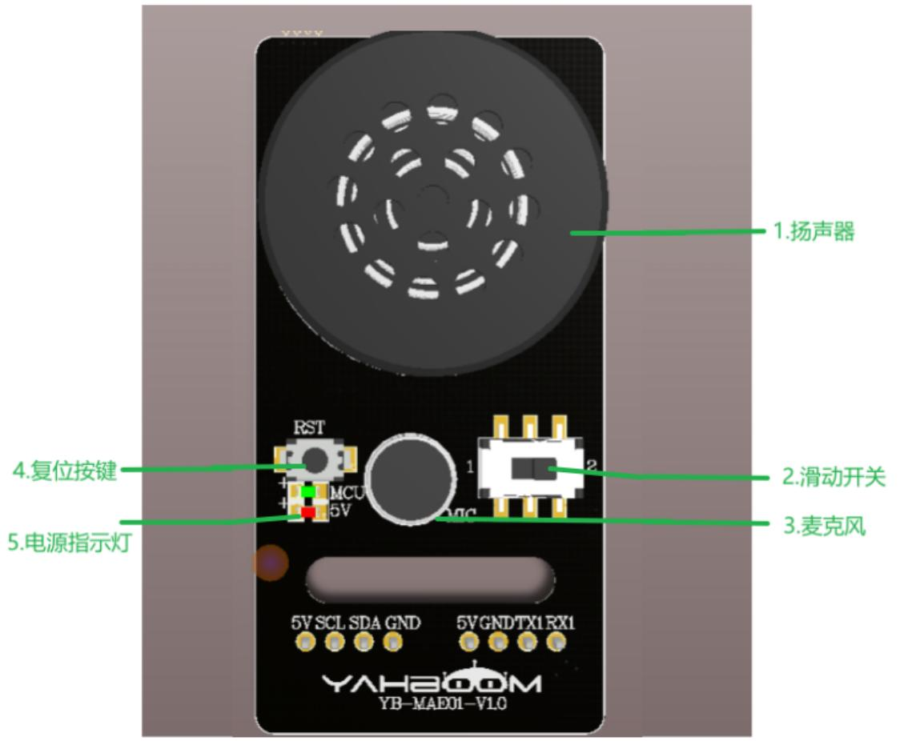
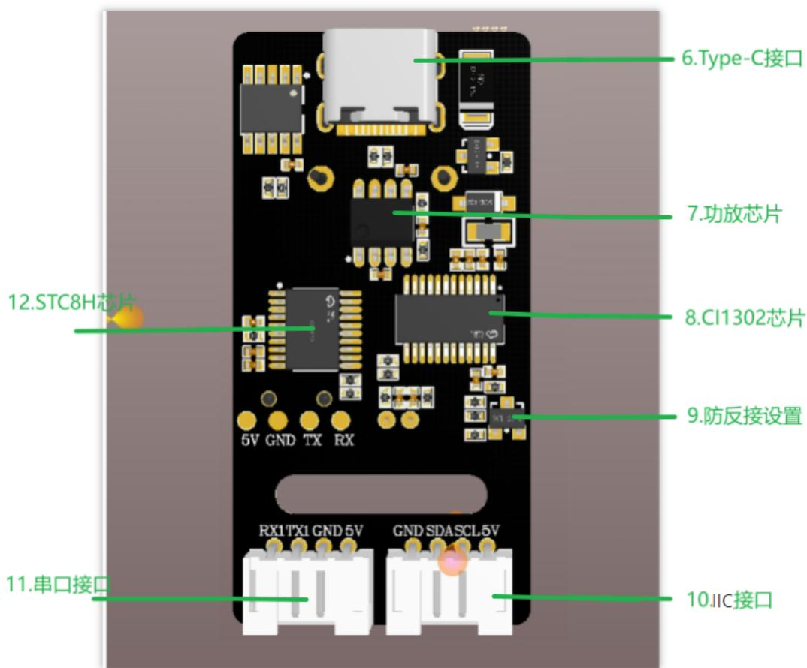

# 语音交互模块简介

# 1.语音交互模块介绍

CI1302 是启英泰伦研发的新一代高性能神经网络智能语音芯片，集成了启英泰伦自研的脑神经网络处理器BNPU V3 和 CPU内核，系统主频可达 220MHz，内置高达 640KByte的 SRAM，集成 PMU 电源管理单元和 RC 振荡器，集成双通道高性能低功耗 Audio Codec 和多路 UART、IIC、IIS、PWM、GPIO、PDM 等外围控制接口。芯片仅需少量电阻电容等外围器件就可以实现各类智能语音产品硬件方案，性价比极高。

采用 3 代硬件 BNPU 技术，支持 DNN\TDNN\RNN\CNN 等神经网络及并行矢量运算，可实现语音识别、声纹识别、命令词自学习、语音检测及深度学习降噪等功能。该芯片方案还支持汉语、英语、日语等多种全球语言，可广泛应用于家电、照明、玩具、可穿戴设备、工业、汽车等产品领域，实现语音交互及控制和各类智能语音方案应用。

CI1302 芯片具有脑神经网络处理器核(BNPU)，支持离线 NN 加速运算和语音信号处理硬件加速等，CPU 主频可达 220MHz，能够离线远场语音识别，内置 2MB FLASH 存储，可支持 300 条命令词。

# 2.工作原理

该模块采取口令模式唤醒，用户需要说出设置好的唤醒词先激活语音交互模块，激活后之后就可以进行语音识别，出厂固件默认唤醒关键词是 “你好，小亚”，如果20秒之后没有识别到语音，模块会进入休眠模式，再次使用的时候需要重新唤醒。

当CI1302芯片识别到对应的语音词条之后，会通过串口、IIC接口发送出去，并反馈播报；IIC芯片将接收到的语音指令存储并通过IIC从机协议发送出来。

模块支持唤醒词修改，命令词修改和自定义词条，可以在教程《2.修改唤醒词与命令词》，《3.自定义协议词条制作》教程学习如何操作。

# 3.注意事项

使用5v电压供电，超过5v会损坏模块  
使用场景应该安静，嘈杂的环境会影响识别效果  
说词条的时候，声音要洪亮而且语速不宜过快，建议与模块之间保持在5米之内

# 4.硬件接口说明

text_image

1.扬声器
2.滑动开关
3.麦克风
4.复位按键
5.电源指示灯
RST
MCU
5V
20°C
5V SCL SDA GND
5VGNDTX1 RX1
YAH800M
YB-MAD01-V1.0

text_image

6.Type-C接口
7.功放芯片
8.CI1302芯片
9.防反接设置
10.IIC接口
11.串口接口
12.STC8H芯片
5V GND TX RX
RX1TX1 GND 5V GND SDA SCL 5V

<table><tr><td>序号</td><td>硬件名称</td><td>说明</td></tr><tr><td>1</td><td>扬声器</td><td>将模拟信号转换成声音</td></tr><tr><td>2</td><td>滑动开关</td><td>进行固件烧录串口切换</td></tr><tr><td>3</td><td>麦克风</td><td>将声音转换为模拟信号</td></tr><tr><td>4</td><td>RST按键</td><td>复位按键</td></tr><tr><td>5</td><td>电源指示灯(红灯)</td><td>供电正常时常亮</td></tr><tr><td>6</td><td>Type-C接口</td><td>用于供电和CI1302芯片、SCT8固件更新下载</td></tr><tr><td>7</td><td>功放芯片</td><td>将数字信号转换为驱动扬声器的模拟信号</td></tr><tr><td>8</td><td>CI1302芯片</td><td>高性能语音识别芯片,识别语音并输出信号</td></tr><tr><td>9</td><td>防反接设置</td><td>5v、GND接反保护</td></tr><tr><td>10</td><td>IIC接口</td><td>做从机,用于供电、与主机设备进行通信</td></tr><tr><td>11</td><td>串口接口</td><td>提供的外部串口,可以通过协议控制播报</td></tr><tr><td>12</td><td>STC8H芯片</td><td>将语音芯片的指令转化为IIC协议指令、串口指令</td></tr></table>