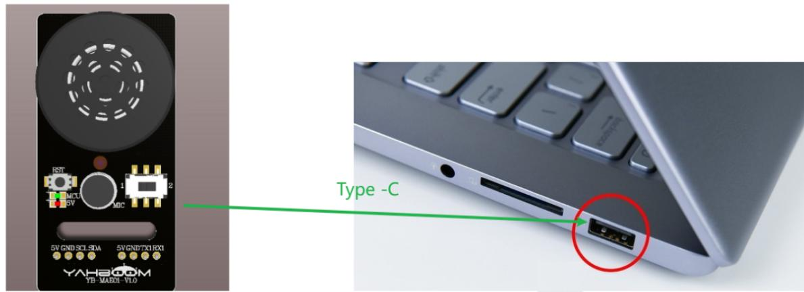

# 修改唤醒词与命令词

# 1.注意事项

请在安静的场景下进行修改唤醒词，嘈杂的环境会影响语音交互模块的识别准确率。  
请在安静的场景下进行修改命令词，嘈杂的环境会影响语音交互模块的识别准确率。  
说词条时，声音要洪亮且语速不宜过快，建议与模块之间保持在 5 米以内。

# 2.设备连接

text_image

I3T
1
MCT
2V
ADC
5V GND.SCL.SDA
5V GND.TX1RX1
YAHEOOM
YB-MADXL.VLO
Type -C

# 3.修改唤醒词

对语音交互模块说出 “你好，小亚” 将语音交互模块唤醒，当模块回复 “我在”时，表明当前处于可识别状态  
再对语音交互模块说出 “学习唤醒词”词条，语音交互模块回应 “说出唤醒词”，即可进入到唤醒词学习功能状态  
接着对语音交互模块说出想要设置的唤醒词，唤醒词尽量简短，这里以设置 “你好，小亚”为例  
当语音交互模块识别成功后，将会播报“学习成功”，表明唤醒词修改成功，这时候我们就可以使用“你好小亚”词条就能唤醒模块了。

注意事项：出厂固件中的唤醒词 “你好，小亚” 是基础唤醒词，无法通过语音进行修改或删除。用户使用语音修改的唤醒词只能同时存在一个，与基础唤醒词时共同存在的

# 4.修改命令词

语音交互模块出厂固件中预置 8个可以语音修改的命令词，如下所示：

<table><tr><td colspan="5">新增行 删除选中</td></tr><tr><td></td><td>* ☑ 语义标签</td><td>* ☑ 学习指令</td><td>* ☑ 学习提示</td><td>* ☑ 删除指令</td></tr><tr><td></td><td>3</td><td>学习唤醒词</td><td>请在安静环境下，说出你要学
习的唤醒词</td><td>删除唤醒词</td></tr><tr><td></td><td>11</td><td>学习小车停止指令</td><td>请说小车停止的指令</td><td>删除小车停止指令</td></tr><tr><td></td><td>12</td><td>学习停车指令</td><td>请说停车的指令</td><td>删除停车指令</td></tr><tr><td></td><td>13</td><td>学习小车休眠指令</td><td>请说小车休眠的指令</td><td>删除小车休眠指令</td></tr><tr><td></td><td>15</td><td>学习小车后退指令</td><td>请说小车后退的指令</td><td>删除小车后退指令</td></tr><tr><td></td><td>29</td><td>学习导航去一号位指令</td><td>请说出一号位指令</td><td>删除一号位指令</td></tr><tr><td></td><td>30</td><td>学习导航去二号位指令</td><td>请说出二号位指令</td><td>删除二号位指令</td></tr><tr><td></td><td>31</td><td>学习导航去三号位指令</td><td>请说出三号位指令</td><td>删除三号位指令</td></tr></table>

<table><tr><td>☐</td><td>32</td><td>学习导航去四号位指令</td><td>请说出四号位指令</td><td>删除四号位指令</td></tr></table>

用法举例如下：

对语音交互模块说出 "你好，小亚"将语音交互模块唤醒，当模块回复 “我在”时，表明当前处于可识别状态  
再对语音交互模块说出 “学习停车指令”词条，语音交互模块回应 “请说指令”，即可进入到命令词学习功能状态  
接着对语音交互模块说出想要设置的命令词，命令词应该尽量简短，这里以设置 “前方停车”位置  
当语音交互模块识别成功之后，会播报 “学习成功”，表明命令词修改成功，这时候我们可以使用“前方停车” 词条就能达到与 “停车”命令词一样的效果了  
如果需要删除掉 ”前方停车“ 词条，只需要说出 ”删除停车指令“ ，当回复 ”删除成功”时，即可完成词条删除（这里只会删除“前方停车”，不会删除 ”停车“）。

注意：出厂固件中命令词时基础命令词，无法通过语音进行修改或者删除，用户使用语音修改的命令词只能同时存在一个，与基础命令词时共同存在的