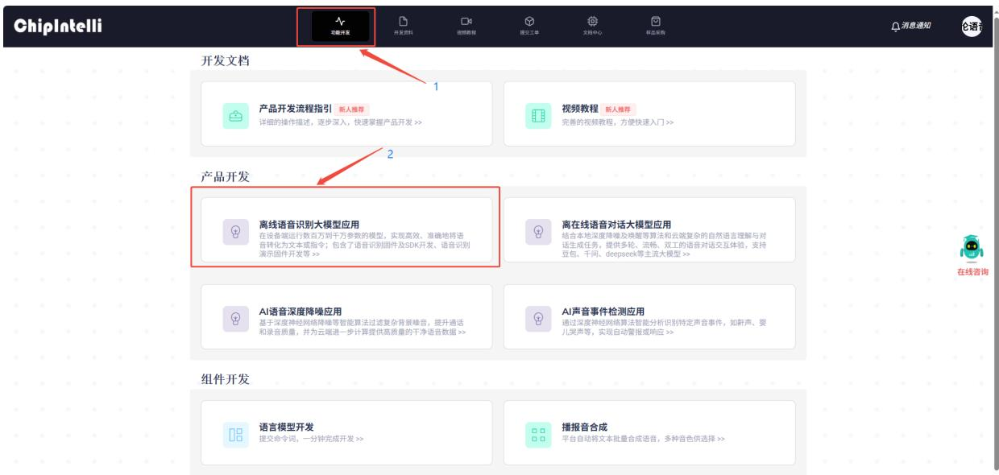
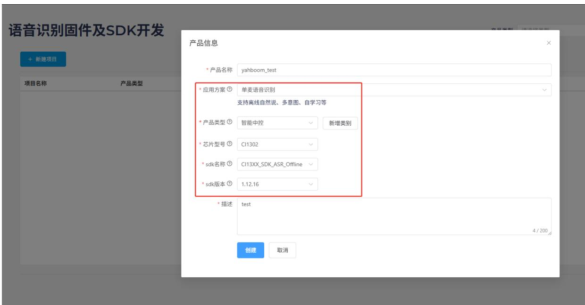
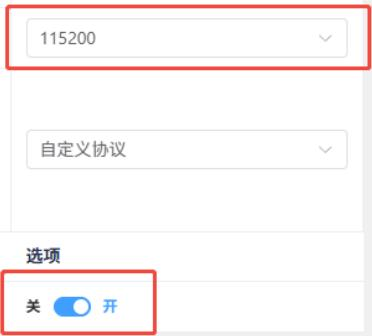
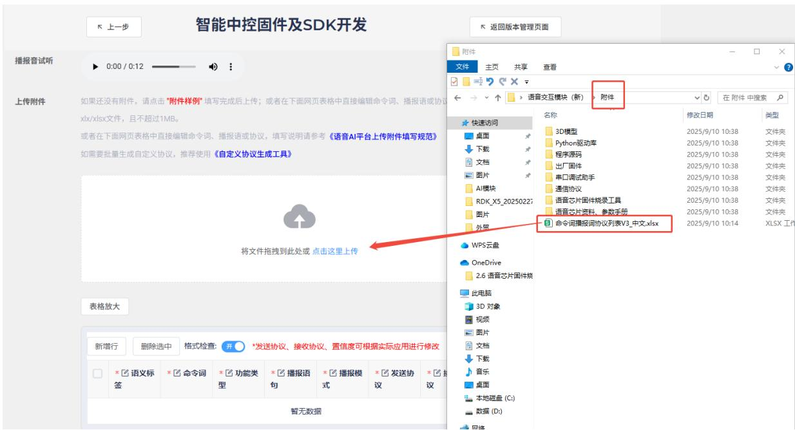
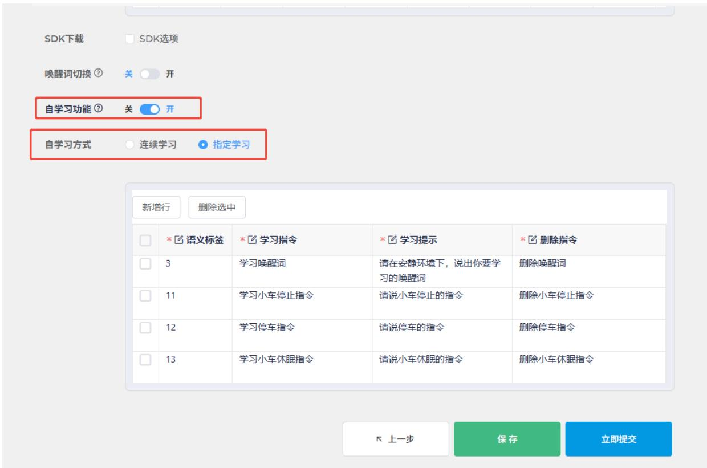
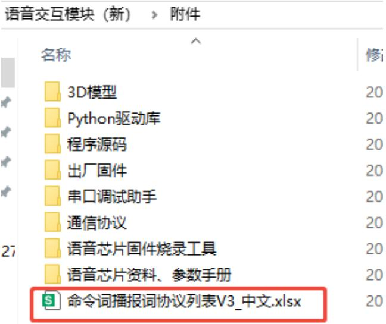
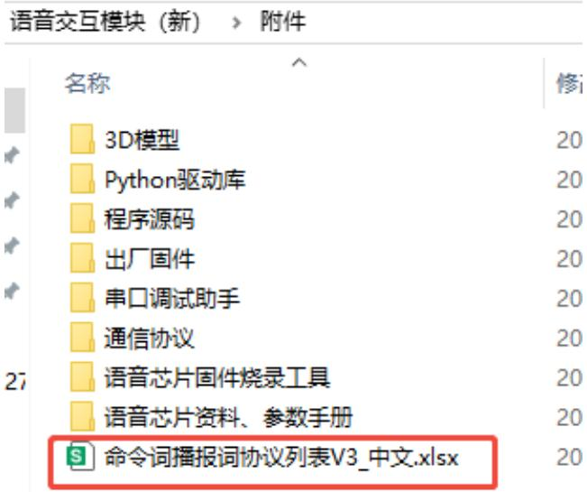
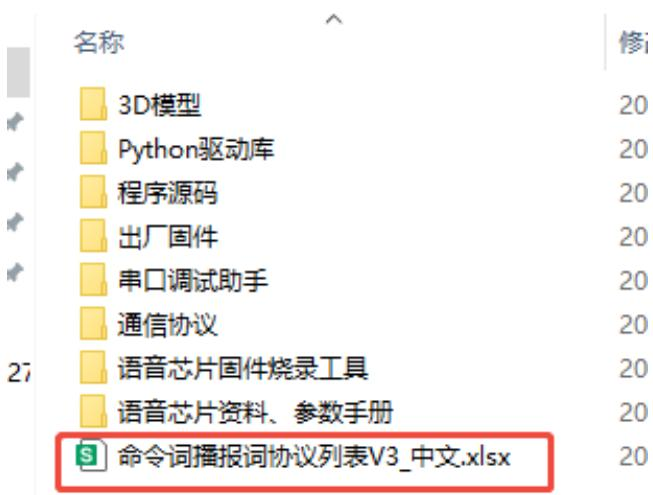

# 自定义协议词条制作

# 自定义协议词条制作

1.语音芯片固件制作  
1.1注意事项  
1.2固件制作  
2.修改功能性词条   
3.新增命令词条  
4.新增播报语

# 1.语音芯片固件制作

# 1.1注意事项

模块出厂已经烧录语音识别功能固件，资料附件里面也提供了出厂固件，如果需要重新制作固件可以根据下面步骤进行固件制作。

# 1.2固件制作

首先需要打开“启英泰伦语音AI平台”这个链接，进入固件制作官网。  
点击菜单栏的“功能开发”，之后点击产品开发栏下的“离线语音识别大模型应用”。

text_image

ChipIntelli
功能开发
开发资料
视频教程
提交工具
文稿中心
样品采购
消息通知
语音
开发文档
1
产品开发流程指引 新人推荐
详细的操作描述，逐步深入，快速掌握产品开发 >>
视频教程 新人推荐
完善的视频教程，方便快速入门 >>
2
产品开发
离线语音识别大模型应用
在设备端运行数百万到千万参数的模型，实现高效、准确地将语音转化为文本或指令；包含了语音识别固件及SDK开发、语音识别演示固件开发等 >>
离在线语音对话大模型应用
结合本地深度降噪及唤醒等算法和云做复杂的自然语言理解与对话生成任务，提供多轮、流畅、双工的语音对话交互体验，支持豆包、千问、deepseek等主流大模型 >>
AI语音深度降噪应用
基于深度神经网络降噪等智能算法过滤复杂背景噪音，提升通话和录音质量，并为云端进一步计算提供高质量的干净语音数据 >>
AI声音事件检测应用
通过深度神经网络算法智能分析识别特定声音事件，如鼾声、婴儿哭声等，实现自动警报或响应 >>
组件开发
语言模型开发
提交命令词，一分钟完成开发 >>
播报音合成
平台自动将文本批量合成语音，多种音色供选择 >>

这个时候会提示需要登录，这里需要使用自己的信息注册一个平台账号，这里教程时已经提前注册好了的，登录之后再次点击 “语音识别固件及SDK开发”。

text_image

ChipIntelli
功能开发
开发资料
视频教程
提交工具
支持中心
样品采购
消息通知
论语音
开发文档
产品开发流程指引 新人推荐
详细的操作描述，逐步深入，快速掌握产品开发 >>
视频教程 新人推荐
完善的视频教程，方便快速入门 >>
产品开发
返回上一级
语音识别固件及SDK开发
快速完成离线语音识别固件开发，参数可配，协议自定，亦可获取SDK进行二次开发 >>
语音识别演示固件开发
十分钟内完成标准模组演示固件开发，快速进行语音识别体验 >>
组件开发
语言模型开发
提交命令词，一分钟完成开发 >>
播报音合成
平台自动将文本批量合成语音，多种音色供选择 >>

页面跳转之后，在左侧点击新建项目，按照下图新建一个产品，其中产品名称和描述都可以自定义，其余信息需要按照红框内容进行选择，产品类型需要选择 “通用->智能中控”，完成后点击创建。

text_image

语音识别固件及SDK开发
+ 新建项目
项目名称	产品类型
产品信息
* 产品名称 yahboom_test
* 应用方案 ◎ 单麦语音识别
支持离线自然说、多意图、自学习等
* 产品类型 ◎ 智能中控	新增类别
* 芯片型号 ◎ CI1302
* sdk名称 ◎ CI13XX_SDK_ASR_Offline
* sdk版本 ◎ 1.12.16
* 描述 test
创建	取消
4 / 200

接下来需要填写项目的基础信息，我们需要识别中文，所以语言类型选择 “中文”，若需要识别英文也可以进行相应的修改，其他部分信息按照下图选择即可，完成点击继续。

# 智能中控固件及SDK开发

r返回版本管理页面

<table><tr><td>版本名称</td><td>V1.0.0</td><td>步骤1
填写基本信息</td></tr><tr><td>方案:</td><td>单麦语音识别</td><td>步骤2
固件参数配置</td></tr><tr><td>产品:</td><td>智能中控</td><td>步骤3
编辑命令词</td></tr><tr><td>芯片:</td><td>CI1302</td><td>步骤4
提交处理</td></tr><tr><td>sdk:</td><td>CI13XX_SDK_ASR_Offline_V1_12_16</td><td></td></tr><tr><td>语言类型</td><td>中文</td><td>✓</td></tr><tr><td>选择声学模型⑦</td><td>中文普通话通用V12_0.9M_V00681_适用sdk1.6.2及以上版本</td><td>✓</td></tr><tr><td>模块板选择⑨</td><td>CI-D02GS02S</td><td>✓</td></tr></table>

继续

然后需要对固件进行配置，这里我们只对需要修改的部分进行说明，将算法参数的回声消除打开。

<table><tr><td>算法参数</td><td>参数</td><td>说明</td><td>选项</td></tr><tr><td></td><td>回声消除</td><td>适用于需要语音打断的场景(如音乐播报),需要确认模块硬件支持该功能才可打开。</td><td>关 开</td></tr></table>

硬件参数中，需要将晶振源选择为“内部 RC”。

<table><tr><td>硬件参数</td><td>参数</td><td>说明</td><td>选项</td></tr><tr><td></td><td>内核1.1V供电</td><td>外部DCDC或内部LDO供电</td><td>内部</td></tr><tr><td></td><td>晶振源</td><td>内部RC或外部晶振源可选</td><td>内部RC</td></tr><tr><td></td><td>参数</td><td>说明</td><td>选项</td></tr><tr><td></td><td>波特率校准功能</td><td>使用内部RC时使用波特率校准功能</td><td>关开</td></tr></table>

在打印串口配置中，将 UART0 电平配置为开漏功能，支持外部上拉 5V。

<table><tr><td>打印串口配置</td><td>参数</td><td>说明</td><td>选项</td></tr><tr><td></td><td>调试信息打印串口</td><td>调试时,打印调试信息的串口(波特率921600),不能与通信串口相同;如果不需要,则关闭即可</td><td>UART0</td></tr><tr><td></td><td>参数</td><td>说明</td><td>选项</td></tr><tr><td></td><td>UART0电平</td><td>配置引脚开漏功能,支持外部上拉5V</td><td>关 开</td></tr></table>

对通讯串口配置进行修改，设置波特率为 115200，并配置 UART1 电平为开漏功能，支持外部上拉 5V，配置完成后点击“继续”进入下一步。

<table><tr><td>通讯串口配置</td><td>参数</td><td>说明</td><td>选项</td></tr><tr><td></td><td>串口通信</td><td>开启后,语音芯片(模块)通过制定串口与上位机通信,关闭后则不能与上位机进行通信</td><td>关 开</td></tr><tr><td></td><td>通信串口</td><td>通信的串口名称</td><td>UART1</td></tr><tr><td></td><td>通信串口波特率</td><td>串口通信的波特率</td><td></td></tr><tr><td></td><td>串口协议版本</td><td>自定义串口通信协议由20个以内的16进制组成,如:AF BF D1 01 12 FB。语音芯片接收协议包时,通过接收超时时长(0.34ms)来确定包已收完,故主控在发送协议包时,需要保证包与包的时间间隔在0.34ms以上,以便保证通信正常。</td><td></td></tr><tr><td></td><td>参数</td><td>说明</td><td></td></tr><tr><td></td><td>UART1电平</td><td>配置引脚开漏功能,支持外部上拉5V</td><td></td></tr></table>

下面进入到编辑命令词功能中，首先需要选择播放的音色，这里我们选择“程程-标准男童”。

<table><tr><td>音色选择②</td><td>中文-成年女声</td><td>中文-成年男声</td><td>中文-女童声</td><td>中文-男童声</td><td>中文-情感女声</td><td>中文-情感男声</td></tr><tr><td></td><td colspan="6">程程-标准男童 Ver.2</td></tr></table>

接着我们将命令词附件进行上传，找到本文档同路径下的“命令词播报词协议列表V3\_中文”表格，直接拖入到网页中进行上传。

text_image

智能中控固件及SDK开发
上一步
返回版本管理页面
播报音试听
0:00 / 0:12
上传附件
如果还没有附件，请点击"附件样例"填写完成后上传；或者在下面网页表格中直接编辑命令词、播报语或协议。
xlx/xlsx文件，且不超过1MB。
或者在下面网页表格中直接编辑命令词、播报语或协议，填写说明请参考《语音AI平台上传附件填写规范》
如需要批量生成自定义协议，推荐使用《自定义协议生成工具》
将文件拖拽到此处或 点击这里上传
表格放大
新增行
删除选中
格式检查:
*发送协议、接收协议、置信度可根据实际应用进行修改
*语义标
签
*命令词
*功能类
型
*播报语
句
*播报模
式
*发送协
议
*
暂无数据
暂停
命令词播报词协议列表V3_中文.xlsx
文件
主页
共享
查看
←→
语音交互模块（新）
附件
在附件中搜索
快捷访问
桌面
下载
文档
图片
AI模块
RDK_X5_20250227
图片
外页
WPS云盘
OneDrive
2.6 语音芯片固件烧
此电脑
3D 对象
视频
图片
文档
下载
音乐
桌面
本地磁盘 (C:)
数据 (D:)
网络

上传文件后，即可在下方的表格中看到我们的命令词数据。

<table><tr><td colspan="9">新增行 删除选中 格式检查: 开 *发送协议、接收协议、置信度可根据实际应用进行修改</td></tr><tr><td></td><td>* 语义
标签</td><td>* 命令词</td><td>* 功能类型</td><td>* 播报语句</td><td>* 播报模式</td><td>* 发送协议</td><td>* 接收协议</td><td>置信度阈值</td></tr><tr><td></td><td>1</td><td>欢迎语</td><td>欢迎语</td><td>欢迎使用小亚</td><td>被</td><td>AA 55 01 00 FB</td><td>AA 55 01 00 FB</td><td>42</td></tr><tr><td></td><td>2</td><td>休息语</td><td>休息语</td><td>我去休息啦</td><td>主</td><td>AA 55 02 00 FB</td><td>AA 55 02 00 FB</td><td>42</td></tr><tr><td></td><td>3</td><td>小亚小亚</td><td>唤醒词</td><td>在的</td><td>主</td><td>AA 55 03 00 FB</td><td>AA 55 03 00 FB</td><td>39</td></tr><tr><td></td><td>4</td><td>增大音量</td><td>增大音量</td><td>增大音量</td><td>主</td><td>AA 55 04 00 FB</td><td>AA 55 04 00 FB</td><td>39</td></tr><tr><td></td><td>5</td><td>减小音量</td><td>减小音量</td><td>减小音量</td><td>主</td><td>AA 55 05 00 FB</td><td>AA 55 05 00 FB</td><td>39</td></tr><tr><td></td><td>6</td><td>最大音量</td><td>最大音量</td><td>最大音量</td><td>主</td><td>AA 55 06 00 FB</td><td>AA 55 06 00 FB</td><td>39</td></tr><tr><td></td><td>7</td><td>中等音量</td><td>中等音量</td><td>中等音量</td><td>主</td><td>AA 55 07 00 FB</td><td>AA 55 07 00 FB</td><td>39</td></tr></table>

打开自学习功能选择指定学习，此时系统会自动生成 4 个自学习指令，我们这里不做修改。

text_image

SDK下载 SDK选项
唤醒词切换 关 开
自学习功能 关 开
自学习方式 连续学习 指定学习
新增行 删除选中
* 语义标签 * 学习指令 * 学习提示 * 删除指令
3 学习唤醒词 请在安静环境下，说出你要学
习的唤醒词 删除唤醒词
11 学习小车停止指令 请说小车停止的指令 删除小车停止指令
12 学习停车指令 请说停车的指令 删除停车指令
13 学习小车休眠指令 请说小车休眠的指令 删除小车休眠指令
上一步 保存 立即提交

提交后等待几分钟即可完成固件制作，完成后点击下载固件即可获取到制作的固件了。

<table><tr><td>版本名称</td><td>版本编号</td><td>芯片型号</td><td>语言模型</td><td>创建时间</td><td>当前流程</td><td>反馈描述</td><td colspan="3">操作</td></tr><tr><td>V1.0.0</td><td>sfw2025091010424891678336</td><td>CI1302</td><td>V00681</td><td>2025年09月10日 10:42:48</td><td>已完成</td><td>OK</td><td>删除</td><td>继承</td><td>查看 下载文件</td></tr></table>

烧录固件步骤可以查看《4.模块固件烧录方法》。

# 2.修改功能性词条

打开附件中的命令词播报词协议列表V3\_中文文件。

text_image

语音交互模块（新） > 附件
名称	修
3D模型	20
Python驱动库	20
程序源码	20
出厂固件	20
串口调试助手	20
通信协议	20
语音芯片固件烧录工具	20
语音芯片资料、参数手册	20
命令词播报词协议列表V3_中文.xlsx	20

找到表格中的功能性词条，也就是表格中的前 10 项。需要注意的是，这里的前 10条功能性词条均为固定词条，无法新增，只能进行修改。

<table><tr><td>语义标签</td><td>命令词</td><td>功能类型</td><td>播报语句</td><td>播报模式</td><td>发送协议</td><td>接收协议</td></tr><tr><td>1</td><td>欢迎语</td><td>欢迎语</td><td>欢迎使用小亚</td><td>被</td><td>AA 55 01 00 FB</td><td>AA 55 01 00 FB</td></tr><tr><td>2</td><td>休息语</td><td>休息语</td><td>我去休息啦</td><td>主</td><td>AA 55 02 6F FB</td><td>AA 55 02 00 FB</td></tr><tr><td>3</td><td>你好小亚</td><td>唤醒词</td><td>我在</td><td>主</td><td>AA 55 03 00 FB</td><td>AA 55 03 00 FB</td></tr><tr><td>4</td><td>增大音量</td><td>增大音量</td><td>增大音量</td><td>主</td><td>AA 55 04 00 FB</td><td>AA 55 04 00 FB</td></tr><tr><td>5</td><td>减小音量</td><td>减小音量</td><td>减小音量</td><td>主</td><td>AA 55 05 00 FB</td><td>AA 55 05 00 FB</td></tr><tr><td>6</td><td>最大音量</td><td>最大音量</td><td>最大音量</td><td>主</td><td>AA 55 06 00 FB</td><td>AA 55 06 00 FB</td></tr><tr><td>7</td><td>中等音量</td><td>中等音量</td><td>中等音量</td><td>主</td><td>AA 55 07 00 FB</td><td>AA 55 07 00 FB</td></tr><tr><td>8</td><td>最小音量</td><td>最小音量</td><td>最小音量</td><td>主</td><td>AA 55 08 00 FB</td><td>AA 55 08 00 FB</td></tr><tr><td>9</td><td>开启播报</td><td>开播报</td><td>开启播报</td><td>主</td><td>AA 55 09 00 FB</td><td>AA 55 09 00 FB</td></tr><tr><td>10</td><td>关闭播报</td><td>关播报</td><td>关闭播报</td><td>主</td><td>AA 55 0A 00 FB</td><td>AA 55 0A 00 FB</td></tr></table>

这里我们以修改唤醒词的播报语为例，将原先识别到 “你好，小亚” 后播报 “我在” ，修改为播报“小亚在这里”。

<table><tr><td>语义标签</td><td>命令词</td><td>功能类型</td><td>播报语句</td><td>播报模式</td><td>发送协议</td><td>接收协议</td></tr><tr><td>1</td><td>欢迎语</td><td>欢迎语</td><td>欢迎使用小亚</td><td>被</td><td>AA 55 01 00 FB</td><td>AA 55 01 00 FB</td></tr><tr><td>2</td><td>休息语</td><td>休息语</td><td>我去休息啦</td><td>主</td><td>AA 55 02 6F FB</td><td>AA 55 02 00 FB</td></tr><tr><td>3</td><td>你好小亚</td><td>唤醒词</td><td>我在</td><td>主</td><td>AA 55 03 00 FB</td><td>AA 55 03 00 FB</td></tr><tr><td>4</td><td>增大音量</td><td>增大音量</td><td>增大音量</td><td>主</td><td>AA 55 04 00 FB</td><td>AA 55 04 00 FB</td></tr><tr><td>5</td><td>减小音量</td><td>减小音量</td><td>减小音量</td><td>主</td><td>AA 55 05 00 FB</td><td>AA 55 05 00 FB</td></tr><tr><td>6</td><td>最大音量</td><td>最大音量</td><td>最大音量</td><td>主</td><td>AA 55 06 00 FB</td><td>AA 55 06 00 FB</td></tr><tr><td>7</td><td>中等音量</td><td>中等音量</td><td>中等音量</td><td>主</td><td>AA 55 07 00 FB</td><td>AA 55 07 00 FB</td></tr><tr><td>8</td><td>最小音量</td><td>最小音量</td><td>最小音量</td><td>主</td><td>AA 55 08 00 FB</td><td>AA 55 08 00 FB</td></tr><tr><td>9</td><td>开启播报</td><td>开播报</td><td>开启播报</td><td>主</td><td>AA 55 09 00 FB</td><td>AA 55 09 00 FB</td></tr><tr><td>10</td><td>关闭播报</td><td>关播报</td><td>关闭播报</td><td>主</td><td>AA 55 0A 00 FB</td><td>AA 55 0A 00 FB</td></tr></table>

修好完后保存，接着按照“1.2 固件制作”中的步骤，将表格导入到网站中。如果已经制作过一次固件了，那么可以点击之前项目中的“继承”按键，这样可以省去参数配置的步骤。

<table><tr><td>版本名称</td><td>版本编号</td><td>芯片型号</td><td>语言模型</td><td>创建时间</td><td>当前流程</td><td>反馈描述</td><td colspan="4">操作</td></tr><tr><td>V1.0.0</td><td>sfw2025091010424891678336</td><td>CI1302</td><td>V00681</td><td>2025年09月10日 10:42:48</td><td>已完成</td><td>OK</td><td>删除</td><td>继承</td><td>查看</td><td>下载文件</td></tr></table>

重新制作固件后，还需要将固件烧录到语音交互模块中，这样就能实现修改功能性词条了。

# 3.新增命令词条

打开附件中的命令词播报词协议列表V3\_中文文件。

text_image

语音交互模块（新） > 附件
名称	修
3D模型	20
Python驱动库	20
程序源码	20
出厂固件	20
串口调试助手	20
通信协议	20
语音芯片固件烧录工具	20
语音芯片资料、参数手册	20
命令词播报词协议列表V3_中文.xlsx	20

在表格的最下方，增加新的命令词条，这里以新增一个“不要过来”的命令词为例。

<table><tr><td>113</td><td>不要过来</td><td>命令词</td><td>好的</td><td>主</td><td>AA 55 00 8B FB</td><td>AA 55 00 8B FB</td></tr></table>

这里需要将功能类型选择为“命令词”，同时播报模式需要设置为“主”，这样才能在识别到“不要过来”后主动播报“好的”。

<table><tr><td>113</td><td>不要过来</td><td>命令词</td><td>好的</td><td>主</td></tr></table>

下面我们来了解一下发送协议，数据中的第 1 位和第 2 位是数据帧头，不需要修改。当我们选择了功能类型为命令词，那么根据发送协议，第 3 位数据必须要为“00”，这是为了区分指令为“命令词”还是“播报语”。

<table><tr><td>113</td><td>不要过来</td><td>命令词</td><td>好的</td><td>主</td><td>AA 55 00 8B FB</td><td>AA 55 00 8B FB</td></tr></table>

第 4 位数据则是命令词的数据 ID，这是一个十六进制数据，因为前一个命令词的ID 是“8A”，所以我们这一位需要设置为“8B”。在特殊情况下数据 ID 可以相同，例如需要使两个命令词返回的结果一致时。

<table><tr><td>11</td><td>小车停止</td><td>命令词</td><td>好的,已停止</td><td>主</td><td>AA 55 00 01 FB</td><td>AA 55 00 01 FB</td></tr><tr><td>12</td><td>停车</td><td>命令词</td><td>好的,已停止</td><td>主</td><td>AA 55 00 02 FB</td><td>AA 55 00 02 FB</td></tr></table>

协议中的第 5 位固定为“FB”，同样也不需要修改。在表格中，需要使发送协议和接收协议一致。

<table><tr><td>113</td><td>不要过来</td><td>命令词</td><td>好的</td><td>主</td><td>AA 55 00 8B FB</td><td>AA 55 00 8B FB</td></tr></table>

修好完后保存，接着按照“1.2 固件制作”中的步骤，将表格导入到网站中。如果已经制作过一次固件了，那么可以点击之前项目中的“继承”按键，这样可以省去参数配置的步骤

<table><tr><td>版本名称</td><td>版本编号</td><td>芯片型号</td><td>语言模型</td><td>创建时间</td><td>当前流程</td><td>反馈描述</td><td colspan="4">操作</td></tr><tr><td>V1.0.0</td><td>sfw2025091010424891678336</td><td>CI1302</td><td>V00681</td><td>2025年09月10日 10:42:48</td><td>已完成</td><td>OK</td><td>删除</td><td>继承</td><td>查看</td><td>下载文件</td></tr></table>

重新制作固件后，还需要将固件烧录到语音交互模块中，这样就能实现新增命令词条的功能了。

# 4.新增播报语

打开附件中的命令词播报词协议列表V3\_中文文件。

# 语音交互模块（新）》附件

text_image

名称
3D模型
Python驱动库
程序源码
出厂固件
串口调试助手
通信协议
语音芯片固件烧录工具
语音芯片资料、参数手册
命令词播报词协议列表V3_中文.xlsx

在表格的最下方，增加新的命令词条，这里以新增一个“现在是晚上”的播报语为例。

<table><tr><td>114</td><td>现在是晚上</td><td>命令词</td><td>现在是晚上</td><td>被</td><td>AA 55 FF 8C FB</td><td>AA 55 FF 8C FB</td></tr></table>

这里需要将功能类型选择为“播报语”，同时播报模式需要设置为“被”。

<table><tr><td>114</td><td>现在是晚上</td><td>命令词</td><td>现在是晚上</td><td>被</td><td>AA 55 FF 8C FB</td><td>AA 55 FF 8C FB</td></tr></table>

下面我们来了解一下发送协议，数据中的第 1 位和第 2 位是数据帧头，不需要修改。当我们选择了功能类型为播报语，那么根据发送协议，第 3 位数据必须要为“FF”，这是为了区分指令为“播报语”。

<table><tr><td>114</td><td>现在是晚上</td><td>命令词</td><td>现在是晚上</td><td>被</td><td>AA 55 FF 8C FB</td><td></td><td>AA 55 FF 8C FB</td></tr></table>

第 4 位数据则是命令词的数据 ID，这是一个十六进制数据，因为前一个播报语的ID 是“8A”，所以我们这一位需要设置为“8C”。

协议中的第 5 位固定为“FB”，同样也不需要修改。在表格中，需要使发送协议和接收协议一致。

<table><tr><td>114</td><td>现在是晚上</td><td>命令词</td><td>现在是晚上</td><td>被</td><td>AA 55 FF 8C FB</td><td>AA 55 FF 8C FB</td></tr></table>

修好完后保存，接着按照“1.2 固件制作”中的步骤，将表格导入到网站中。如果已经制作过一次固件了，那么可以点击之前项目中的“继承”按键，这样可以省去参数配置的步骤。

<table><tr><td>版本名称</td><td>版本编号</td><td>芯片型号</td><td>语言模型</td><td>创建时间</td><td>当前流程</td><td>反馈描述</td><td colspan="4">操作</td></tr><tr><td>V1.0.0</td><td>sfw2025091010424891678336</td><td>C11302</td><td>V00681</td><td>2025年09月10日 10:42:48</td><td>已完成</td><td>OK</td><td>删除</td><td>继承</td><td>查看</td><td>下载文件</td></tr></table>

重新制作固件后，还需要将固件烧录到语音交互模块中，这样就能实现新增命令词条的功能了。