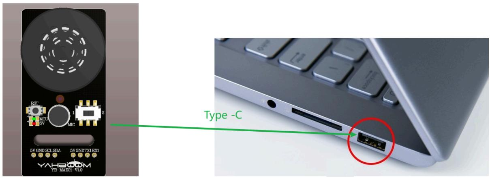
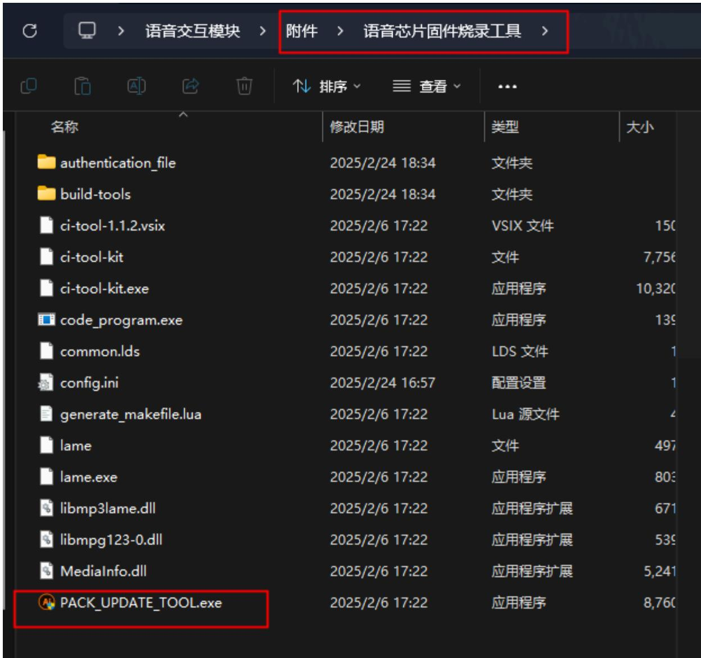
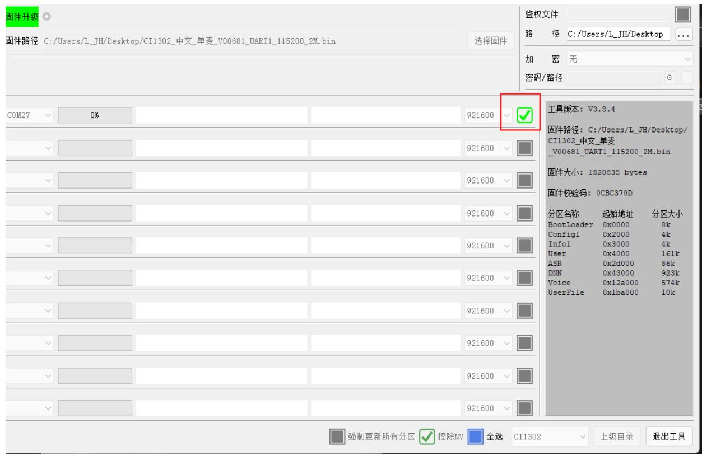
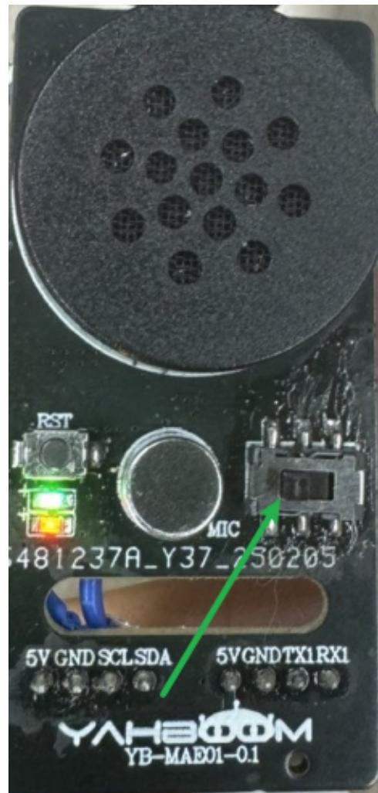

# 模块固件烧录方法

# 1.语音芯片烧录步骤

# 1.1设备连接

text_image

Type -C
YAHROOM
YB-MADD-VLO

# 1.2.打开烧录软件

打开附件中的语音芯片固件烧录工具文件夹点击”PACK\_UPDATE\_TOOL.exe“

text_image

语音交互模块 > 附件 > 语音芯片固件烧录工具 >
排序 查看
名称 修改日期 类型 大小
authentication_file 2025/2/24 18:34 文件夹
build-tools 2025/2/24 18:34 文件夹
ci-tool-1.1.2.vsix 2025/2/6 17:22 VSIX 文件 150
ci-tool-kit 2025/2/6 17:22 文件 7,756
ci-tool-kit.exe 2025/2/6 17:22 应用程序 10,320
code_program.exe 2025/2/6 17:22 应用程序 139
common.lds 2025/2/6 17:22 LDS 文件 1
config.ini 2025/2/24 16:57 配置设置 1
generate_makefile.lua 2025/2/6 17:22 Lua 源文件 4
lame 2025/2/6 17:22 文件 497
lame.exe 2025/2/6 17:22 应用程序 803
libmp3lame.dll 2025/2/6 17:22 应用程序扩展 671
libmpg123-0.dll 2025/2/6 17:22 应用程序扩展 539
MediaInfo.dll 2025/2/6 17:22 应用程序扩展 5,241
PACK_UPDATE_TOOL.exe 2025/2/6 17:22 应用程序 8,760

选择CI1302芯片，然后点击“固件升级”

PACK\_UPDATE\_TOOLS

# Chiplntelli

#

# 串口升级工具

CI1302

English

固件打包

固件升级

检查版本

V3.8. 4

退出工具

按下"F1"可查看帮助

点 击 选 择 刚刚制作固 件 ， 找 到 附件中出厂固件 的 “ CI1302中文单麦\_V00681\_UART1\_115200\_2M”固件。

PACK UPDATE TOOLS

固件升级

固件路径C:/Users/L\_JH/Desktop/CI1302\_中文\_单麦\_V00681\_UART1\_115200\_2M.bin

选择固件

找到对应的串口号，并点击选择

text_image

固件升级
固件路径 C:/Users/L_JH/Desktop/CI1302_中文_单麦_V00681_UART1_115200_2M.bin
选择固件
COM27 0%
921600 ✓
固件路径 C:/Users/L_JH/Desktop/
CI1302_中文_单麦
_V00681_UART1_115200_2M.bin
固件大小: 1820835 bytes
固件校验码: 0CBC370D
分区名称 起始地址 分区大小
BootLoader 0x0000 8k
Config1 0x2000 4k
Infol 0x3000 4k
User 0x4000 161k
ASR 0x2d000 86k
DNN 0x43000 923k
Voice 0x12a000 574k
UserFile 0x1ba000 10k
强制更新所有分区 ✓ 擦除NV 全选 CI1302 上级目录 退出工具

将滑动开关拨到1的位置，1表示为语音芯片烧录固件（也就是靠左的一边）

text_image

RST
MIC
481237A_Y37_250205
5V GND SCLSDA
5VGNDTX1RX1
YAH800M
YB-MAE01-0.1

拨到对应的位置之后，按下语音交互模块上的 RST 键，即可进入到烧录中，等待烧录成功即可。

text_image

COM27 100% device:update success(02-25 19:08:53) BootVer:2.1.3 M:0x5E Size:2M 921600 √ 工

