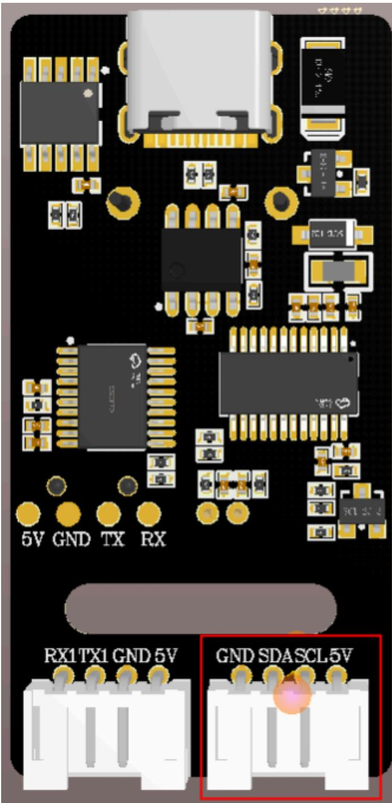
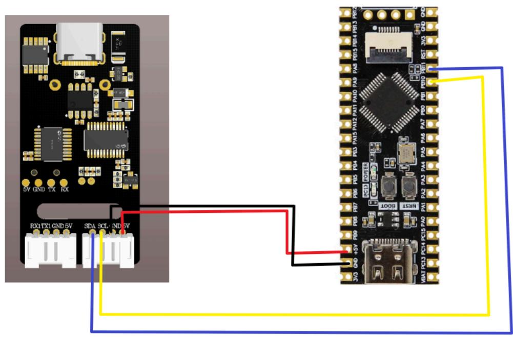
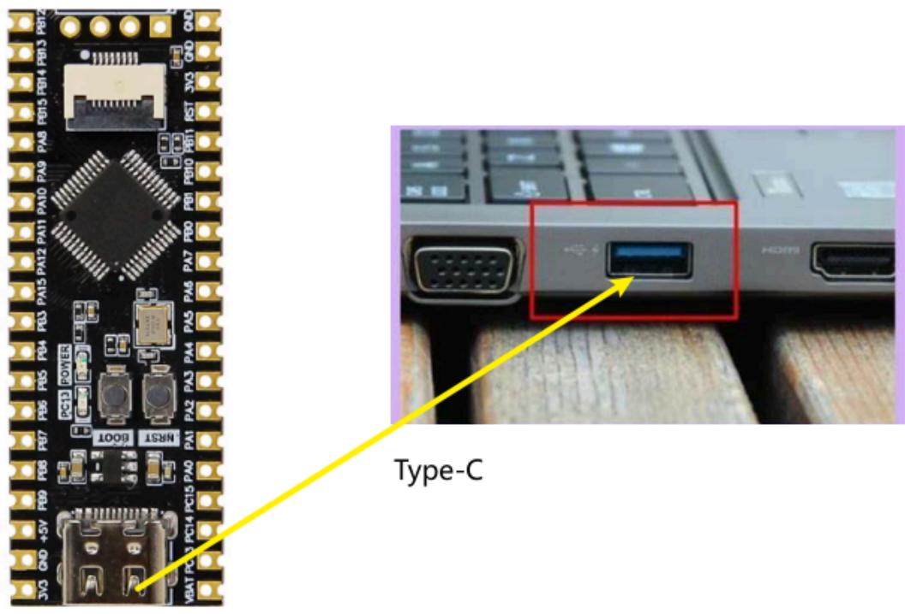
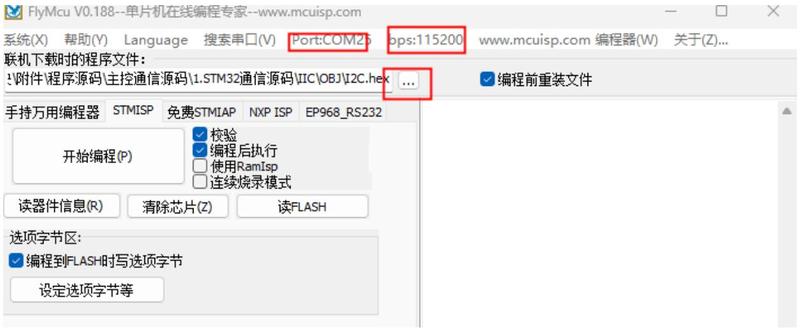
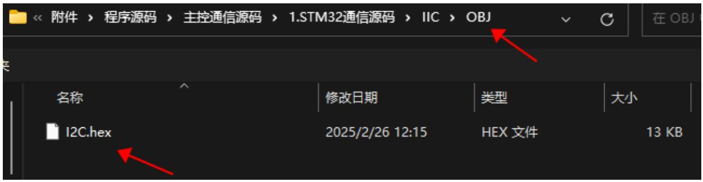
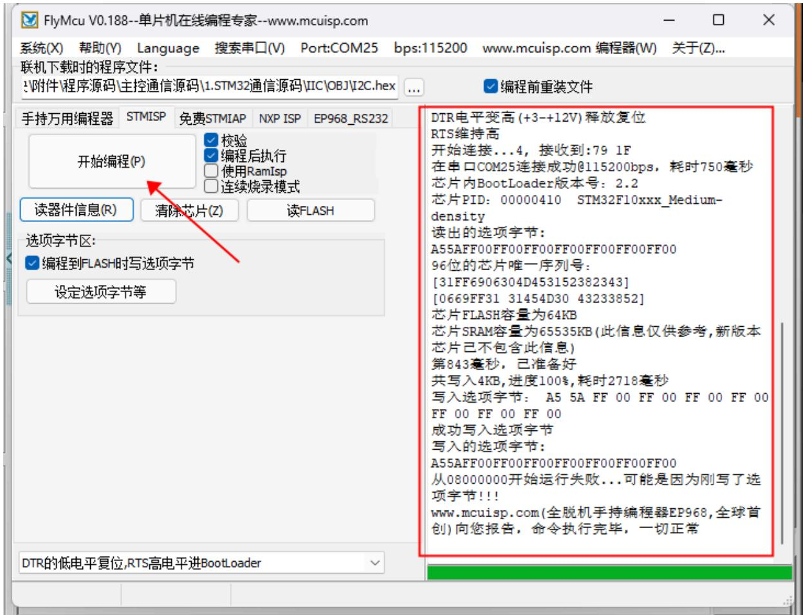
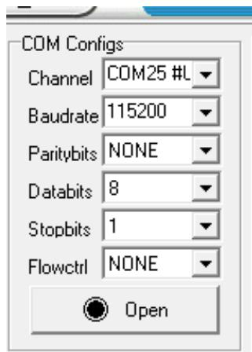
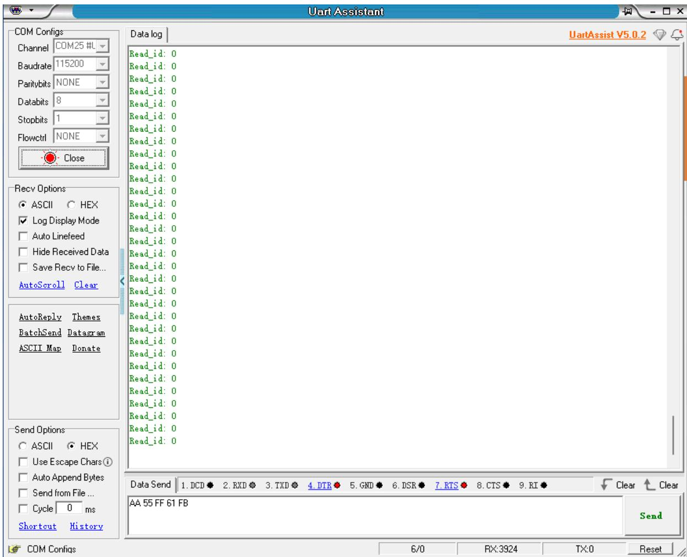
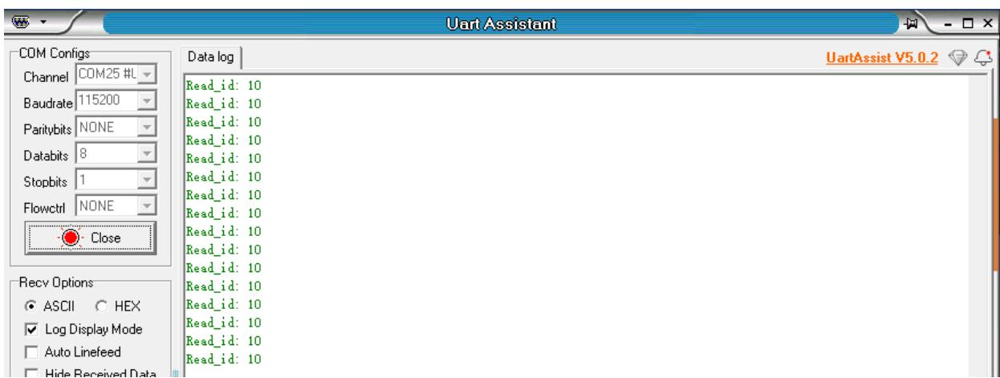

注意：语音交互模块需要烧录出厂固件，语音芯片到手之后没有刷过固件的则不需要

# 1.实验准备

STM32F103C8T6最小核心板  
语音交互模块   
4pin杜邦转接线

# 2.接线示意图

<table><tr><td>STM32</td><td>语音交互模块</td></tr><tr><td>PB10</td><td>SCL</td></tr><tr><td>PB11</td><td>SDA</td></tr><tr><td>GND</td><td>GND</td></tr><tr><td>5V</td><td>5V</td></tr></table>

注意：

下图是新版本的模块的语音交互模块，需要根据引脚线序来接线，不能根据颜色进行接线

text_image

5V GND TX RX
RX1 TX1 GND 5V
GND SDA SCL 5V

下图是旧版本的接线，根据引脚线序接线

text_image

5V GND RX RX
EX1TX1 GND 5V SDA SOL ND 5V
3V3 040 -5V FB9 FB8 FB7 FB6 FB5 FB4 FB3 PA2 PA1 PA0 PA8 PA6 PA5 PA3 PA1 PA0 PA7 PA4 PA5 PA2 PA3 PA1 PA2 PA6 PA7 PA3 PA4 PA5 PA3 PA1 PA0
MSP1001
GOO1
MSP1001 PC14 PC15 PA0

# 3.程序下载

将stm32主板和电脑进行Type-C数据线连接

text_image

Type-C

打开stm32固件烧录工具FlyMcu.exe，选择对应的设备端口，比特率115200，将程序烧录到开发板，如下图

text_image

FlyMcu V0.188--单片机在线编程专家--www.mcuisp.com
系统(X)  帮助(Y)  Language  搜索串口(V)  Port:COM26  bps:115200  www.mcuisp.com 编程器(W)  关于(Z)...
联机下载时的程序文件:
附件\程序源码\主控通信源码\1.STM32通信源码\IIC\OBJ\I2C.hex  ...
编程前重装文件
手持万用编程器  STMISP  免费STMIAP  NXP ISP  EP968_RS232
开始编程(P)
校验
编程后执行
使用Ramisp
连续烧录模式
读器件信息(R)  清除芯片(Z)  读FLASH
选项字节区:
编程到FLASH时写选项字节
设定选项字节等

点击三个点，选择stm32通信源码下的iic文件夹里的OBJ文件下的hex文件。

text_image

<< 附件 > 程序源码 > 主控通信源码 > 1.STM32通信源码 > IIC > OBJ
在 OBJ
名称	修改日期	类型	大小
I2C.hex	2025/2/26 12:15	HEX 文件	13 KB

软件低下选择下图选项

text_image

DTR的高电平复位,RTS高电平进BootLoader

点击开始编程即可将程序写入到stm32开发板

text_image

FlyMcu V0.188--单片机在线编程专家--www.mcuisp.com
系统(X)  帮助(Y)  Language  搜索串口(V)  Port:COM25  bps:115200  www.mcuisp.com 编程器(W)  关于(Z)...
联机下载时的程序文件:
!附件\程序源码\主控通信源码\1.STM32通信源码\IIC\OBJ\I2C.hex
编程前重装文件
手持万用编程器  STMISP  免费STMIAP  NXP ISP  EP968_RS232
开始编程(P)
校验
编程后执行
使用Ramisp
连续烧录模式
读器件信息(R)  清除芯片(Z)  读FLASH
选项字节区:
编程到FLASH时写选项字节
设定选项字节等
DTR电平变高(+3-+12V)释放复位
RTS维持高
开始连接...4, 接收到:79 1F
在串口COM25连接成功@115200bps, 耗时750毫秒
芯片内BootLoader版本号: 2.2
芯片PID: 00000410  STM32F10xxx_Medium-
density
读出的选项字节:
A55AFF00FF00FF00FF00FF00FF00FF00
96位的芯片唯一序列号:
[31FF6906304D453152382343]
[0669FF31 31454D30 43233852]
芯片FLASH容量为64KB
芯片SRAM容量为65535KB(此信息仅供参考,新版本
芯片已不包含此信息)
第843毫秒, 已准备好
共写入4KB, 进度100%, 耗时2718毫秒
写入选项字节: A5 5A FF 00 FF 00 FF 00 FF 00
FF 00 FF 00 FF 00
成功写入选项字节
写入的选项字节:
A55AFF00FF00FF00FF00FF00FF00FF00
从08000000开始运行失败...可能是因为刚写了选
项字节!!!
www.mcuisp.com(全脱机手持编程器EP968,全球首
创)向您报告, 命令执行完毕, 一切正常
DTR的低电平复位,RTS高电平进BootLoader

# 4.实现效果

烧录完成之后，我们给stm32开发板重新上一下电，按一下stm32复位按键，可以听到语音模块播报“初始化完成”，这表示程序运行正常  
可以通过修改程序中得代码来选择播报播报内容如下图

//主动播报内容 Active broadcast content

#define This\_red 0x5F

#define This\_blue 0x60

#define This\_green 0x61

#define This\_yellow 0x62

#define Recognize\_yellow Ox63

#define Recognize\_green Ox64

#define Recognize\_blue0x65

#define Recognize\_red 0x66

#define init 0x67

Broadcast (init)://设置播报内容 Set the content of the announcement

播报的内容可以根据附件提供的命令词播报词协议列表V3\_中文文件查看协议，

其中第一第二个字节AA FF表示的是协议的帧头，第三个字节FF表示的是播报功能，第四个就是播报内容的ID，这里能看到“初始化完成”是16进制的67，所以程序里给寄存器0x03发送0x67即可播报对应内容。第五个字节是结束帧。

<table><tr><td>84</td><td>这是红色</td><td>命令词</td><td>这是红色</td><td>被</td><td>AA 55 FF 5F FB</td><td>AA 55 FF 5F FB</td></tr><tr><td>85</td><td>这是蓝色</td><td>命令词</td><td>这是蓝色</td><td>被</td><td>AA 55 FF 60 FB</td><td>AA 55 FF 60 FB</td></tr><tr><td>86</td><td>这是绿色</td><td>命令词</td><td>这是绿色</td><td>被</td><td>AA 55 FF 61 FB</td><td>AA 55 FF 61 FB</td></tr><tr><td>87</td><td>这是黄色</td><td>命令词</td><td>这是黄色</td><td>被</td><td>AA 55 FF 62 FB</td><td>AA 55 FF 62 FB</td></tr><tr><td>88</td><td>识别到黄色</td><td>命令词</td><td>识别到黄色</td><td>被</td><td>AA 55 FF 63 FB</td><td>AA 55 FF 63 FB</td></tr><tr><td>89</td><td>识别到绿色</td><td>命令词</td><td>识别到绿色</td><td>被</td><td>AA 55 FF 64 FB</td><td>AA 55 FF 64 FB</td></tr><tr><td>90</td><td>识别到蓝色</td><td>命令词</td><td>识别到蓝色</td><td>被</td><td>AA 55 FF 65 FB</td><td>AA 55 FF 65 FB</td></tr><tr><td>91</td><td>识别到红色</td><td>命令词</td><td>识别到红色</td><td>被</td><td>AA 55 FF 66 FB</td><td>AA 55 FF 66 FB</td></tr><tr><td>92</td><td>初始化完成</td><td>命令词</td><td>初始化完成</td><td>被</td><td>AA 55 FF 67 FB</td><td>AA 55 FF 67 FB</td></tr></table>

打开附件提供的串口调试助手，选择好对应的端口，以及波特率为115200

text_image

COM Configs
Channel COM25 #L
Baudrate 115200
Paritybits NONE
Databits 8
Stopbits 1
Flowctrl NONE
Open

点击open打开能看到终端会打印接收到的命令词ID

text_image

Uart Assistant
COM Configs
Channel COM25 #L
Baudrate 115200
Paritybits NONE
Databits 8
Stopbits 1
Flowctrl NONE
Close
Data log
UartAssist V5.0.2
Read_id: 0
Read_id: 0
Read_id: 0
Read_id: 0
Read_id: 0
Read_id: 0
Read_id: 0
Read_id: 0
Read_id: 0
Read_id: 0
Read_id: 0
Read_id: 0
Read_id: 0
Read_id: 0
Read_id: 0
Read_id: 0
Read_id: 0
Read_id:
ASCII HEX
Log Display Mode
Auto Linefeed
Hide Received Data
Save Recv to File...
AutoScroll Clear
AutoReply Themes
BatchSend Datagram
ASCII Map Donate
Send Options
ASCII HEX
Use Escape Chars①
Auto Append Bytes
Send from File ...
Cycle 0 ms
Shortcut History
Data Send 1. DCD 2. RXD 3. TXD 4. DTR 5. GND 6. DSR 7. RTS 8. CTS 9. RI 
AA 55 FF 61 FB
Send
COM Configs	6/0	RX:3924	TX:0	Reset

当我说出唤醒词唤醒之后，说“关灯”调试助手会回复接收ID：10

text_image

Uart Assistant
COM Configs
Channel COM25 #L
Baudrate 115200
Paritybits NONE
Databits 8
Stopbits 1
Flowctrl NONE
Close
Data log
Read_id: 10
Read_id: 10
Read_id: 10
Read_id: 10
Read_id: 10
Read_id: 10
Read_id: 10
Read_id: 10
Read_id: 10
Read_id: 10
Read_id: 10
Read_id: 10
Read_id: 10
Read_id: 10
Read_id: 10
Recv Options
ASCII HEX
Log Display Mode
Auto Linefeed
Hide Received Data

这时候可以打开附件的命令词播报词协议列表V3\_中文文件查看“关灯”的协议其中第一第二个字节AA FF表示的是协议的帧头，第三个字节表示的是芯片的十个功能词的ID，第四个就是命令词的ID，这里能看到“关灯”是16进制的0A，所以十进制会返回10。第五个字节是结束帧。

<table><tr><td>20</td><td>关灯</td><td>命令词</td><td>好的,已关灯</td><td>主</td><td>AA 55 00 0A FB</td><td>AA 55 00 0A FB</td></tr><tr><td>21</td><td>亮红灯</td><td>命令词</td><td>好的,已亮红灯</td><td>主</td><td>AA 55 00 0B FB</td><td>AA 55 00 0B FB</td></tr></table>

说其他的命令词，串口调试助手也会打印相对应得命令词ID，可以自行尝试