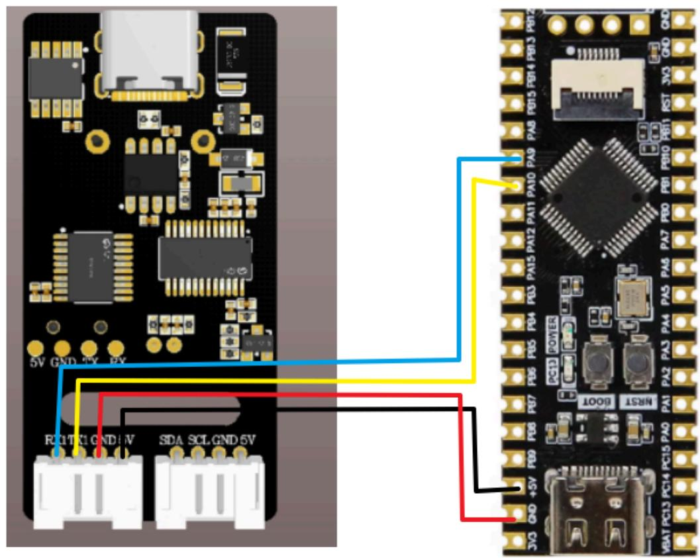
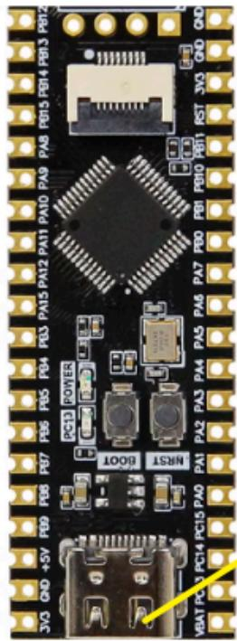
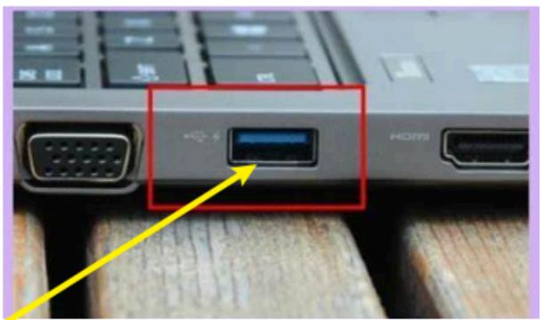
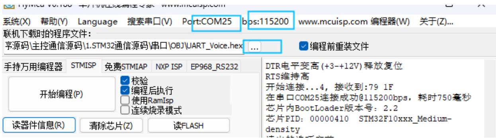
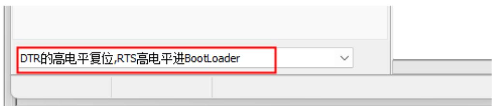
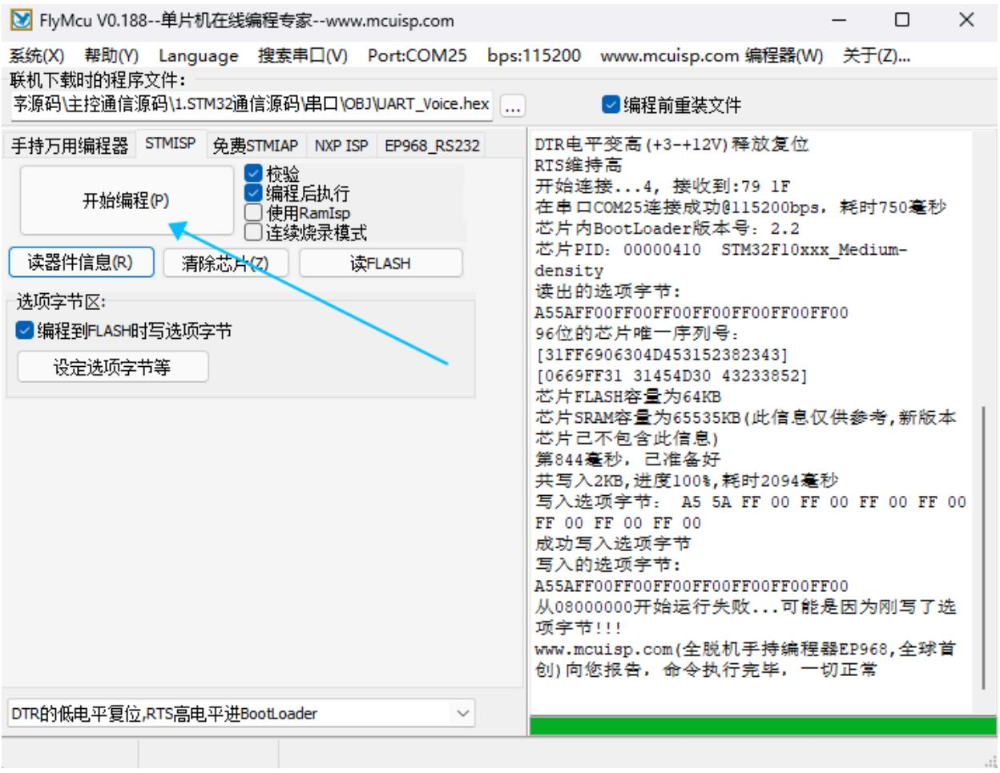
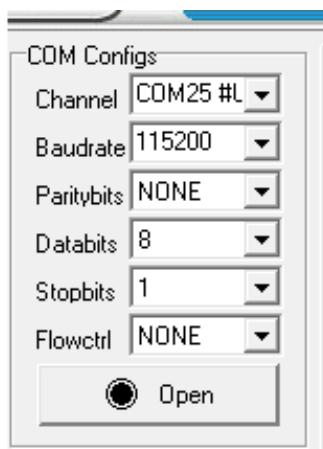
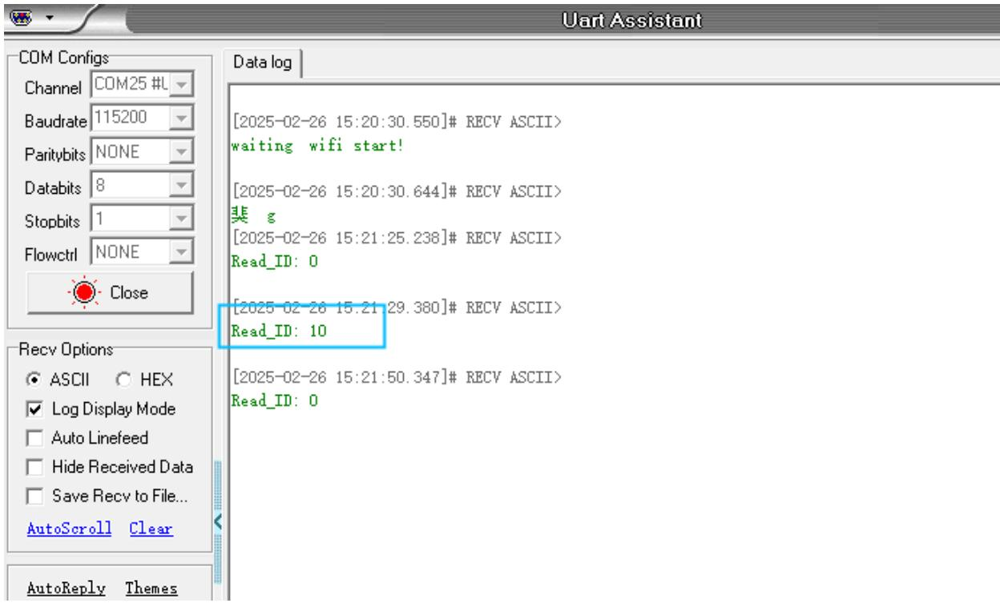

注意：语音交互模块需要烧录出厂固件，语音芯片到手之后没有刷过固件的则不需要

# 1.实验准备

STM32F103C8T6最小核心板  
语音交互模块   
4pin杜邦转接线

# 2.接线示意图

<table><tr><td>STM32</td><td>语音交互模块</td></tr><tr><td>PA9</td><td>RX</td></tr><tr><td>PA10</td><td>TX</td></tr><tr><td>GND</td><td>GND</td></tr><tr><td>5V</td><td>5V</td></tr></table>



<details>
<summary>text_image</summary>

5V GND 5V
RCLT C1 GND 4V
SDA SCL GND 5V
NRSI
BOOT
PCD3 POWER
PBI PBI0 PBI1 PBI2 PBI3 PBI4 PBI5 PBI6 PBI7 PBI8 PBI9 PBI10 PBI11 PBI12 PBI13 PBI14 PBI15 PBI16 PBI17 PBI18 PBI19 PBI20 PBI21 PBI22 PBI23 PBI24 PBI25 PBI26 PBI27 PBI28 PBI29 PBI30 PBI31 PBI32 PBI33 PBI34 PBI35 PBI36 PBI37 PBI38 PBI39 PBI40 PBI41 PBI42 PBI43 PBI44 PBI45 PBI46 PBI47 PBI48 PBI49 PBI50 PBI51 PBI52 PBI53 PBI54 PBI55 PBI56 PBI57 PBI58 PBI59 PBI60 PBI61 PBI62 PBI63 PBI64 PBI65 PBI66 PBI67 PBI68 PBI69 PBI70 PBI71 PBI72 PBI73 PBI74 PBI75 PBI76 PBI77 PBI78 PBI79 PBI80 PBI81 PBI82 PBI83 PBI84 PBI85 PBI86 PBI87 PBI88 PBI89 PBI90 PBI91 PBI92 PBI93 PBI94 PBI95 PBI96 PBI97 PBI98 PBI99 PBI100 PBI101 PBI102 PBI103 PBI104 PBI105 PBI106 PBI107 PBI108 PBI109 PBI110 PBI111 PBI112 PBI113 PBI114 PBI115 PBI116 PBI117 PBI118 PBI119 PBI120 PBI121 PBI122 PBI123 PBI124 PBI125 PBI126 PBI127 PBI128 PBI129 PBI130 PBI131 PBI132 PBI133 PBI134 PBI135 PBI136 PBI137 PBI138 PBI139 PBI140
JGQ QO +5V FEN FEN FEN FEN FEN FEN FEN FEN FEN FEN FEN FEN FEN FEN FEN FEN FEN FEN FEN FEN FEN FEN FEN FEN FEN FEN FEN FEN FEN FEN FEN FEN FEN FEN FEN FEN FEN FEN FEN FEN FEN FEN FEN FEN FEN FEN FEN FEN FEN FEN FAN
VBAI PCI3 PCI4 PCI5 PAO PAI PA2 PA3 PA4 PA5 PA6 PA7 PA8 PA9
NRSI
</details>

# 3.程序下载

将stm32主板和电脑进行Type-C数据线连接



<details>
<summary>natural_image</summary>

Close-up of a black printed circuit board with integrated circuits and connectors (no readable text or symbols)
</details>



<details>
<summary>natural_image</summary>

Close-up of a computer keyboard with an orange arrow pointing to a blue indicator port labeled 'HDMI' (no text beyond labels)
</details>

Type-C

打开stm32固件烧录工具FlyMcu.exe，选择对应的设备端口，比特率115200，将程序烧录到开发板，如下图



<details>
<summary>text_image</summary>

系统(X)  帮助(Y)  Language  搜索串口(V)  Port:COM25  bps:115200  www.mcuisp.com 编程器(W)  关于(Z)...
联机下载时的程序文件:
字源码\主控通信源码\1.STM32通信源码\串口\OBJ\UART_Voice.hex  ...  编程前重装文件
手持万用编程器  STMISP  免费STMIAP  NXP ISP  EP968_RS232
开始编程(P)
校验
编程后执行
使用RamIsp
连续烧录模式
读器件信息(R)  清除芯片(Z)  读FLASH
DTR电平变高(+3-+12V)释放复位
RTS维持高
开始连接...4, 接收到:79 1F
在串口COM25连接成功@115200bps, 耗时750毫秒
芯片内BootLoader版本号: 2.2
芯片PID: 00000410  STM32F10xxx_Medium-
density
</details>

点击三个点，选择stm32通信源码下的iic文件夹里的OBJ文件下的hex文件。

<table><tr><td>名称</td><td>修改日期</td><td>类型</td><td>大小</td></tr><tr><td>UART_Voice.hex</td><td>2025/2/26 15:12</td><td>HEX 文件</td><td>9 KB</td></tr></table>

软件低下选择下图选项



<details>
<summary>text_image</summary>

DTR的高电平复位,RTS高电平进BootLoader
</details>

点击开始编程即可将程序写入到stm32开发板



<details>
<summary>text_image</summary>

FlyMcu V0.188--单片机在线编程专家--www.mcuisp.com
系统(X)  帮助(Y)  Language  搜索串口(V)  Port:COM25  bps:115200  www.mcuisp.com 编程器(W)  关于(Z)...
联机下载时的程序文件:
字源码\主控通信源码\1.STM32通信源码\串口\OBJ\UART_Voice.hex
...
编程前重装文件
手持万用编程器  STMISP  免费STMIAP  NXP ISP  EP968_RS232
开始编程(P)
校验
编程后执行
使用Ramisp
连续烧录模式
读器件信息(R)  清除芯片(Z)  读FLASH
选项字节区:
编程到FLASH时写选项字节
设定选项字节等
DTR电平变高(+3-+12V)释放复位
RTS维持高
开始连接...4, 接收到:79 1F
在串口COM25连接成功@115200bps, 耗时750毫秒
芯片内BootLoader版本号: 2.2
芯片PID: 00000410  STM32F10xxx_Medium-
density
读出的选项字节:
A55AFF00FF00FF00FF00FF00FF00FF00
96位的芯片唯一序列号:
[31FF6906304D453152382343]
[0669FF31 31454D30 43233852]
芯片FLASH容量为64KB
芯片SRAM容量为65535KB(此信息仅供参考,新版本
芯片已不包含此信息)
第844毫秒, 已准备好
共写入2KB, 进度100%, 耗时2094毫秒
写入选项字节: A5 5A FF 00 FF 00 FF 00 FF 00
FF 00 FF 00 FF 00
成功写入选项字节
写入的选项字节:
A55AFF00FF00FF00FF00FF00FF00FF00
从08000000开始运行失败...可能是因为刚写了选
项字节!!!
www.mcuisp.com(全脱机手持编程器EP968,全球首
创)向您报告, 命令执行完毕, 一切正常
DTR的低电平复位,RTS高电平进BootLoader
</details>

# 4.实现效果

烧录完成之后，我们给stm32开发板重新上一下电，按一下stm32复位按键，可以听到语音模块播报“初始化完成”，这表示程序运行正常  
可以通过修改程序中得代码来选择播报播报内容如下图

//主动播报内容 Active broadcast content

#define This\_red Ox5F

#define This\_blue 0x60

#define This\_green 0x61

#define This\_yellow 0x62

#define Recognize\_yellow\_0x63

#define Recognize\_green 0x64

#define Recognize\_blue 0x65

#define Recognize\_red 0x66

#define init 0x67

```txt
int main()
{
    SystemInit();
    delay_init();
    USART1_init(115200); // 接PC的串口PA9(TX) PA10(RX) Connect to PC's serial
    printf("waiting wifi start!\r\n");
    delay_ms(100);
    Write_Data(init);
    while(1)
    {
    }
} 
```

播报的内容可以根据附件提供的命令词播报词协议列表V3\_中文文件查看协议，

其中第一第二个字节AA FF表示的是协议的帧头，第三个字节FF表示的是播报功能，第四个就是播报内容的ID，这里能看到“初始化完成”是16进制的67，所以程序里给寄存器0x03发送0x67即可播报对应内容。第五个字节是结束帧。

<table><tr><td>84</td><td>这是红色</td><td>命令词</td><td>这是红色</td><td>被</td><td>AA 55 FF 5F FB</td><td>AA 55 FF 5F FB</td></tr><tr><td>85</td><td>这是蓝色</td><td>命令词</td><td>这是蓝色</td><td>被</td><td>AA 55 FF 60 FB</td><td>AA 55 FF 60 FB</td></tr><tr><td>86</td><td>这是绿色</td><td>命令词</td><td>这是绿色</td><td>被</td><td>AA 55 FF 61 FB</td><td>AA 55 FF 61 FB</td></tr><tr><td>87</td><td>这是黄色</td><td>命令词</td><td>这是黄色</td><td>被</td><td>AA 55 FF 62 FB</td><td>AA 55 FF 62 FB</td></tr><tr><td>88</td><td>识别到黄色</td><td>命令词</td><td>识别到黄色</td><td>被</td><td>AA 55 FF 63 FB</td><td>AA 55 FF 63 FB</td></tr><tr><td>89</td><td>识别到绿色</td><td>命令词</td><td>识别到绿色</td><td>被</td><td>AA 55 FF 64 FB</td><td>AA 55 FF 64 FB</td></tr><tr><td>90</td><td>识别到蓝色</td><td>命令词</td><td>识别到蓝色</td><td>被</td><td>AA 55 FF 65 FB</td><td>AA 55 FF 65 FB</td></tr><tr><td>91</td><td>识别到红色</td><td>命令词</td><td>识别到红色</td><td>被</td><td>AA 55 FF 66 FB</td><td>AA 55 FF 66 FB</td></tr><tr><td>92</td><td>初始化完成</td><td>命令词</td><td>初始化完成</td><td>被</td><td>AA 55 FF 67 FB</td><td>AA 55 FF 67 FB</td></tr></table>

打开附件提供的串口调试助手，选择好对应的端口，以及波特率为115200



<details>
<summary>text_image</summary>

COM Configs
Channel COM25 #L
Baudrate 115200
Paritybits NONE
Databits 8
Stopbits 1
Flowctrl NONE
Open
</details>

打开串口助手，当我说出唤醒词唤醒之后，说“关灯”调试助手会回复接收ID：10



<details>
<summary>text_image</summary>

Uart Assistant
COM Configs
Channel COM25 #L
Baudrate 115200
Paritybits NONE
Databits 8
Stopbits 1
Flowctrl NONE
Close
Data log
[2025-02-26 15:20:30.550]# RECV ASCII>
waiting wifi start!
[2025-02-26 15:20:30.644]# RECV ASCII>
斐 g
[2025-02-26 15:21:25.238]# RECV ASCII>
Read_ID: 0
[2025-02-26 15:21:29.380]# RECV ASCII>
Read_ID: 10
[2025-02-26 15:21:50.347]# RECV ASCII>
Read_ID: 0
Recv Options
ASCII HEX
Log Display Mode
Auto Linefeed
Hide Received Data
Save Recv to File...
AutoScroll Clear
AutoReply Themes
</details>

这时候可以打开附件的命令词播报词协议列表V3\_中文文件查看“关灯”的协议

<table><tr><td>20</td><td>关灯</td><td>命令词</td><td>好的,已关灯</td><td>主</td><td>AA 55 00 0A FB</td><td>AA 55 00 0A FB</td></tr><tr><td>21</td><td>亮红灯</td><td>命令词</td><td>好的,已亮红灯</td><td>主</td><td>AA 55 00 0B FB</td><td>AA 55 00 0B FB</td></tr></table>

其中第一第二个字节AA FF表示的是协议的帧头，第三个字节表示的是芯片的十个功能词的ID，第四个就是命令词的ID，这里能看到“关灯”是16进制的0A，所以十进制会返回10。第五个字节是结束帧。

说其他的命令词，串口调试助手也会打印相对应得命令词ID，可以自行尝试