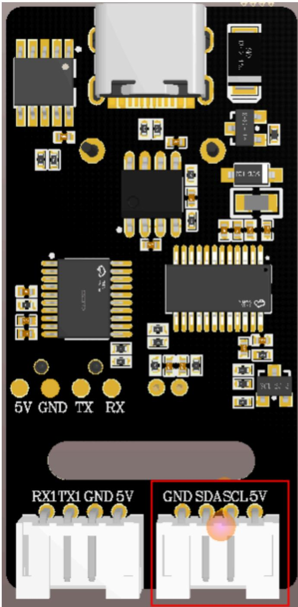
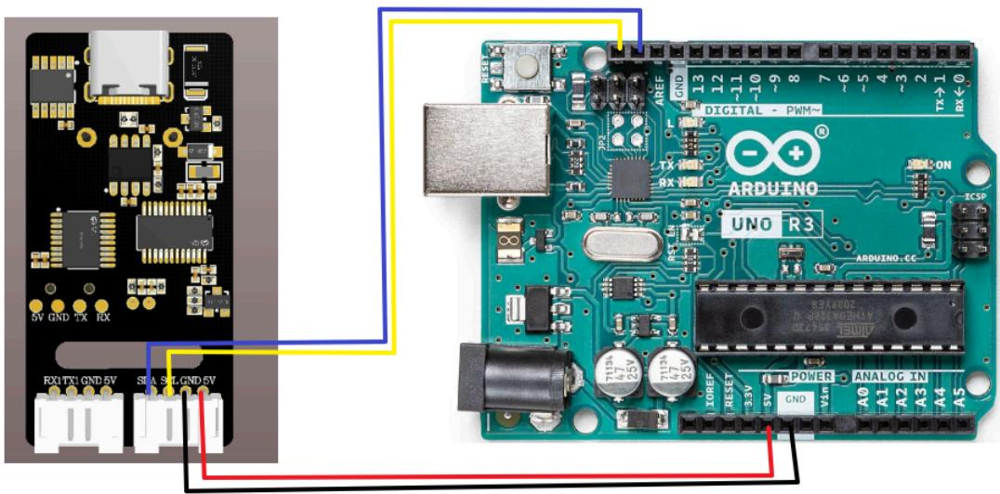
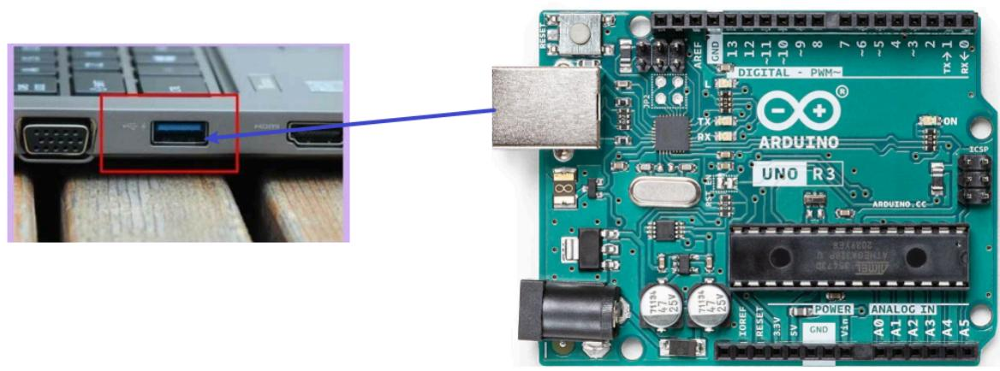
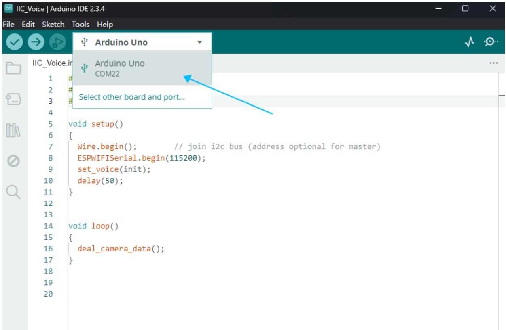
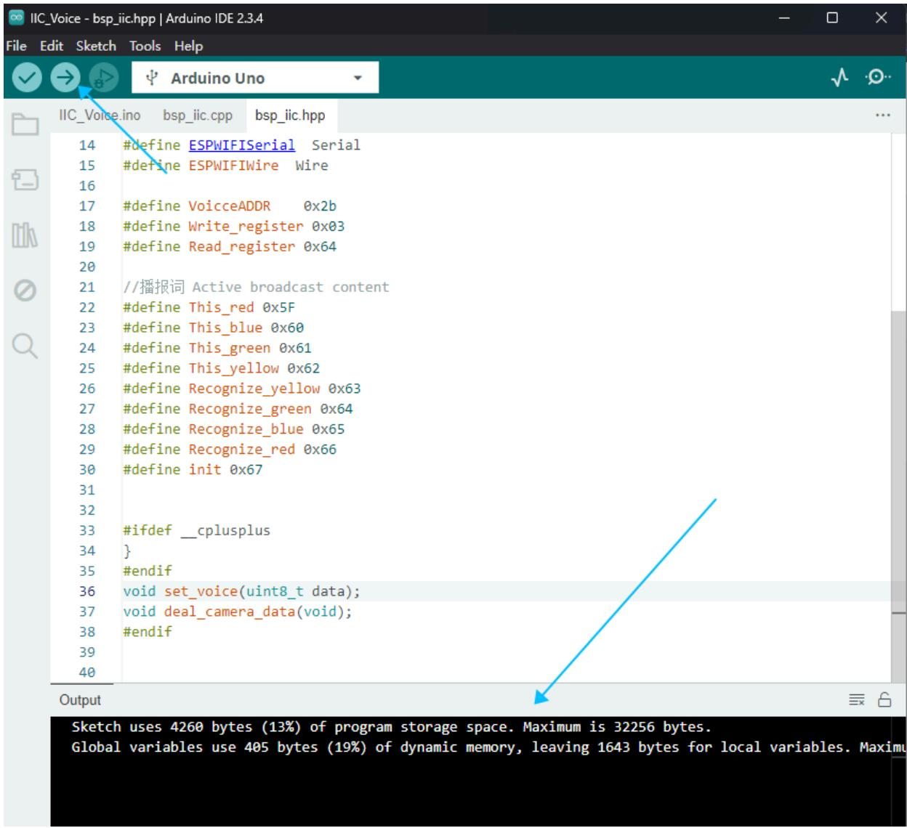
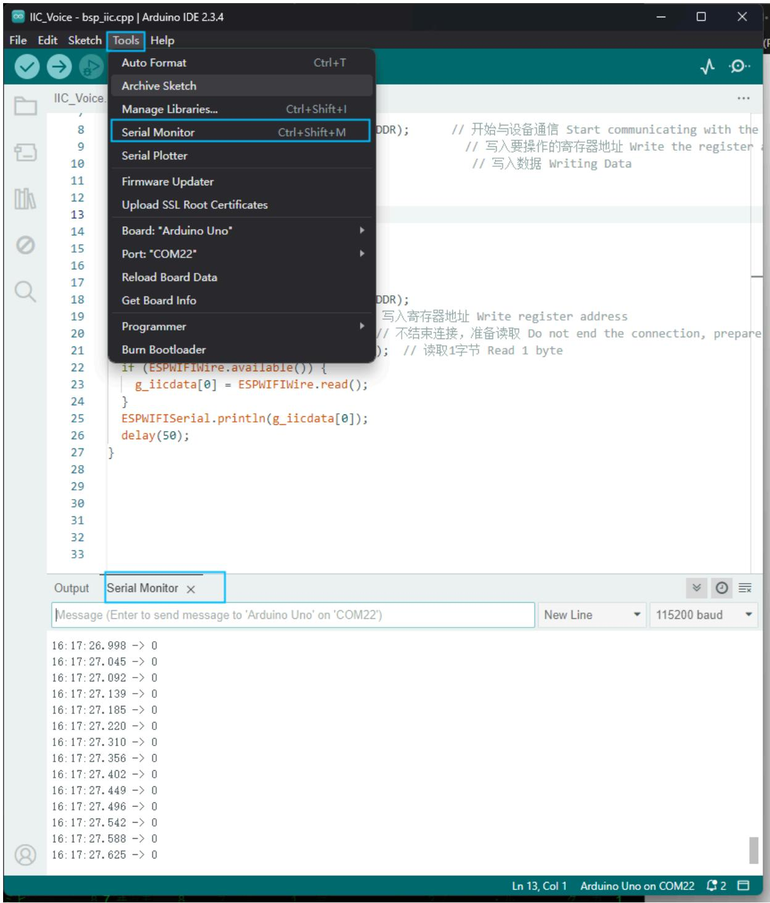

注意：语音交互模块需要烧录出厂固件，语音芯片到手之后没有刷过固件的则不需要

# 1.实验准备

Arduino开发板  
语音交互模块   
多跟杜邦线

# 2.接线示意图

<table><tr><td>Arduino</td><td>语音交互模块</td></tr><tr><td>SCL</td><td>SCL</td></tr><tr><td>SDA</td><td>SDA</td></tr><tr><td>GND</td><td>GND</td></tr><tr><td>5V</td><td>5V</td></tr></table>

注意：

下图是新版本的模块的语音交互模块，需要根据引脚线序来接线，不能根据颜色进行接线



<details>
<summary>text_image</summary>

5V GND TX RX
RX1 TX1 GND 5V GND SDASCL 5V
</details>

下图是旧版本的接线，根据引脚线序接线



<details>
<summary>text_image</summary>

RX1 TX1 GND 5V
SIN A SIN GND 5V
5V GND TX RX
ARBUINO
UNO R3
DIGITAL - PWM~
TX
RX
REF
GND
L
13
12
~11
~10
~9
8
7
6
5
4
3
2
TX→1
RX←0
ON
ICSP
ARDUINO-CC
RESET
3.3V
POWER
A0 A1 A2 A3 A4 A5
GND V3n
</details>

# 3.程序下载

将Arduino使用下载线和电脑进行连接



<details>
<summary>text_image</summary>

Close-up of an Arduino Uno board with visible component labels and a close-up of the device's port, including a red button labeled 'ARDOINO'.
</details>

打开ArduinoIDE编译平台上，能看到串口号就是正常的。



<details>
<summary>text_image</summary>

IIC_Voice | Arduino IDE 2.3.4
File Edit Sketch Tools Help
✓ → ↕ Arduino Uno
IIC_Voice.ir
1 #
2 #
3 #
4
5 void setup()
6 {
7 Wire.begin(); // join i2c bus (address optional for master)
8 ESPWIFISerial.begin(115200);
9 set_voice(init);
10 delay(50);
11 }
12
13
14 void loop()
15 {
16 deal_camera_data();
17 }
18
19
20
</details>

点击右上角向右箭头下载程序，下方能看出编译成功



<details>
<summary>text_image</summary>

#define ESPWIFISerial Serial
#define ESPWIFIWire Wire
#define VoiceADDR 0x2b
#define Write_register 0x03
#define Read_register 0x64

//播报词 Active broadcast content
#define This_red 0x5F
#define This_blue 0x60
#define This_green 0x61
#define This_yellow 0x62
#define Recognize_yellow 0x63
#define Recognize_green 0x64
#define Recognize_blue 0x65
#define Recognize_red 0x66
#define init 0x67

#ifdef __cplusplus
}
#endif
void set_voice(uint8_t data);
void deal_camera_data(void);
#endif

Output
Sketch uses 4260 bytes (13%) of program storage space. Maximum is 32256 bytes.
Global variables use 405 bytes (19%) of dynamic memory, leaving 1643 bytes for local variables. Maxima
</details>

按一下复位按键能听到“初始化完成”，表示程序已经烧录进去

# 4.实现效果

可以通过修改程序中得代码来选择播报播报内容如下图

```cpp
void setup()
{
    Wire.begin(); // join i2c bus (address optional for master)
    ESPWIFISerial.begin(115200);
    set_voice(init);
    delay(50);
} 
```

```c
//播报词 Active broadcast content
#define This_red 0x5F
#define This_blue 0x60
#define This_green 0x61
#define This_yellow 0x62
#define Recognize_yellow 0x63
#define Recognize_green 0x64
#define Recognize_blue 0x65
#define Recognize_red 0x66
#define init 0x67 
```

报的内容可以根据附件提供的命令词播报词协议列表V3\_中文文件查看协议，

其中第一第二个字节AA FF表示的是协议的帧头，第三个字节FF表示的是播报功能，第四个就是播报内容的ID，这里能看到“初始化完成”是16进制的67，所以程序里给寄存器0x03发送0x67即可播报对应内容。第五个字节是结束帧。

<table><tr><td>84</td><td>这是红色</td><td>命令词</td><td>这是红色</td><td>被</td><td>AA 55 FF 5F FB</td><td>AA 55 FF 5F FB</td></tr><tr><td>85</td><td>这是蓝色</td><td>命令词</td><td>这是蓝色</td><td>被</td><td>AA 55 FF 60 FB</td><td>AA 55 FF 60 FB</td></tr><tr><td>86</td><td>这是绿色</td><td>命令词</td><td>这是绿色</td><td>被</td><td>AA 55 FF 61 FB</td><td>AA 55 FF 61 FB</td></tr><tr><td>87</td><td>这是黄色</td><td>命令词</td><td>这是黄色</td><td>被</td><td>AA 55 FF 62 FB</td><td>AA 55 FF 62 FB</td></tr><tr><td>88</td><td>识别到黄色</td><td>命令词</td><td>识别到黄色</td><td>被</td><td>AA 55 FF 63 FB</td><td>AA 55 FF 63 FB</td></tr><tr><td>89</td><td>识别到绿色</td><td>命令词</td><td>识别到绿色</td><td>被</td><td>AA 55 FF 64 FB</td><td>AA 55 FF 64 FB</td></tr><tr><td>90</td><td>识别到蓝色</td><td>命令词</td><td>识别到蓝色</td><td>被</td><td>AA 55 FF 65 FB</td><td>AA 55 FF 65 FB</td></tr><tr><td>91</td><td>识别到红色</td><td>命令词</td><td>识别到红色</td><td>被</td><td>AA 55 FF 66 FB</td><td>AA 55 FF 66 FB</td></tr><tr><td>92</td><td>初始化完成</td><td>命令词</td><td>初始化完成</td><td>被</td><td>AA 55 FF 67 FB</td><td>AA 55 FF 67 FB</td></tr></table>

打开IDE串口，会打印接收到的命令词ID



<details>
<summary>text_image</summary>

IIC_Voice - bsp_iic.cpp | Arduino IDE 2.3.4
File Edit Sketch Tools Help
Auto Format Ctrl+T
Archive Sketch
Manage Libraries... Ctrl+Shift+I
Serial Monitor Ctrl+Shift+M
Serial Plotter
Firmware Updater
Upload SSL Root Certificates
Board: "Arduino Uno"
Port: "COM22"
Reload Board Data
Get Board Info
Programmer
Burn Bootloader
if (ESPWIFIWire.available()) {
    g_iicdata[0] = ESPWIFIWire.read();
}
ESPWIFISerial.println(g_iicdata[0]);
delay(50);
}
Output Serial Monitor ×
Message (Enter to send message to 'Arduino Uno' on 'COM22') New Line 115200 baud
16: 17: 26.998 -> 0
16: 17: 27.045 -> 0
16: 17: 27.092 -> 0
16: 17: 27.139 -> 0
16: 17: 27.185 -> 0
16: 17: 27.220 -> 0
16: 17: 27.310 -> 0
16: 17: 27.356 -> 0
16: 17: 27.402 -> 0
16: 17: 27.449 -> 0
16: 17: 27.496 -> 0
16: 17: 27.542 -> 0
16: 17: 27.588 -> 0
16: 17: 27.625 -> 0
LDR); // 开始与设备通信 Start communicating with the
// 写入要操作的寄存器地址 Write the register a
// 写入数据 Writing Data
DDR);写入寄存器地址 Write register address
// 不结束连接，准备读取 Do not end the connection, prepare
(); // 读取1字节 Read 1 byte
</details>

当我说出唤醒词唤醒之后，说“关灯”调试助手会回复接收ID：10

```srt
16:17:56.674 -> 10
16:17:56.766 -> 10
16:17:56.812 -> 10
16:17:56.858 -> 10
16:17:56.904 -> 10
16:17:56.952 -> 10
16:17:56.999 -> 10
16:17:57.046 -> 10
16:17:57.078 -> 10
16:17:57.168 -> 10
16:17:57.215 -> 10
16:17:57.261 -> 10
16:17:57.308 -> 10
16:17:57.354 -> 10 
```

这时候可以打开附件的命令词播报词协议列表V3\_中文文件查看“关灯”的协议

<table><tr><td>20</td><td>关灯</td><td>命令词</td><td>好的,已关灯</td><td>主</td><td>AA 55 00 0A FB</td><td>AA 55 00 0A FB</td></tr><tr><td>21</td><td>亮红灯</td><td>命令词</td><td>好的,已亮红灯</td><td>主</td><td>AA 55 00 0B FB</td><td>AA 55 00 0B FB</td></tr></table>

其中第一第二个字节AA FF表示的是协议的帧头，第三个字节表示的是芯片的十个功能词的ID，第四个就是命令词的ID，这里能看到“关灯”是16进制的0A，所以十进制会返回10。第五个字节是结束帧。

说其他的命令词，串口调试助手也会打印相对应得命令词ID，可以自行尝试