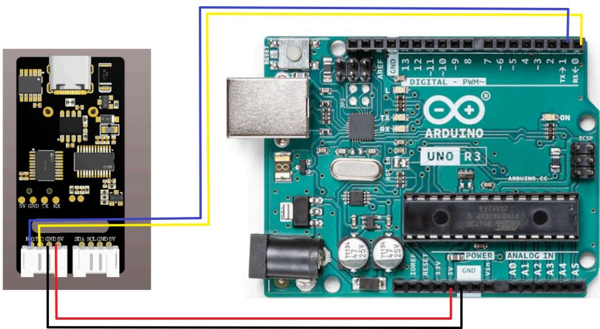
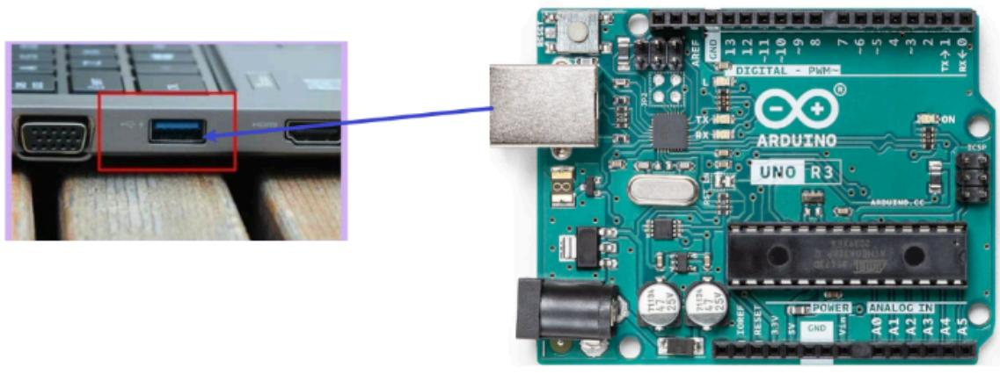
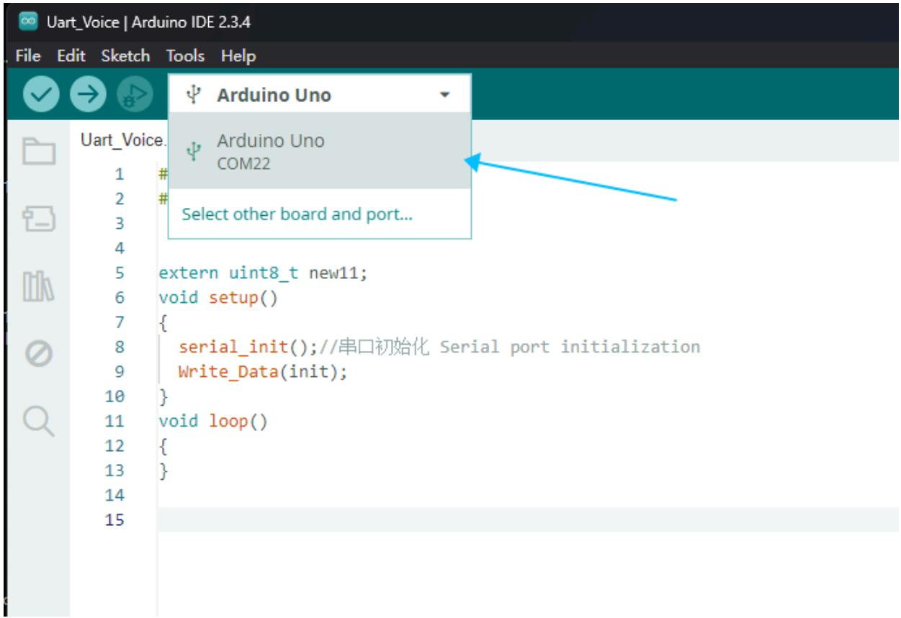
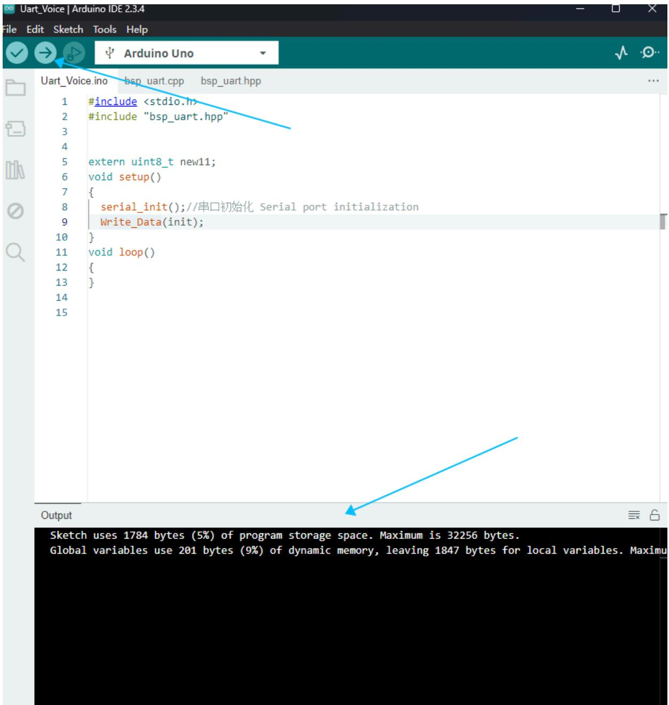
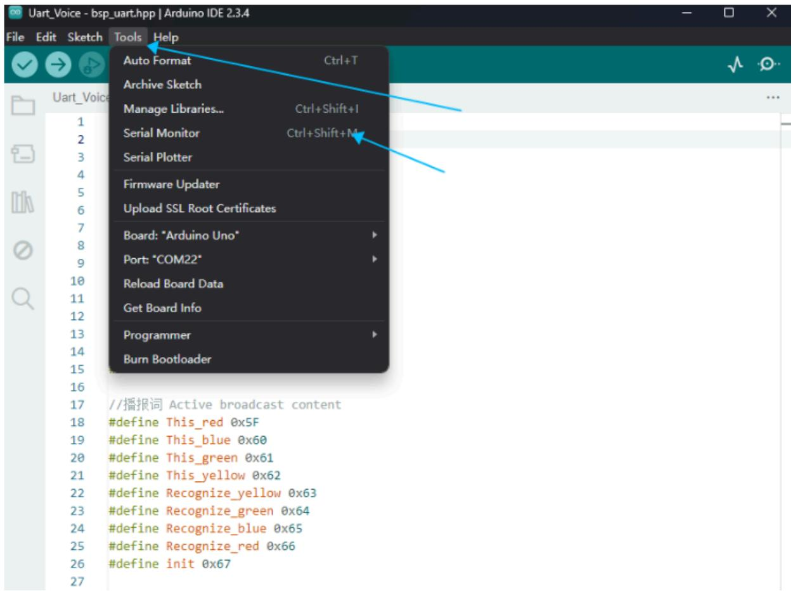
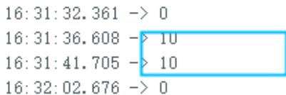

注意：语音交互模块需要烧录出厂固件，语音芯片到手之后没有刷过固件的则不需要

# 1.实验准备

Arduino开发板  
语音交互模块   
多跟杜邦线

# 2.接线示意图

<table><tr><td>Arduino</td><td>语音交互模块</td></tr><tr><td>TX</td><td>RX</td></tr><tr><td>RX</td><td>TX</td></tr><tr><td>GND</td><td>GND</td></tr><tr><td>5V</td><td>5V</td></tr></table>



<details>
<summary>text_image</summary>

RSV GND TX RX
R01G GND SV SDA SOL GND EV
ARDUINO
UNO R3
DIGITAL - PWM-
TX
RX
ON
AREF
GND
13 12 ~11 ~10 8 7 6 ~5 4 3 2 TX→1 RX←0
ICSP
ARDUINO
ON
ARDUINO-CC
IONEF RESET 3.3V 5V GND VAC
POWER
ANALOG IN
A0 A1 A2 A3 A4 A5
</details>

# 3.程序下载

将Arduino使用下载线和电脑进行连接



<details>
<summary>text_image</summary>

Close-up of an Arduino Uno board with visible component labels and a close-up of the device's port, including a red connector icon.
</details>

打开ArduinoIDE编译平台上，能看到串口号就是正常的。



<details>
<summary>text_image</summary>

Uart_Voice | Arduino IDE 2.3.4
File Edit Sketch Tools Help
✓ → ↗ Arduino Uno
Uart_Voice.
1 #
2 #
3
4
5 extern uint8_t new11;
6 void setup()
7 {
8    serial_init();//串口初始化 Serial port initialization
9    Write_Data(init);
10 }
11 void loop()
12 {
13 }
14
15
</details>

点击右上角向右箭头下载程序，下方能看出编译成功



<details>
<summary>text_image</summary>

Uart_Voice ino bsp_uart.cpp bsp_uart.hpp
#include <stdio.h>
#include "bsp_uart.hpp"
extern uint8_t new11;
void setup()
{
    serial_init(); //串口初始化 Serial port initialization
    Write_Data(init);
}
void loop()
{
}
</details>

按一下复位按键能听到“初始化完成”，表示程序已经烧录进去

# 4.实现效果

可以通过修改程序中得代码来选择播报播报内容如下图

```txt
extern uint8_t new11;
void setup()
{
    serial_init(); // 串口初始化 Serial port initialization
    Write_Data(init);
}
void loop()
{ 
```

```c
//播报词 Active broadcast content
#define This_red 0x5F
#define This_blue 0x60
#define This_green 0x61
#define This_yellow 0x62
#define Recognize_yellow 0x63
#define Recognize_green 0x64
#define Recognize_blue 0x65
#define Recognize_red 0x66
#define init 0x67 
```

报的内容可以根据附件提供的命令词播报词协议列表V3\_中文文件查看协议，

其中第一第二个字节AA FF表示的是协议的帧头，第三个字节FF表示的是播报功能，第四个就是播报内容的ID，这里能看到“初始化完成”是16进制的67，所以程序里给寄存器0x03发送0x67即可播报对应内容。第五个字节是结束帧。

<table><tr><td>84</td><td>这是红色</td><td>命令词</td><td>这是红色</td><td>被</td><td>AA 55 FF 5F FB</td><td>AA 55 FF 5F FB</td></tr><tr><td>85</td><td>这是蓝色</td><td>命令词</td><td>这是蓝色</td><td>被</td><td>AA 55 FF 60 FB</td><td>AA 55 FF 60 FB</td></tr><tr><td>86</td><td>这是绿色</td><td>命令词</td><td>这是绿色</td><td>被</td><td>AA 55 FF 61 FB</td><td>AA 55 FF 61 FB</td></tr><tr><td>87</td><td>这是黄色</td><td>命令词</td><td>这是黄色</td><td>被</td><td>AA 55 FF 62 FB</td><td>AA 55 FF 62 FB</td></tr><tr><td>88</td><td>识别到黄色</td><td>命令词</td><td>识别到黄色</td><td>被</td><td>AA 55 FF 63 FB</td><td>AA 55 FF 63 FB</td></tr><tr><td>89</td><td>识别到绿色</td><td>命令词</td><td>识别到绿色</td><td>被</td><td>AA 55 FF 64 FB</td><td>AA 55 FF 64 FB</td></tr><tr><td>90</td><td>识别到蓝色</td><td>命令词</td><td>识别到蓝色</td><td>被</td><td>AA 55 FF 65 FB</td><td>AA 55 FF 65 FB</td></tr><tr><td>91</td><td>识别到红色</td><td>命令词</td><td>识别到红色</td><td>被</td><td>AA 55 FF 66 FB</td><td>AA 55 FF 66 FB</td></tr><tr><td>92</td><td>初始化完成</td><td>命令词</td><td>初始化完成</td><td>被</td><td>AA 55 FF 67 FB</td><td>AA 55 FF 67 FB</td></tr></table>

打开IDE串口，



<details>
<summary>text_image</summary>

Uart_Voice - bsp_uart.hpp | Arduino IDE 2.3.4
File Edit Sketch Tools Help
Auto Format Ctrl+T
Archive Sketch
Manage Libraries... Ctrl+Shift+I
Serial Monitor Ctrl+Shift+M
Serial Plotter
Firmware Updater
Upload SSL Root Certificates
Board: "Arduino Uno"
Port: "COM22"
Reload Board Data
Get Board Info
Programmer
Burn Bootloader
//播报词 Active broadcast content
#define This_red 0x5F
#define This_blue 0x60
#define This_green 0x61
#define This_yellow 0x62
#define Recognize_yellow 0x63
#define Recognize_green 0x64
#define Recognize_blue 0x65
#define Recognize_red 0x66
#define init 0x67
</details>

当我说出唤醒词唤醒之后，说“关灯”调试助手会回复接收ID：10



<details>
<summary>text_image</summary>

16:31:32.361 -> 0
16:31:36.608 -> 10
16:31:41.705 -> 10
16:32:02.676 -> 0
</details>

这时候可以打开附件的命令词播报词协议列表V3\_中文文件查看“关灯”的协议

<table><tr><td>20</td><td>关灯</td><td>命令词</td><td>好的,已关灯</td><td>主</td><td>AA 55 00 0A FB</td><td>AA 55 00 0A FB</td></tr><tr><td>21</td><td>亮红灯</td><td>命令词</td><td>好的,已亮红灯</td><td>主</td><td>AA 55 00 0B FB</td><td>AA 55 00 0B FB</td></tr></table>

其中第一第二个字节AA FF表示的是协议的帧头，第三个字节表示的是芯片的十个功能词的ID，第四个就是命令词的ID，这里能看到“关灯”是16进制的0A，所以十进制会返回10。第五个字节是结束帧。

说其他的命令词，串口调试助手也会打印相对应得命令词ID，可以自行尝试