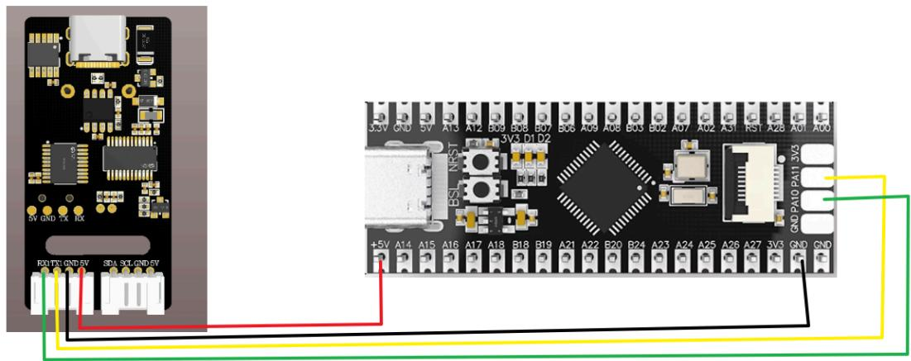
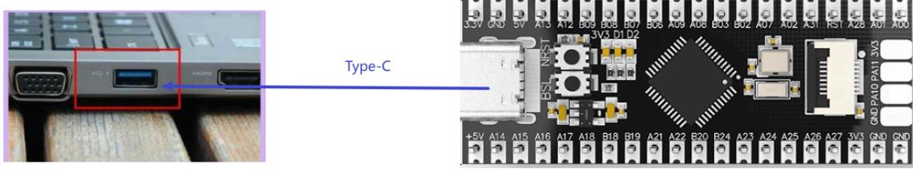
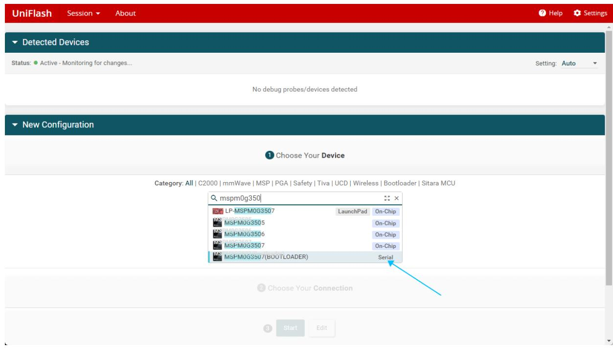
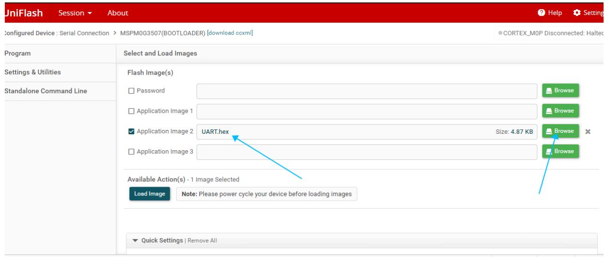
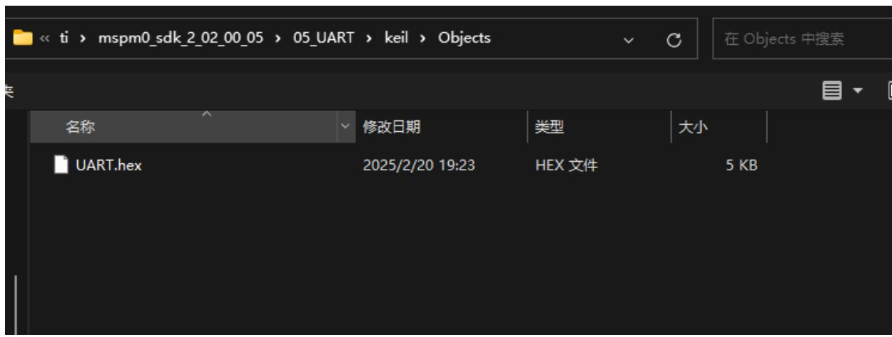
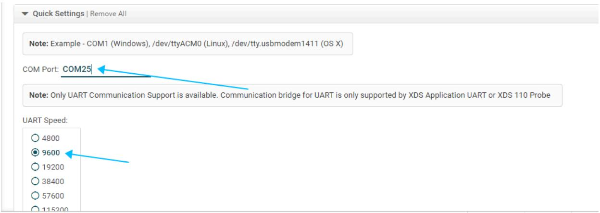
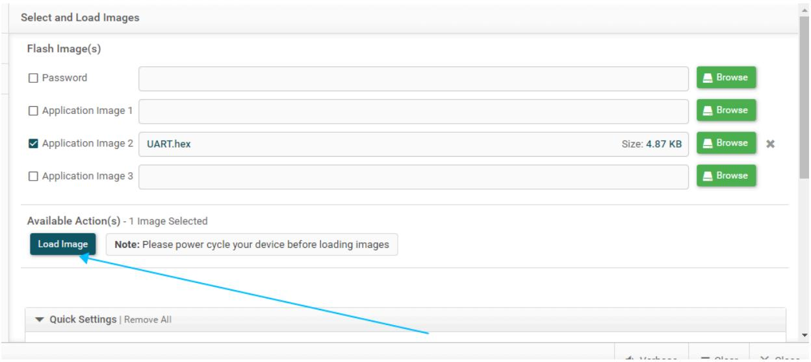
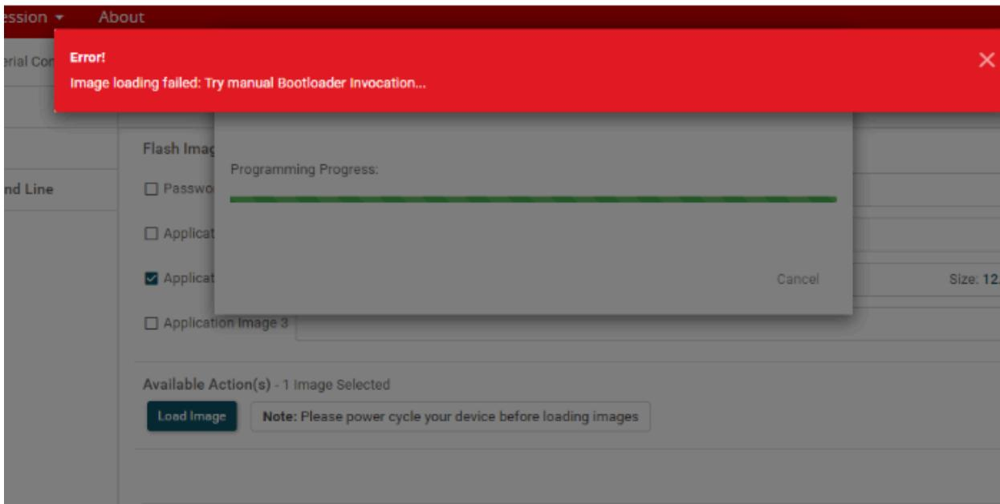
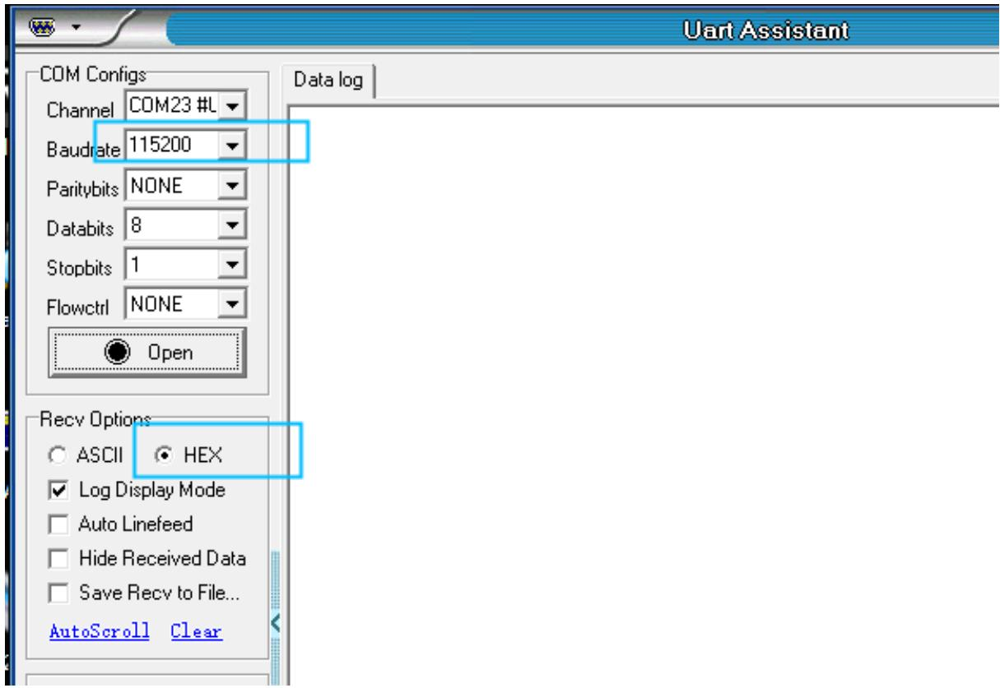
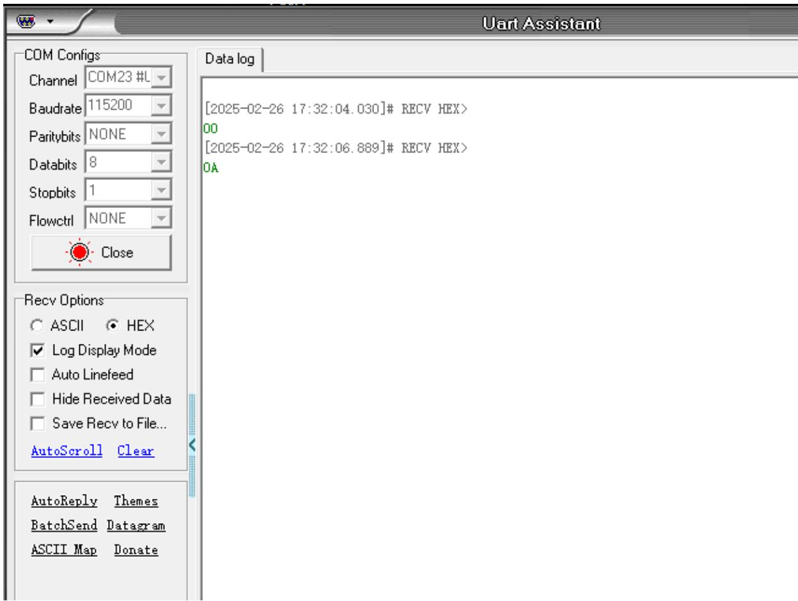

注意：语音交互模块需要烧录出厂固件，语音芯片到手之后没有刷过固件的则不需要

# 1.实验准备

MSPM0G3507Z主板  
语音交互模块   
杜邦线

# 2.接线示意图

<table><tr><td>mspm0g350</td><td>语音交互模块</td></tr><tr><td>PA0</td><td>RX</td></tr><tr><td>PA1</td><td>TX</td></tr><tr><td>GND</td><td>GND</td></tr><tr><td>5V</td><td>5V</td></tr></table>



<details>
<summary>text_image</summary>

3.3V GND 5V AT3 A12 B09 B08 B07 B06 A09 A08 B03 B02 A07 A02 A31 RST A28 A01 A00
+5V A14 A15 A16 A17 A18 B18 B19 A21 A22 B20 B24 A23 A24 A25 A26 A27 3V3 GND PA10 PA11 3V3
EQUITY GND-BV 3DA SCLGND-BV
</details>

# 3.程序下载

将mspm0g350使用下载线和电脑进行连接



<details>
<summary>text_image</summary>

Type-C
+5V A14 A15 A16 A17 A18 B18 B19 A21 A22 B20 B24 A23 A24 A25 A26 A27 3V3 3V3 PA10 PA11 3V3
</details>

打开烧录软件UniFlash 8.8.1.exe，选择对应的型号mspm0g350，之后点击start



<details>
<summary>text_image</summary>

UniFlash
Session
About
Help
Settings
Detected Devices
Status: ● Active - Monitoring for changes...
Setting: Auto
No debug probes/devices detected
New Configuration
Choose Your Device
Category: All | C2000 | mmWave | MSP | PGA | Safety | Tiva | UCD | Wireless | Bootloader | Sitara MCU
mspm0g3501
LP-MSPM0G3507
LaunchPad On-Chip
MSPM0G3505
On-Chip
MSPM0G3506
On-Chip
MSPM0G3507
On-Chip
MSPM0G3507(BOOTLOADER)
Serial
Choose Your Connection
Start Edit
</details>

打开附件，选择 自己电脑环境下mspm0g350源码下的Objects文件夹里的hex文件。



<details>
<summary>text_image</summary>

UniFlash Session About
Configured Device : Serial Connection > MSPM0G3507(BOOTLOADER) [download ccxml]
CORTEX_MOP Disconnected: Halted
Program Select and Load Images
Settings & Utilities
Standalone Command Line
Flash Image(s)
Password
Application Image 1
Application Image 2 UART.hex Size: 4.87 KB
Application Image 3
Available Action(s) - 1 Image Selected
Load Image Note: Please power cycle your device before loading images
Quick Settings | Remove All
</details>

点击Browse



<details>
<summary>text_image</summary>

<< ti > mspm0_sdk_2_02_00_05 > 05_UART > keil > Objects
在 Objects 中搜索
名称	修改日期	类型	大小
UART.hex	2025/2/20 19:23	HEX 文件	5 KB
</details>

往下拉能看到选择对应的端口号，波特率选择自己设置的，这里是9600.



<details>
<summary>text_image</summary>

Quick Settings | Remove All
Note: Example - COM1 (Windows), /dev/ttyACM0 (Linux), /dev/tty.usbmodem1411 (OS X)
COM Port: COM25
Note: Only UART Communication Support is available. Communication bridge for UART is only supported by XDS Application UART or XDS 110 Probe
UART Speed:
○ 4800
● 9600
○ 19200
○ 38400
○ 57600
○ 115200
</details>

长按BSL按键，之后短按RST按键一秒，两个按键松开，之后点击Load Image即可烧录固件



<details>
<summary>text_image</summary>

Select and Load Images
Flash Image(s)
Password
Application Image 1
Application Image 2 UART.hex Size: 4.87 KB
Application Image 3
Available Action(s) - 1 Image Selected
Load Image Note: Please power cycle your device before loading images
Quick Settings | Remove All
</details>

出现下图表示程序正常写入，不用在意警告



<details>
<summary>text_image</summary>

Error!
Image loading failed: Try manual Bootloader Invocation...
Flash Image
Password
Application
✓ Application
Application Image 3
Programming Progress:
Cancel
Size: 12.
Available Action(s) - 1 Image Selected
Load Image
Note: Please power cycle your device before loading images
</details>

听到语音模块播报“初始化完成”，表示程序成功写入。

# 4.实现效果

可以通过修改程序中得代码来选择播报播报内容如下图

```c
//播报词 Active broadcast content
#define This_red 0x5F
#define This_blue 0x60
#define This_green 0x61
#define This_yellow 0x62
#define Recognize_yellow 0x63
#define Recognize_green 0x64
#define Recognize_blue 0x65
#define Recognize_red 0x66
#define init 0x67

int main(void)
{
    SYSCFG_DL_init();
    //清除串口中断标志 Clear the serial port interrupt flag
    NVIC_ClearPendingIRQ(UART_0_INST_INT_IRQn);
    //使能串口中断 Enable serial port interrupt
    NVIC_EnableIRQ(UART_0_INST_INT_IRQn);

    Write_Data(init);

    while (1)
    {
    :
    }
} 
```

播报的内容可以根据附件提供的命令词播报词协议列表V3\_中文文件查看协议，

其中第一第二个字节AA FF表示的是协议的帧头，第三个字节FF表示的是播报功能，第四个就是播报内容的ID，这里能看到“初始化完成”是16进制的67，所以程序里给寄存器0x03发送0x67即可播报对应内容。第五个字节是结束帧。

<table><tr><td>84</td><td>这是红色</td><td>命令词</td><td>这是红色</td><td>被</td><td>AA 55 FF 5F FB</td><td>AA 55 FF 5F FB</td></tr><tr><td>85</td><td>这是蓝色</td><td>命令词</td><td>这是蓝色</td><td>被</td><td>AA 55 FF 60 FB</td><td>AA 55 FF 60 FB</td></tr><tr><td>86</td><td>这是绿色</td><td>命令词</td><td>这是绿色</td><td>被</td><td>AA 55 FF 61 FB</td><td>AA 55 FF 61 FB</td></tr><tr><td>87</td><td>这是黄色</td><td>命令词</td><td>这是黄色</td><td>被</td><td>AA 55 FF 62 FB</td><td>AA 55 FF 62 FB</td></tr><tr><td>88</td><td>识别到黄色</td><td>命令词</td><td>识别到黄色</td><td>被</td><td>AA 55 FF 63 FB</td><td>AA 55 FF 63 FB</td></tr><tr><td>89</td><td>识别到绿色</td><td>命令词</td><td>识别到绿色</td><td>被</td><td>AA 55 FF 64 FB</td><td>AA 55 FF 64 FB</td></tr><tr><td>90</td><td>识别到蓝色</td><td>命令词</td><td>识别到蓝色</td><td>被</td><td>AA 55 FF 65 FB</td><td>AA 55 FF 65 FB</td></tr><tr><td>91</td><td>识别到红色</td><td>命令词</td><td>识别到红色</td><td>被</td><td>AA 55 FF 66 FB</td><td>AA 55 FF 66 FB</td></tr><tr><td>92</td><td>初始化完成</td><td>命令词</td><td>初始化完成</td><td>被</td><td>AA 55 FF 67 FB</td><td>AA 55 FF 67 FB</td></tr></table>

打开附件提供的串口调试助手，选择好对应的端口，以及波特率为115200，接收设置成16进制接收



<details>
<summary>text_image</summary>

Uart Assistant
COM Configs
Channel COM23 #L
Baudrate 115200
Paritybits NONE
Databits 8
Stopbits 1
Flowctrl NONE
Open
Data log
Recv Options
ASCII HEX
Log Display Mode
Auto Linefeed
Hide Received Data
Save Recv to File...
AutoScroll Clear
</details>

打开串口，说出唤醒词唤醒之后，说“关灯”调试助手会回复接收0A



<details>
<summary>text_image</summary>

Uart Assistant
COM Configs
Channel COM23 #L
Baudrate 115200
Paritybits NONE
Databits 8
Stopbits 1
Flowctrl NONE
Close
Data log
[2025-02-26 17:32:04.030]# RECV HEX>
00
[2025-02-26 17:32:06.889]# RECV HEX>
OA
Recv Options
ASCII HEX
Log Display Mode
Auto Linefeed
Hide Received Data
Save Recv to File...
AutoScroll Clear
AutoReply Themes
BatchSend Datagram
ASCII Map Donate
</details>

这时候可以打开附件的命令词播报词协议列表V3\_中文文件查看“关灯”的协议

<table><tr><td>20</td><td>关灯</td><td>命令词</td><td>好的,已关灯</td><td>主</td><td>AA 55 00 0A FB</td><td>AA 55 00 0A FB</td></tr><tr><td>21</td><td>亮红灯</td><td>命令词</td><td>好的,已亮红灯</td><td>主</td><td>AA 55 00 0B FB</td><td>AA 55 00 0B FB</td></tr></table>

其中第一第二个字节AA FF表示的是协议的帧头，第三个字节表示的是芯片的十个功能词的ID，第四个就是命令词的ID，这里能看到“关灯”是16进制的0A。第五个字节是结束帧。

说其他的命令词，串口调试助手也会打印相对应得命令词ID，可以自行尝试