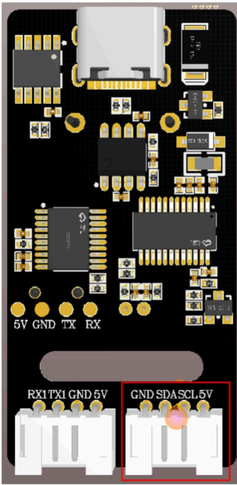
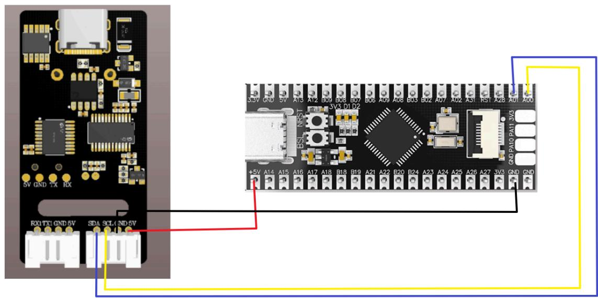
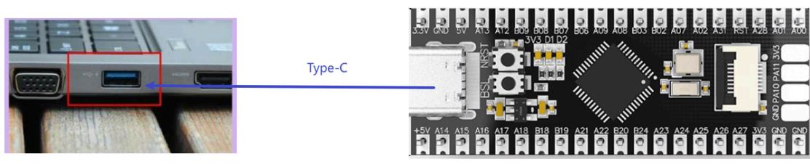
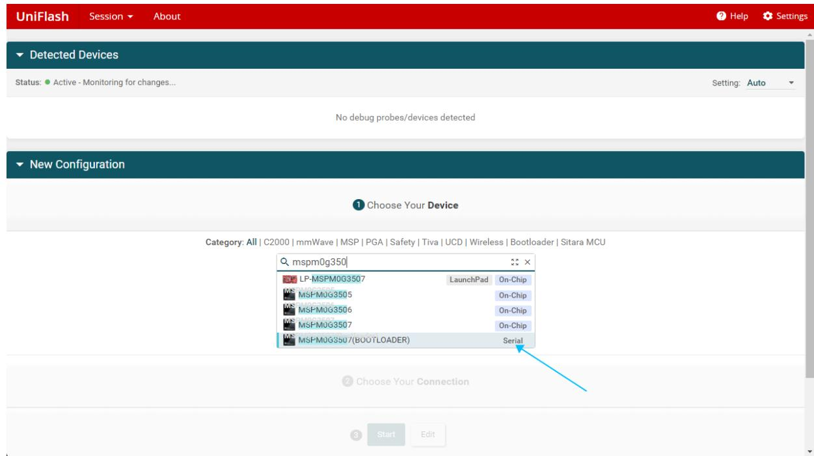
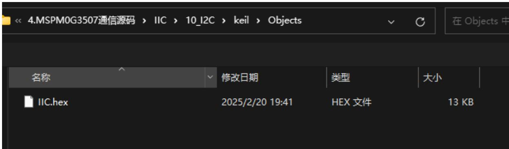
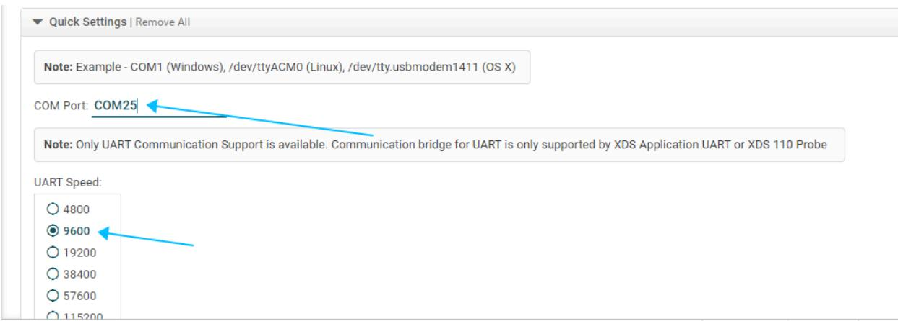
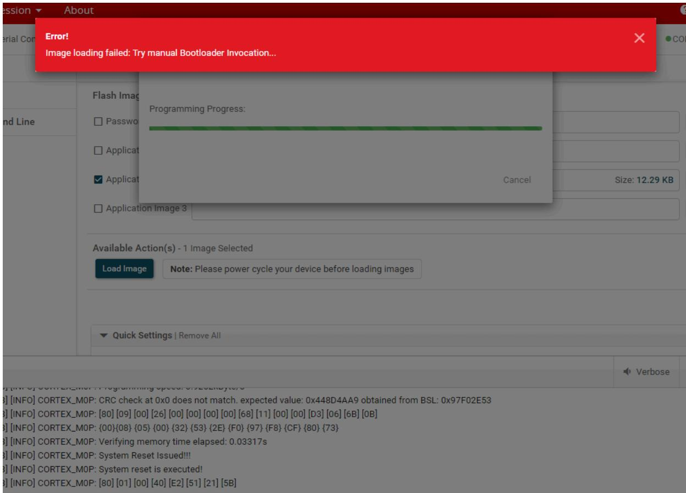
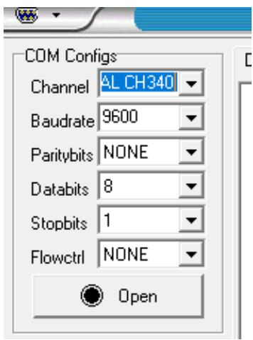
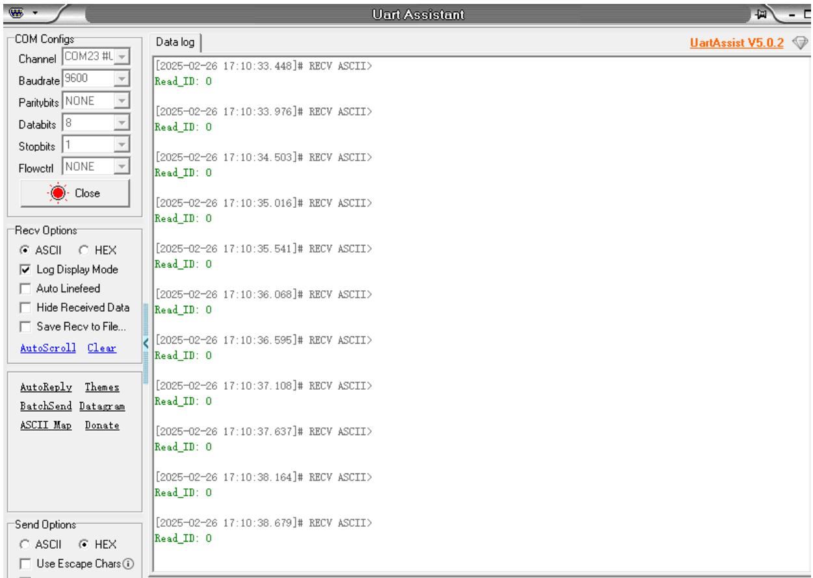
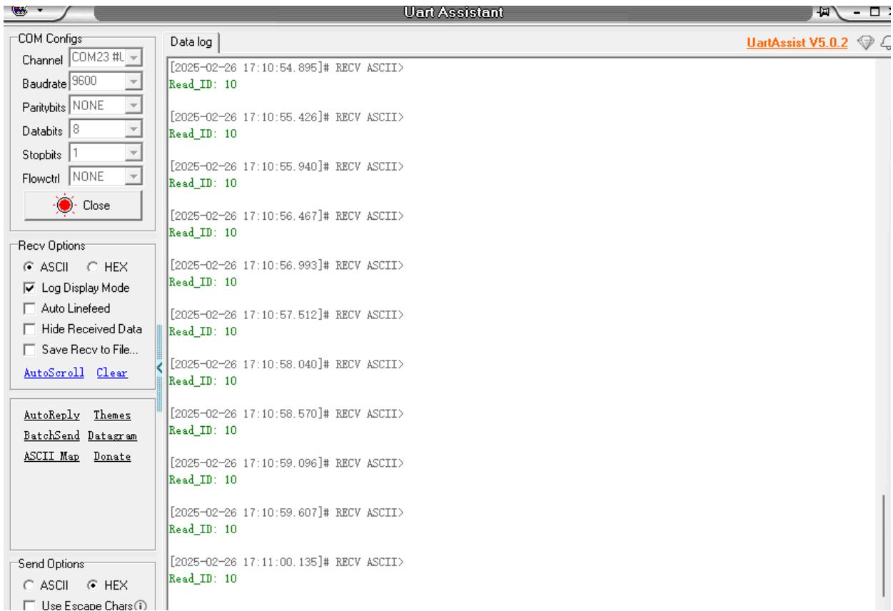

注意：语音交互模块需要烧录出厂固件，语音芯片到手之后没有刷过固件的则不需要

# 1.实验准备

MSPM0G3507Z主板  
语音交互模块   
杜邦线

# 2.接线示意图

<table><tr><td>mspm0g350</td><td>语音交互模块</td></tr><tr><td>PA0</td><td>SCL</td></tr><tr><td>PA1</td><td>SDA</td></tr><tr><td>GND</td><td>GND</td></tr><tr><td>5V</td><td>5V</td></tr></table>

下图是新版本的模块的语音交互模块，需要根据引脚线序来接线，不能根据颜色进行接线



<details>
<summary>text_image</summary>

5V GND TX RX
RX1 TX1 GND 5V
GND SDA SCL 5V
</details>

下图是旧版本的接线，根据引脚线序接线



<details>
<summary>text_image</summary>

5V GND TX RX
RX1 TX GND 5V SDA SCL GND 5V
S3V GND 5V A13 A12 B09 B08 B07 B06 A09 A08 B03 B02 A07 A02 A31 RST A28 A01 A00
+5V A14 A15 A16 A17 A18 B18 B19 A21 A22 B20 B24 A23 A24 A25 A26 A27 3V3 GND GND
</details>

# 3.程序下载

将mspm0g350使用下载线和电脑进行连接



<details>
<summary>text_image</summary>

Type-C
</details>

打开烧录软件UniFlash 8.8.1.exe，选择对应的型号mspm0g350，之后点击start



<details>
<summary>text_image</summary>

UniFlash
Session
About
Help
Settings
Detected Devices
Status: ● Active - Monitoring for changes...
Setting: Auto
No debug probes/devices detected
New Configuration
Choose Your Device
Category: All | C2000 | mmWave | MSP | PGA | Safety | Tiva | UCD | Wireless | Bootloader | Sitara MCU
mspm0g3501
LP-MSPM0G3507
MS
MSPM0G3505
MS
MSPM0G3506
MS
MSPM0G3507
MS
MSPM0G3507(BOOTLOADER)
LaunchPad
On-Chip
On-Chip
On-Chip
Serial
Choose Your Connection
Start
Edit
</details>

打开附件，选择 自己电脑环境下mspm0g350源码下的Objects文件夹里的hex文件。

Select and Load Images

☑Application Image 2

Available Action(s) - 1 Image Selected

Load Image

Note: Please power cycle your device before loading images

点击Browse



<details>
<summary>text_image</summary>

4.MSPM0G3507通信源码 > IIC > 10_I2C > keil > Objects
在 Objects 中
名称	修改日期	类型	大小
IIC.hex	2025/2/20 19:41	HEX 文件	13 KB
</details>

往下拉能看到选择对应的端口号，波特率选择自己设置的，这里是9600.



<details>
<summary>text_image</summary>

Quick Settings | Remove All
Note: Example - COM1 (Windows), /dev/ttyACM0 (Linux), /dev/tty.usbmodem1411 (OS X)
COM Port: COM25
Note: Only UART Communication Support is available. Communication bridge for UART is only supported by XDS Application UART or XDS 110 Probe
UART Speed:
4800
9600
19200
38400
57600
115200
</details>

长按BSL按键，之后短按RST按键一秒，两个按键松开，之后点击Load Image即可烧录固件

Select and Load Images

Flash Image(s)

☑ Application Image 2IIc.hex

Available Action(s) - 1 Image Selected

Load Image

Note: Please power cycle your device before loading images

出现下图表示程序正常写入，不用在意警告



<details>
<summary>text_image</summary>

Error!
Image loading failed: Try manual Bootloader Invocation...
Flash Image
Password
Application
✓ Application
Programming Progress:
Cancel
Size: 12.29 KB
Application Image 3
Available Action(s) - 1 Image Selected
Load Image
Note: Please power cycle your device before loading images
Quick Settings | Remove All
[INFO] CORTEX_MOP: Programming Speed: 0x92E1876/0
[INFO] CORTEX_MOP: CRC check at 0x0 does not match. expected value: 0x448D4AA9 obtained from BSL: 0x97F02E53
[INFO] CORTEX_MOP: [80][09][00][26][00][00][00][00][68][11][00][00][D3][06][6B][0B]
[INFO] CORTEX_MOP: {00}{08} {05} {00} {32} {53} {2E} {F0} {97} {F8} {CF} {80} {73}
[INFO] CORTEX_MOP: Verifying memory time elapsed: 0.03317s
[INFO] CORTEX_MOP: System Reset Issued!!!
[INFO] CORTEX_MOP: System reset is executed!
[INFO] CORTEX_MOP: [80][01][00][40][E2][51][21][5B]
</details>

听到语音模块播报“初始化完成”，表示程序成功写入。

# 4.实现效果

可以通过修改程序中得代码来选择播报播报内容如下图

```c
//播报词 Active broadcast content
#define This_red 0x5F
#define This_blue 0x60
#define This_green 0x61
#define This_yellow 0x62
#define Recognize_yellow 0x63
#define Recognize_green 0x64
#define Recognize_blue 0x65
#define Recognize_red 0x66
#define init 0x67

int main(void)
{
    //开发板初始化 Development board initialization
    board_init();
    SYSCFG_DL_init();
    set_voice(init);
    delay_ms(500);
    printf("Initialization Data Succeed \r\n");
    while(1) 
```

播报的内容可以根据附件提供的命令词播报词协议列表V3\_中文文件查看协议，

其中第一第二个字节AA FF表示的是协议的帧头，第三个字节FF表示的是播报功能，第四个就是播报内容的ID，这里能看到“初始化完成”是16进制的67，所以程序里给寄存器0x03发送0x67即可播报对应内容。第五个字节是结束帧。

<table><tr><td>84</td><td>这是红色</td><td>命令词</td><td>这是红色</td><td>被</td><td colspan="2">AA 55 FF 5F FB</td><td>AA 55 FF 5F FB</td></tr><tr><td>85</td><td>这是蓝色</td><td>命令词</td><td>这是蓝色</td><td>被</td><td colspan="2">AA 55 FF 60 FB</td><td>AA 55 FF 60 FB</td></tr><tr><td>86</td><td>这是绿色</td><td>命令词</td><td>这是绿色</td><td>被</td><td colspan="2">AA 55 FF 61 FB</td><td>AA 55 FF 61 FB</td></tr><tr><td>87</td><td>这是黄色</td><td>命令词</td><td>这是黄色</td><td>被</td><td colspan="2">AA 55 FF 62 FB</td><td>AA 55 FF 62 FB</td></tr><tr><td>88</td><td>识别到黄色</td><td>命令词</td><td>识别到黄色</td><td>被</td><td colspan="2">AA 55 FF 63 FB</td><td>AA 55 FF 63 FB</td></tr><tr><td>89</td><td>识别到绿色</td><td>命令词</td><td>识别到绿色</td><td>被</td><td colspan="2">AA 55 FF 64 FB</td><td>AA 55 FF 64 FB</td></tr><tr><td>90</td><td>识别到蓝色</td><td>命令词</td><td>识别到蓝色</td><td>被</td><td colspan="2">AA 55 FF 65 FB</td><td>AA 55 FF 65 FB</td></tr><tr><td>91</td><td>识别到红色</td><td>命令词</td><td>识别到红色</td><td>被</td><td colspan="2">AA 55 FF 66 FB</td><td>AA 55 FF 66 FB</td></tr><tr><td>92</td><td>初始化完成</td><td>命令词</td><td>初始化完成</td><td>被</td><td colspan="2">AA 55 FF 67 FB</td><td>AA 55 FF 67 FB</td></tr></table>

打开附件提供的串口调试助手，选择好对应的端口，以及波特率为9600



<details>
<summary>text_image</summary>

COM Configs
Channel AL CH340
Baudrate 9600
Paritybits NONE
Databits 8
Stopbits 1
Flowctrl NONE
Open
</details>

点击open打开能看到终端会打印接收到的命令词ID



<details>
<summary>text_image</summary>

Uart Assistant
COM Configs
Channel COM23 #
Baudrate 9600
Paritybits NONE
Databits 8
Stopbits 1
Flowctrl NONE
Close
Data log
[2025-02-26 17:10:33.448]# RECV ASCII>
Read_ID: 0
[2025-02-26 17:10:33.976]# RECV ASCII>
Read_ID: 0
[2025-02-26 17:10:34.503]# RECV ASCII>
Read_ID: 0
[2025-02-26 17:10:35.016]# RECV ASCII>
Read_ID: 0
[2025-02-26 17:10:35.541]# RECV ASCII>
Read_ID: 0
[2025-02-26 17:10:36.068]# RECV ASCII>
Read_ID: 0
[2025-02-26 17:10:36.595]# RECV ASCII>
Read_ID: 0
[2025-02-26 17:10:37.108]# RECV ASCII>
Read_ID: 0
[2025-02-26 17:10:37.637]# RECV ASCII>
Read_ID: 0
[2025-02-26 17:10:38.164]# RECV ASCII>
Read_ID: 0
[2025-02-26 17:10:38.679]# RECV ASCII>
Read_ID: 0
Recv Options
ASCII HEX
Log Display Mode
Auto Linefeed
Hide Received Data
Save Recv to File...
AutoScroll Clear
AutoReply Themes
BatchSend Datagram
ASCII Map Donate
Send Options
ASCII HEX
Use Escape Chars①
</details>

当我说出唤醒词唤醒之后，说“关灯”调试助手会回复接收ID：10



<details>
<summary>text_image</summary>

Uart Assistant
COM Configs
Channel COM23 #L
Baudrate 9600
Paritybits NONE
Databits 8
Stopbits 1
Flowctrl NONE
Close
Data log
[2025-02-26 17:10:54.895]# RECV ASCII>
Read_ID: 10
[2025-02-26 17:10:55.426]# RECV ASCII>
Read_ID: 10
[2025-02-26 17:10:55.940]# RECV ASCII>
Read_ID: 10
[2025-02-26 17:10:56.467]# RECV ASCII>
Read_ID: 10
[2025-02-26 17:10:56.993]# RECV ASCII>
Read_ID: 10
[2025-02-26 17:10:57.512]# RECV ASCII>
Read_ID: 10
[2025-02-26 17:10:58.040]# RECV ASCII>
Read_ID: 10
[2025-02-26 17:10:58.570]# RECV ASCII>
Read_ID: 10
[2025-02-26 17:10:59.096]# RECV ASCII>
Read_ID: 10
[2025-02-26 17:10:59.607]# RECV ASCII>
Read_ID: 10
[2025-02-26 17:11:00.135]# RECV ASCII>
Read_ID: 10
Recv Options
ASCII HEX
Log Display Mode
Auto Linefeed
Hide Received Data
Save Recv to File...
AutoScroll Clear
AutoReply Themes
BatchSend Datagram
ASCII Map Donate
Send Options
ASCII HEX
Use Escape Chars
</details>

这时候可以打开附件的命令词播报词协议列表V3\_中文文件查看“关灯”的协议

<table><tr><td>20</td><td>关灯</td><td>命令词</td><td>好的,已关灯</td><td>主</td><td>AA 55 00 0A FB</td><td>AA 55 00 0A FB</td></tr><tr><td>21</td><td>亮红灯</td><td>命令词</td><td>好的,已亮红灯</td><td>主</td><td>AA 55 00 0B FB</td><td>AA 55 00 0B FB</td></tr></table>

其中第一第二个字节AA FF表示的是协议的帧头，第三个字节表示的是芯片的十个功能词的ID，第四个就是命令词的ID，这里能看到“关灯”是16进制的0A，所以十进制会返回10。第五个字节是结束帧。

说其他的命令词，串口调试助手也会打印相对应得命令词ID，可以自行尝试