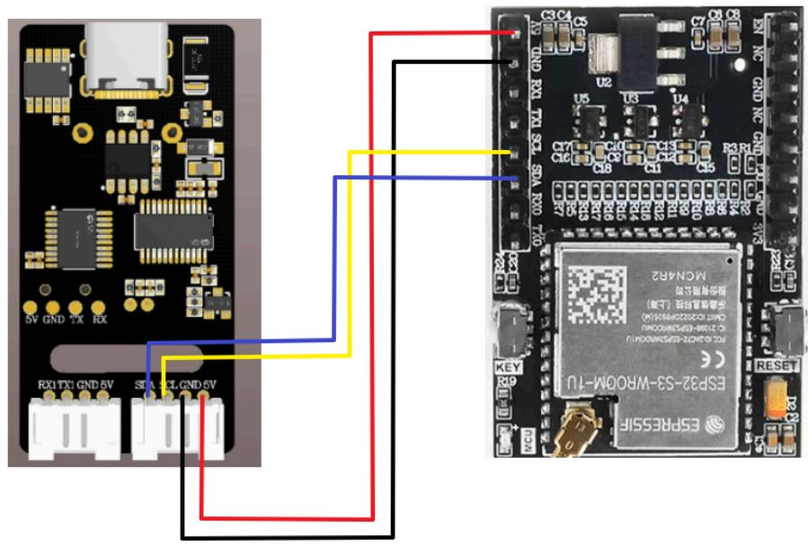
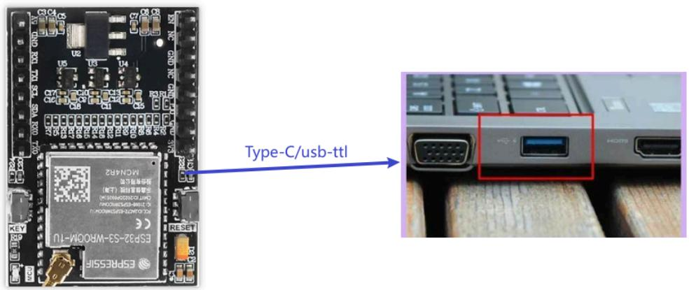
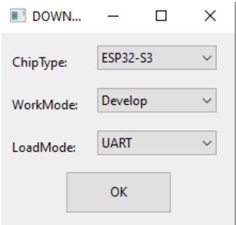
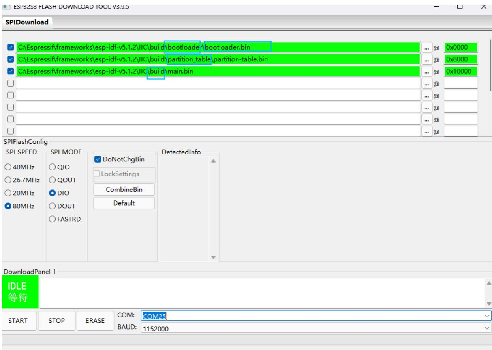
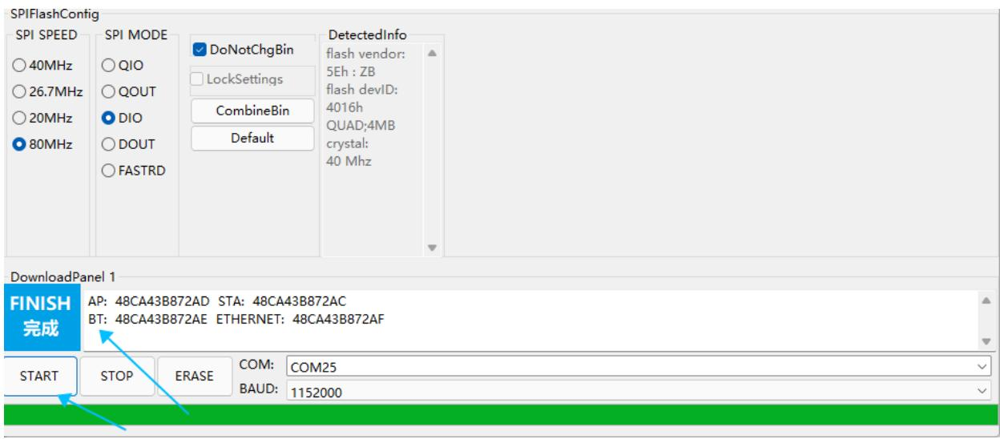
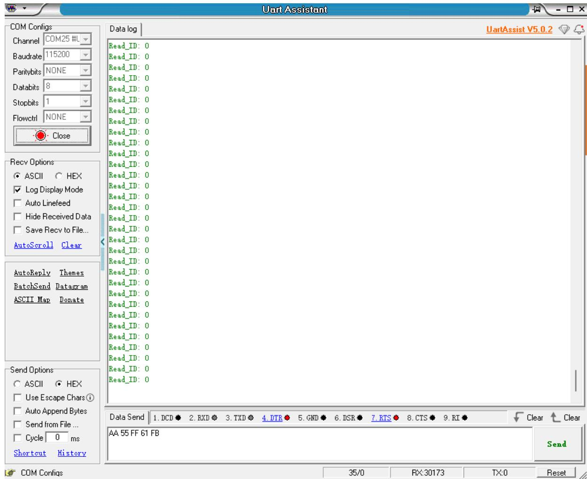
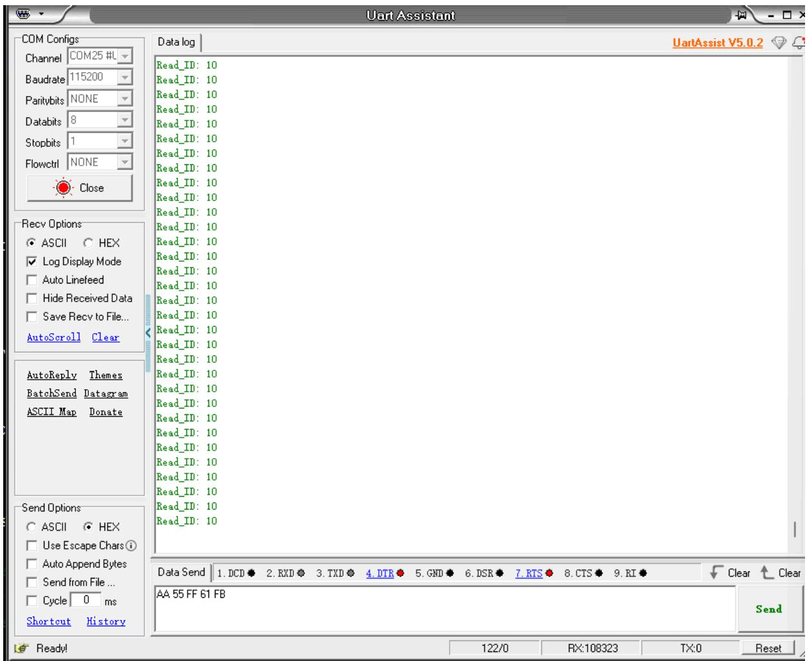

注意：语音交互模块需要烧录出厂固件，语音芯片到手之后没有刷过固件的则不需要

# 1.实验准备

ESP32主板  
语音交互模块   
杜邦线

# 2.接线示意图

<table><tr><td>ESP32</td><td>语音交互模块</td></tr><tr><td>38</td><td>SDA</td></tr><tr><td>37</td><td>SCL</td></tr><tr><td>GND</td><td>GND</td></tr><tr><td>5V</td><td>5V</td></tr></table>

注意：

下图是新版本的模块的语音交互模块，需要根据引脚线序来接线，不能根据颜色进行接线


<details>
<summary>text_image</summary>

5V GND TX RX
RX1 TX1 GND 5V
GND SDASCL 5V
</details>

下图是旧版本的接线，根据引脚线序接线



<details>
<summary>text_image</summary>

ESR2-53-WROM-IU
MCN4R2
RS107100-685258WRO0001J
NCM107100-685258WRO0001J
RS107100-685258WRO0001J
RS107100-685258WRO0001J
RS107100-685258WRO0001J
RS107100-685258WRO0001J
RS107100-6852L GND-5V
RS107100-6852L GND-5V
RS107100-6852L GND-5V
RS107100-6852L GND-5V
RS107100-6852L GND-5V
RS107100-6852L GND-5V
RS10TCKGND-5V
RS10TCKGND-5V
RS10TCKGND-5V
RS10TCKGND-5V
RS10TCKGND-5V
RS10TCKGND-5V
RS10TCKGND-5V
RS10TCKGND-5V
RS10TCKGND-5V
RS10TCKGUND-5V
RS10TCKGUND-5V
RS10TCKGUND-5V
RS10TCKGUND-5V
RS10TCKGUND-5V
RS10TCKGUND-5V
RS10TCKGUND-5V
RS10TCKGUND-5V
RS10TCKGUND-5V
RS10TCKGUND -5V
RS10TCKGUND -5V
RS10TCKGUND -5V
RS10TCKGUND -5V
RS10TCKGUND -5V
RS10TCKGUND -5V
RS10TCKGUND -5V
RS10TCKGUND -5V
RS10TCKGUND -5V
RS10TCKGUND - 5V
RS10TCKGUND - 5V
RS10TCKGUND - 5V
RS10TCKGUND - 5V
RS10TCKGUND - 5V
RS10TCKGUND - 5V
RS10TCKGUND - 5V
RS10TCKGUND - 5V
RS10TCKGUND - 5V
RLX
RLX
RLX
RLX
RLX
RLX
RLX
RLX
RLX
RLX
RLX
RLX
RLX
RLX
RLX
RLX
RLX
RLX
RLX
RLX
RLX
RLX
RLX
RLX
RLX
RLX
RLX
RLX
RLX
RLX
RLX
RLX
RLX
RLX
</details>

# 3.程序下载

将ESP32使用串口模块或者Type-C和电脑进行连接



<details>
<summary>text_image</summary>

ESPR2555IF
MCM4R2
Type-C/usb-ttl
ESPR25-3A-WROOM-TU
1.00 GB 0.000000000000
1.00 GB 0.000000000000
1.00 GB 0.000000000000
1.00 GB 0.000000000000
1.00 GB 0.000000000000
1.00 GB 0.000000111111111111111111111111111111111111111111111111111111111111111111111111111
ESPR2555IF
MCM4R2
ESPR25-3A-WROOM-TU
KEY
RGP
RESET
</details>

下载Flash工具

下载网址：

https://www.espressif.com.cn/zh-hans/support/download/other-tools

Flash 下载工具

<table><tr><td>标题</td><td>平台</td><td>版本</td><td>发布日期</td><td>下载</td></tr><tr><td>+ Flash 下载工具</td><td>Windows PC</td><td>V3.9.5</td><td>2023年06月12日</td><td></td></tr></table>

解压得到flash\_download\_tool，双击打开。

如下图所示，选择串口烧录ESP32-S3。点击OK打开烧录工具。



<details>
<summary>text_image</summary>

DOWN...
ChipType: ESP32-S3
WorkMode: Develop
LoadMode: UART
OK
</details>

出厂固件烧录

在‘SPIDownload’选择要烧录到ESP32S3的固件，文件与地址对应关系如下表所示，再选择连接的COM口，其他配置保持默认即可。

<table><tr><td>件名称</td><td>固件地址</td><td>备注</td></tr><tr><td>bootloader.bin</td><td>0x0000</td><td>引导文件</td></tr><tr><td>partition-table.bin</td><td>0x8000</td><td>分区表文件</td></tr><tr><td>microROS_Robot.bin</td><td>0x10000</td><td>功能文件</td></tr></table>

选择提供源码的对应文件目录下的bin文件，



<details>
<summary>text_image</summary>

ESP32S3 FLASH DOWNLOAD TOOL V3.9.5
SPIDownload
C:\Espressif\frameworks\esp-idf-v5.1.2\IIC\build\bootloader.\bootloader.bin
C:\Espressif\frameworks\esp-idf-v5.1.2\IIC\build\partition_table\partition-table.bin
C:\Espressif\frameworks\esp-idf-v5.1.2\IIC\build\main.bin
...
...
...
...
...
...
...
...
...
SPIFlashConfig
SPI SPEED
40MHz
26.7MHz
20MHz
80MHz
SPI MODE
QIO
QOUT
DIO
DOUT
FASTRD
DoNotChgBin
LockSettings
CombineBin
Default
DetectedInfo
DownloadPanel 1
IDLE
等待
START STOP ERASE COM: COM25
BAUD: 1152000
</details>

点击Start按钮，工具即自动开始烧录固件。

注：如果没有自动开始烧录固件，请先按住boot0键，再按复位键，松开boot0键，手动进入烧录模式。



<details>
<summary>text_image</summary>

SPIFlashConfig
SPI SPEED
○ 40MHz
○ 26.7MHz
○ 20MHz
● 80MHz
SPI MODE
○ QIO
○ QOUT
● DIO
○ DOUT
○ FASTRD
DoNotChgBin
LockSettings
CombineBin
Default
DetectedInfo
flash vendor:
5Eh : ZB
flash devID:
4016h
QUAD:4MB
crystal:
40 Mhz
DownloadPanel 1
FINISH
完成
AP: 48CA43B872AD STA: 48CA43B872AC
BT: 48CA43B872AE ETHERNET: 48CA43B872AF
START STOP ERASE COM: COM25 BAUD: 1152000
</details>

听到语音模块播报“初始化完成”，表示程序成功写入。

# 4.实现效果

可以通过修改程序中得代码来选择播报播报内容如下图

```c
//播报词 Active broadcast content
#define This_red 0x5F
#define This_blue 0x60
#define This_green 0x61
#define This_yellow 0x62
#define Recognize_yellow 0x63
#define Recognize_green 0x64
#define Recognize_blue 0x65
#define Recognize_red 0x66
#define init 0x67 
```

```c
void app_main(void)
{
    printf("hello yahboom\n");
    I2C_Master_Init();
    I2C_Master_Write_Byte(VoiceADDR,Write_register,init);
    while (1)
    {
    read_camera_data();
    }
} 
```

播报的内容可以根据附件提供的命令词播报词协议列表V3\_中文文件查看协议，

其中第一第二个字节AA FF表示的是协议的帧头，第三个字节FF表示的是播报功能，第四个就是播报内容的ID，这里能看到“初始化完成”是16进制的67，所以程序里给寄存器0x03发送0x67即可播报对应内容。第五个字节是结束帧。

<table><tr><td>84</td><td>这是红色</td><td>命令词</td><td>这是红色</td><td>被</td><td>AA 55 FF 5F FB</td><td>AA 55 FF 5F FB</td></tr><tr><td>85</td><td>这是蓝色</td><td>命令词</td><td>这是蓝色</td><td>被</td><td>AA 55 FF 60 FB</td><td>AA 55 FF 60 FB</td></tr><tr><td>86</td><td>这是绿色</td><td>命令词</td><td>这是绿色</td><td>被</td><td>AA 55 FF 61 FB</td><td>AA 55 FF 61 FB</td></tr><tr><td>87</td><td>这是黄色</td><td>命令词</td><td>这是黄色</td><td>被</td><td>AA 55 FF 62 FB</td><td>AA 55 FF 62 FB</td></tr><tr><td>88</td><td>识别到黄色</td><td>命令词</td><td>识别到黄色</td><td>被</td><td>AA 55 FF 63 FB</td><td>AA 55 FF 63 FB</td></tr><tr><td>89</td><td>识别到绿色</td><td>命令词</td><td>识别到绿色</td><td>被</td><td>AA 55 FF 64 FB</td><td>AA 55 FF 64 FB</td></tr><tr><td>90</td><td>识别到蓝色</td><td>命令词</td><td>识别到蓝色</td><td>被</td><td>AA 55 FF 65 FB</td><td>AA 55 FF 65 FB</td></tr><tr><td>91</td><td>识别到红色</td><td>命令词</td><td>识别到红色</td><td>被</td><td>AA 55 FF 66 FB</td><td>AA 55 FF 66 FB</td></tr><tr><td>92</td><td>初始化完成</td><td>命令词</td><td>初始化完成</td><td>被</td><td>AA 55 FF 67 FB</td><td>AA 55 FF 67 FB</td></tr></table>

打开附件提供的串口调试助手，选择好对应的端口，以及波特率为115200，能看到终端会打印接收到的命令词ID



<details>
<summary>text_image</summary>

Uart Assistant
COM Configs
Channel COM25 #L
Baudrate 115200
Paritybits NONE
Databits 8
Stopbits 1
Flowctrl NONE
Close
Data log
UartAssist V5.0.2
Read_ID: 0
Read_ID: 0
Read_ID: 0
Read_ID: 0
Read_ID: 0
Read_ID: 0
Read_ID: 0
Read_ID: 0
Read_ID: 0
Read_ID: 0
Read_ID: 0
Read_ID: 0
Read_ID: 0
Read_ID: 0
Read_ID: 0
Read_ID: 0
Read_ID: 0
Read_ID:
AutoScroll Clear
Recv Options
ASCII HEX
Log Display Mode
Auto Linefeed
Hide Received Data
Save Recv to File...
AutoReply Themes
BatchSend Datagram
ASCII Map Donate
Send Options
ASCII HEX
Use Escape Chars i
Auto Append Bytes
Send from File ...
Cycle 0 ms
Shortcut History
Data Send 1.DCD 2.RXD 3.TXD 4.DTR 5.GND 6.DSR 7.RTS 8.CTS 9.RI
AA 55 FF 61 FB
Send
COM Configs
35/0 RX:30173 TX:0 Reset
</details>

当我说出唤醒词唤醒之后，说“关灯”调试助手会回复接收ID：10



<details>
<summary>text_image</summary>

Uart Assistant
COM Configs
Channel COM25 #L
Baudrate 115200
Paritybits NONE
Databits 8
Stopbits 1
Flowctrl NONE
Close
Data log
Read_ID: 10
Read_ID: 10
Read_ID: 10
Read_ID: 10
Read_ID: 10
Read_ID: 10
Read_ID: 10
Read_ID: 10
Read_ID: 10
Read_ID: 10
Read_ID: 10
Read_ID: 10
Read_ID: 10
Read_ID: 10
Read_ID: 10
AutoScroll Clear
Recv Options
ASCII HEX
Log Display Mode
Auto Linefeed
Hide Received Data
Save Recv to File...
AutoReply Themes
BatchSend Datagram
ASCII Map Donate
Send Options
ASCII HEX
Use Escape Chars①
Auto Append Bytes
Send from File ...
Cycle 0 ms
Shortcut History
Data Send 1. DCD 2. RXD 3. TXD 4. DTR 5. GND 6. DSR 7. RTS 8. CTS 9. RI 
AA 55 FF 61 FB
Send
122/0 RX:108323 TX:0 Reset
</details>

这时候可以打开附件的命令词播报词协议列表V3\_中文文件查看“关灯”的协议

<table><tr><td>20</td><td>关灯</td><td>命令词</td><td>好的,已关灯</td><td>主</td><td>AA 55 00 0A FB</td><td>AA 55 00 0A FB</td></tr><tr><td>21</td><td>亮红灯</td><td>命令词</td><td>好的,已亮红灯</td><td>主</td><td>AA 55 00 0B FB</td><td>AA 55 00 0B FB</td></tr></table>

其中第一第二个字节AA FF表示的是协议的帧头，第三个字节表示的是芯片的十个功能词的ID，第四个就是命令词的ID，这里能看到“关灯”是16进制的0A，所以十进制会返回10。第五个字节是结束帧。

说其他的命令词，串口调试助手也会打印相对应得命令词ID，可以自行尝试