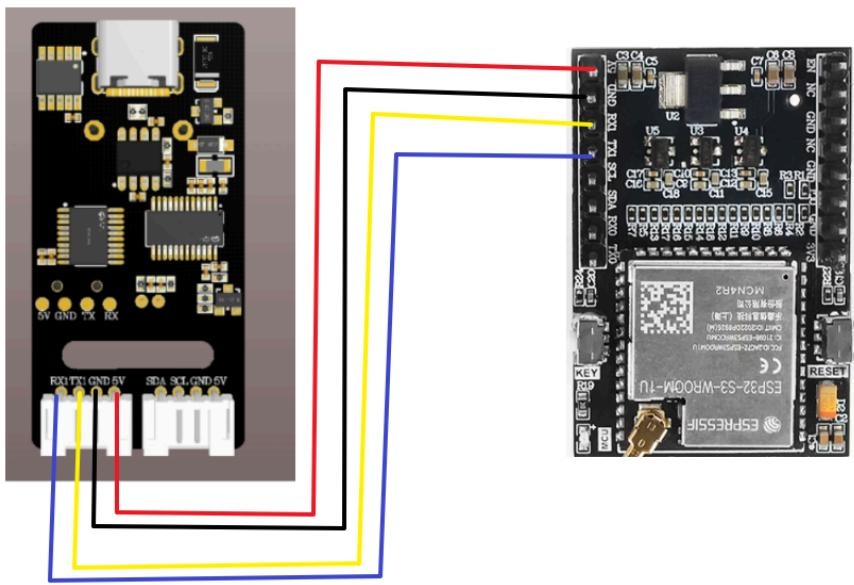
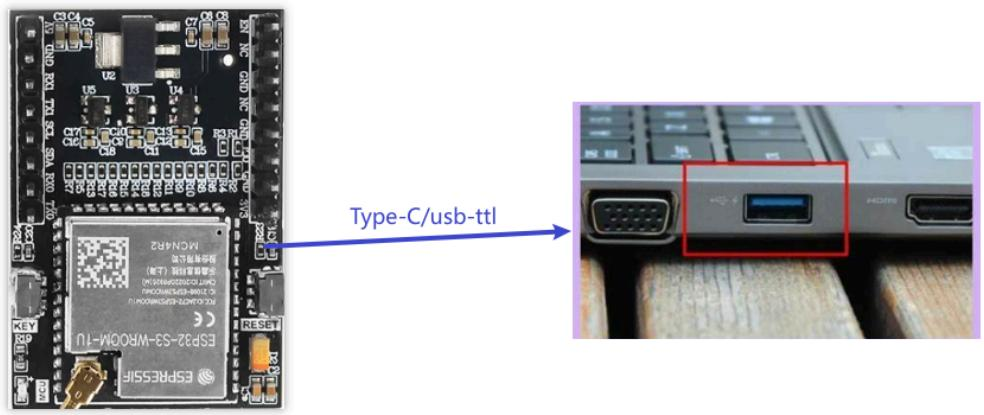
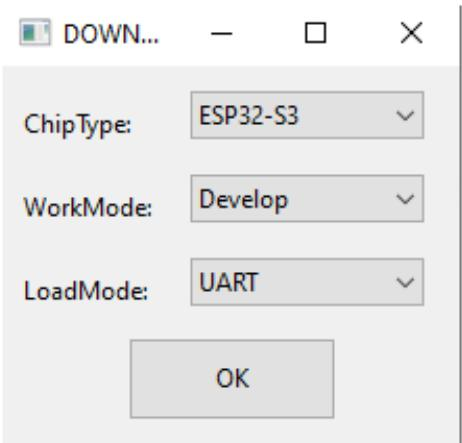
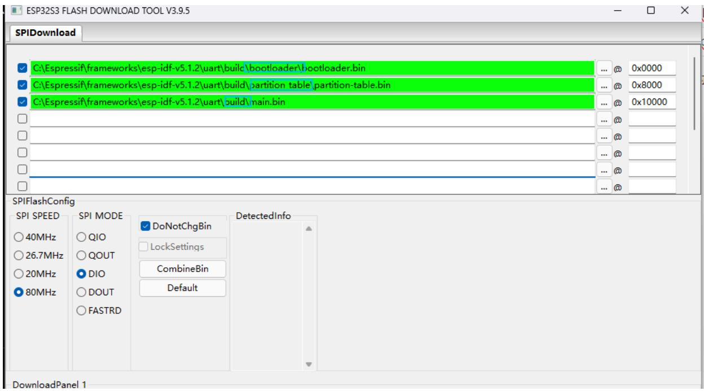
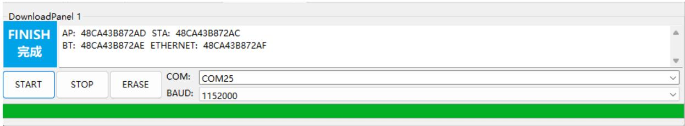
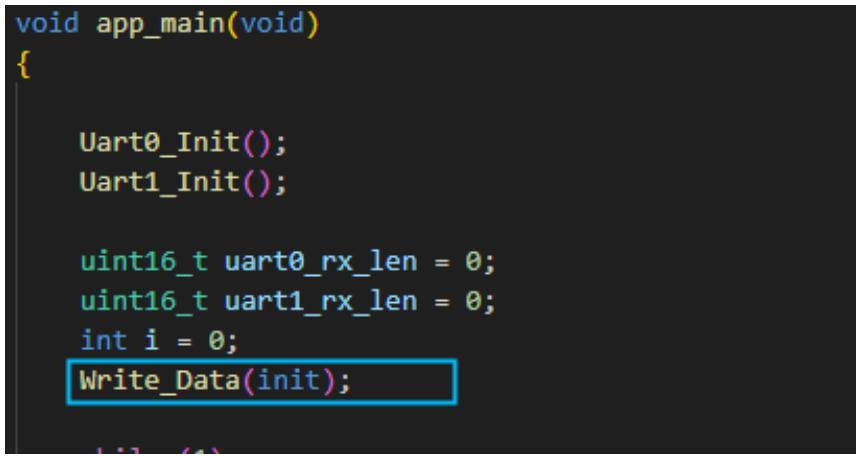
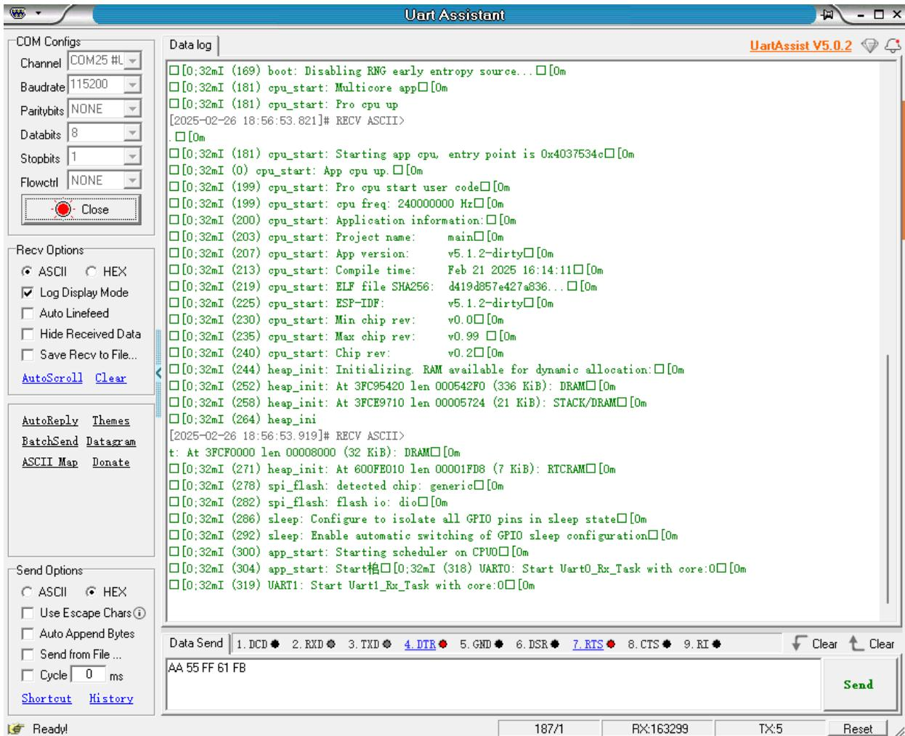
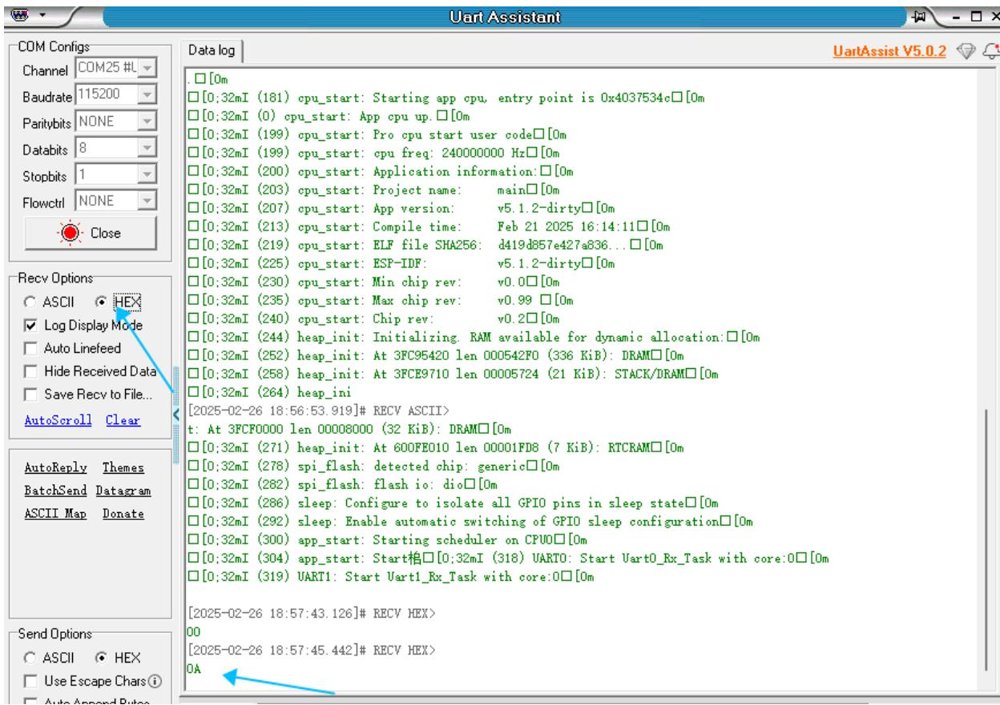

注意：语音交互模块需要烧录出厂固件，语音芯片到手之后没有刷过固件的则不需要

# 1.实验准备

ESP32主板  
语音交互模块   
杜邦线

# 2.接线示意图

<table><tr><td>ESP32</td><td>语音交互模块</td></tr><tr><td>35</td><td>RX</td></tr><tr><td>36</td><td>TX</td></tr><tr><td>GND</td><td>GND</td></tr><tr><td>5V</td><td>5V</td></tr></table>



<details>
<summary>text_image</summary>

5V GND 5V RX
RXUTX GND 5V SPA SCL GND 5V
ESPRESSI4
ESPR2-53-WROOM-1U
MGN482
ONAMOSSEMICON (LED)
GND 500-600-600-600-600-600-600-600-600-600-600-600-600-600-600-600-600-600-600-600-600-600-600-600-600-600-719
RESET
KEY
OK
OK
OK
OK
OK
OK
OK
OK
OK
OK
OK
OK
OK
OK
OK
OK
OK
OK
OK
OK
OK
OK
OK
OK
OK
OK
OK
OK
OK
OK
OK
OK
OK
OK
OK
OK
OK
OK
OK
OK
OK
OK
OK
OK
OK
OK
OK
OK
OK
OK
ONAMOSSEMICON (LED)
GND 500-600-600-600-600-600-600-600-600-600-600-600-600-600-600-600-600-600-619
EN NC GND NC GND NC GND NC GND NC GND NC GND NC GND NC GND NC GND NC GND NC GND NC GND NC GND NC GND NC GND NC GND NC GND NC GND NC GND NC GND NC GND NC GND NC GND NC GND NC GND NC GND NC GND NC GND NC GND NC GND NC GND NC GND NC GND NC GND NCKA2
</details>

# 3.程序下载

将ESP32使用串口模块或者Type-C和电脑进行连接



<details>
<summary>text_image</summary>

ESPP2-3S-WROOM-IU
MCN4R2
Type-C/usb-ttl
ESPP2-3S-WROOM-IU
MCN4R2
ESPP2-3S-WROOM-IU
MCN4R2
ESPP2-3S-WROOM-IU
MCN4R2
ESPP2-3S-WROOM-IU
MCN4R2
ESPP2-3S-WROOM-IU
MCN4R2
ESPP2-3S-WROOM-IU
MCN4R2
ESPP2-3S-WROOM-IU
MCN5R2
ESPP2-3S-WROOM-IU
MCN5R2
ESPP2-3S-WROOM-IU
MCN5R2
ESPP2-3S-WROOM-IU
MCN5R2
ESPP2-3S-WROOM-IU
MCN5R2
ESPP2-3S-WROOM-IU
MCN5R2
ESPP2-3S-WROOM-IU
HC100 0000000000000000000000000000000000000000000000000000000000000000000000000000000000000000000000000000
</details>

下载Flash工具

下载网址：

https://www.espressif.com.cn/zh-hans/support/download/other-tools

Flash下载工具

<table><tr><td>标题</td><td>平台</td><td>版本</td><td>发布日期</td><td>下载</td></tr><tr><td>+ Flash 下载工具</td><td>Windows PC</td><td>V3.9.5</td><td>2023年06月12日</td><td></td></tr></table>

解压得到flash\_download\_tool，双击打开。

如下图所示，选择串口烧录ESP32-S3。点击OK打开烧录工具。



<details>
<summary>text_image</summary>

DOWN...
ChipType: ESP32-S3
WorkMode: Develop
LoadMode: UART
OK
</details>

出厂固件烧录

在‘SPIDownload’选择要烧录到ESP32S3的固件，文件与地址对应关系如下表所示，再选择连接的COM口，其他配置保持默认即可。

<table><tr><td>件名称</td><td>固件地址</td><td>备注</td></tr><tr><td>bootloader.bin</td><td>0x0000</td><td>引导文件</td></tr><tr><td>partition-table.bin</td><td>0x8000</td><td>分区表文件</td></tr><tr><td>microROS_Robot.bin</td><td>0x10000</td><td>功能文件</td></tr></table>

选择提供源码的对应文件目录下的bin文件，



<details>
<summary>text_image</summary>

ESP32S3 FLASH DOWNLOAD TOOL V3.9.5
SPIDownload
✓ C:\Espressif\frameworks\esp-idf-v5.1.2\uart\build\bootloader\bootloader.bin
... @ 0x0000
✓ C:\Espressif\frameworks\esp-idf-v5.1.2\uart\build\partition_table\partition-table.bin
... @ 0x8000
✓ C:\Espressif\frameworks\esp-idf-v5.1.2\uart\build\main.bin
... @ 0x10000
...
...
...
...
...
...
...
...
SPIFlashConfig
SPI SPEED
40MHz
26.7MHz
20MHz
80MHz
SPI MODE
QIO
QOUT
DIO
DOUT
FASTRD
DetectedInfo
DoNotChgBin
LockSettings
CombineBin
Default
DownloadPanel 1
</details>

选择对应的端口，点击Start按钮，工具即自动开始烧录固件。

注：如果没有自动开始烧录固件，请先按住boot0键，再按复位键，松开boot0键，手动进入烧录模式。



<details>
<summary>text_image</summary>

DownloadPanel 1
FINISH
完成
AP: 48CA43B872AD STA: 48CA43B872AC
BT: 48CA43B872AE ETHERNET: 48CA43B872AF
START STOP ERASE COM: COM25
BAUD: 1152000
</details>

听到语音模块播报“初始化完成”，表示程序成功写入。

# 4.实现效果

可以通过修改程序中得代码来选择播报播报内容如下图

```c
//播报词 Active broadcast content
#define This_red 0x5F
#define This_blue 0x60
#define This_green 0x61
#define This_yellow 0x62
#define Recognize_yellow 0x63
#define Recognize_green 0x64
#define Recognize_blue 0x65
#define Recognize_red 0x66
#define init 0x67 
```



<details>
<summary>text_image</summary>

void app_main(void)
{
    Uart0_Init();
    Uart1_Init();

    uint16_t uart0_rx_len = 0;
    uint16_t uart1_rx_len = 0;
    int i = 0;
    Write_Data(init);
}
</details>

播报的内容可以根据附件提供的命令词播报词协议列表V3\_中文文件查看协议，

其中第一第二个字节AA FF表示的是协议的帧头，第三个字节FF表示的是播报功能，第四个就是播报内容的ID，这里能看到“初始化完成”是16进制的67，所以程序里给寄存器0x03发送0x67即可播报对应内容。第五个字节是结束帧。

<table><tr><td>84</td><td>这是红色</td><td>命令词</td><td>这是红色</td><td>被</td><td colspan="2">AA 55 FF 5F FB</td><td>AA 55 FF 5F FB</td></tr><tr><td>85</td><td>这是蓝色</td><td>命令词</td><td>这是蓝色</td><td>被</td><td colspan="2">AA 55 FF 60 FB</td><td>AA 55 FF 60 FB</td></tr><tr><td>86</td><td>这是绿色</td><td>命令词</td><td>这是绿色</td><td>被</td><td colspan="2">AA 55 FF 61 FB</td><td>AA 55 FF 61 FB</td></tr><tr><td>87</td><td>这是黄色</td><td>命令词</td><td>这是黄色</td><td>被</td><td colspan="2">AA 55 FF 62 FB</td><td>AA 55 FF 62 FB</td></tr><tr><td>88</td><td>识别到黄色</td><td>命令词</td><td>识别到黄色</td><td>被</td><td colspan="2">AA 55 FF 63 FB</td><td>AA 55 FF 63 FB</td></tr><tr><td>89</td><td>识别到绿色</td><td>命令词</td><td>识别到绿色</td><td>被</td><td colspan="2">AA 55 FF 64 FB</td><td>AA 55 FF 64 FB</td></tr><tr><td>90</td><td>识别到蓝色</td><td>命令词</td><td>识别到蓝色</td><td>被</td><td colspan="2">AA 55 FF 65 FB</td><td>AA 55 FF 65 FB</td></tr><tr><td>91</td><td>识别到红色</td><td>命令词</td><td>识别到红色</td><td>被</td><td colspan="2">AA 55 FF 66 FB</td><td>AA 55 FF 66 FB</td></tr><tr><td>92</td><td>初始化完成</td><td>命令词</td><td>初始化完成</td><td>被</td><td colspan="2">AA 55 FF 67 FB</td><td>AA 55 FF 67 FB</td></tr></table>

打开附件提供的串口调试助手，选择好对应的端口，以及波特率为115200，能看到终端会打印的log信息



<details>
<summary>text_image</summary>

Uart Assist V5.0.2
COM Configs
Channel COM25 #
Baudrate 115200
Paritybits NONE
Databits 8
Stopbits 1
Flowctrl NONE
Close
Data log
[0;32mI (169) boot: Disabling RNG early entropy source...□[0m
[0;32mI (181) cpu_start: Multicore app□[0m
[0;32mI (181) cpu_start: Pro cpu up
[2025-02-26 18:56:53.821]# RECV ASCII>
□[0m
[0;32mI (181) cpu_start: Starting app cpu, entry point is 0x4037534c□[0m
[0;32mI (0) cpu_start: App cpu up.□[0m
[0;32mI (199) cpu_start: Pro cpu start user code□[0m
[0;32mI (199) cpu_start: cpu freq: 240000000 Hz□[0m
[0;32mI (200) cpu_start: Application information:□[0m
[0;32mI (203) cpu_start: Project name: main□[0m
[0;32mI (207) cpu_start: App version: v5.1.2-dirty□[0m
[0;32mI (213) cpu_start: Compile time: Feb 21 2025 16:14:11□[0m
[0;32mI (219) cpu_start: ELF file SHA256: d419d857e427a836...□[0m
[0;32mI (225) cpu_start: ESP-IDF: v5.1.2-dirty□[0m
[0;32mI (230) cpu_start: Min chip rev: v0.0□[0m
[0;32mI (235) cpu_start: Max chip rev: v0.99 □[0m
[0;32mI (240) cpu_start: Chip rev: v0.2□[0m
[0;32mI (244) heap_init: Initializing. RAM available for dynamic allocation:□[0m
[0;32mI (252) heap_init: At 3FC95420 len 000542F0 (336 KiB): DRAM□[0m
[0;32mI (258) heap_init: At 3FCE9710 len 00005724 (21 KiB): STACK/DRAM□[0m
[0;32mI (264) heap_ini
[2025-02-26 18:56:53.919]# RECV ASCII>
t: At 3FCF0000 len 00008000 (32 KiB): DRAM□[0m
[0;32mI (271) heap_init: At 600FEO10 len 00001FD8 (7 KiB): RTCRAM□[0m
[0;32mI (278) spi_flash: detected chip: generic□[0m
[0;32mI (282) spi_flash: flash io: dio□[0m
[0;32mI (286) sleep: Configure to isolate all GPIO pins in sleep state□[0m
[0;32mI (292) sleep: Enable automatic switching of GPIO sleep configuration□[0m
[0;32mI (300) app_start: Starting scheduler on CPUo□[0m
[0;32mI (304) app_start: Start格□[0;32mI (318) UARTO: Start VartO_Rx_Task with core:○□[0m
[0;32mI (319) UART1: Start Vart1_Rx_Task with core:○□[0m
Send Options
ASCII HEX
Use Escape Chars i
Auto Append Bytes
Send from File ...
Cycle 0 ms
Shortcut History
Data Send 1.DCD 2.RXD 3.TXD 4.DTR 5.GND 6.DSR 7.RTS 8.CTS 9.RI 
AA 55 FF 61 FB
Send
Ready!
187/1 RX:163299 TX:5 Reset
</details>

将接收切换成16进制模式，我说出唤醒词唤醒之后，说“关灯”调试助手会回复0A



<details>
<summary>text_image</summary>

Uart Assistant
COM Configs
Channel COM25 #L
Baudrate 115200
Paritybits NONE
Databits 8
Stopbits 1
Flowctrl NONE
Close
Data log
UartAssist V5.0.2
□ [Om]
□ [0:32mI (181) cpu_start: Starting app cpu, entry point is 0x4037534c□[Om]
□ [0:32mI (0) cpu_start: App cpu up. □[Om]
□ [0:32mI (199) cpu_start: Pro cpu start user code□[Om]
□ [0:32mI (199) cpu_start: cpu freq: 240000000 Hz□[Om]
□ [0:32mI (200) cpu_start: Application information: □[Om]
□ [0:32mI (203) cpu_start: Project name: main□[Om]
□ [0:32mI (207) cpu_start: App version: v5.1.2-dirty□[Om]
□ [0:32mI (213) cpu_start: Compile time: Feb 21 2025 16:14:11□[Om]
□ [0:32mI (219) cpu_start: ELF file SHA256: d419d857e427a836...□[Om]
□ [0:32mI (225) cpu_start: ESP-IDF: v5.1.2-dirty□[Om]
□ [0:32mI (230) cpu_start: Min chip rev: v0.0□[Om]
□ [0:32mI (235) cpu_start: Max chip rev: v0.99 □[Om]
□ [0:32mI (240) cpu_start: Chip rev: v0.2□[Om]
□ [0:32mI (244) heap_init: Initializing RAM available for dynamic allocation: □[Om]
□ [0:32mI (252) heap_init: At 3FC95420 len 000542F0 (336 KiB): DRAM□[Om]
□ [0:32mI (258) heap_init: At 3FCE9710 len 00005724 (21 KiB): STACK/DRAM□[Om]
□ [0:32mI (264) heap_ini
[2025-02-26 18:56:53.919]# RECV ASCII>
t: At 3FCF0000 len 00008000 (32 KiB): DRAM□[Om]
□ [0:32mI (271) heap_init: At 600FEO10 len 00001FD8 (7 KiB): RTCRAM□[Om]
□ [0:32mI (278) spi_flash: detected chip: generic□[Om]
□ [0:32mI (282) spi_flash: flash io: dio□[Om]
□ [0:32mI (286) sleep: Configure to isolate all GPIO pins in sleep state□[Om]
□ [0:32mI (292) sleep: Enable automatic switching of GPIO sleep configuration□[Om]
□ [0:32mI (300) app_start: Starting scheduler on CPUO□[Om]
□ [0:32mI (304) app_start: Start相口[0;32mI (318) UARTO: Start VartO_Rx_Task with core:○□[Om]
□ [0:32mI (319) UART1: Start Vart1_Rx_Task with core:○□[Om]
[2025-02-26 18:57:43.126]# RECV HEX>
OO
[2025-02-26 18:57:45.442]# RECV HEX>
OA
Send Options
○ ASCII ● HEX
□ Use Escape Chars i
□ Auto Annoed Bytes
</details>

这时候可以打开附件的命令词播报词协议列表V3\_中文文件查看“关灯”的协议

<table><tr><td>20</td><td>关灯</td><td>命令词</td><td>好的,已关灯</td><td>主</td><td>AA 55 00 0A FB</td><td>AA 55 00 0A FB</td></tr><tr><td>21</td><td>亮红灯</td><td>命令词</td><td>好的,已亮红灯</td><td>主</td><td>AA 55 00 0B FB</td><td>AA 55 00 0B FB</td></tr></table>

其中第一第二个字节AA FF表示的是协议的帧头，第三个字节表示的是芯片的十个功能词的ID，第四个就是命令词的ID，这里能看到“关灯”是16进制的0A，所以十进制会返回10。第五个字节是结束帧。

说其他的命令词，串口调试助手也会打印相对应得命令词ID，可以自行尝试