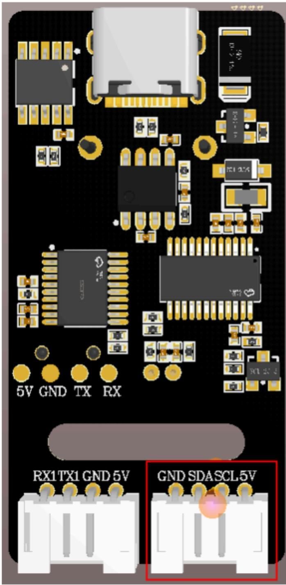
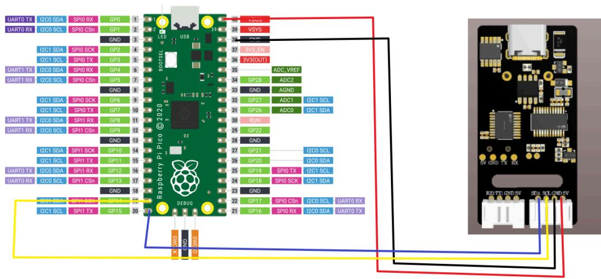
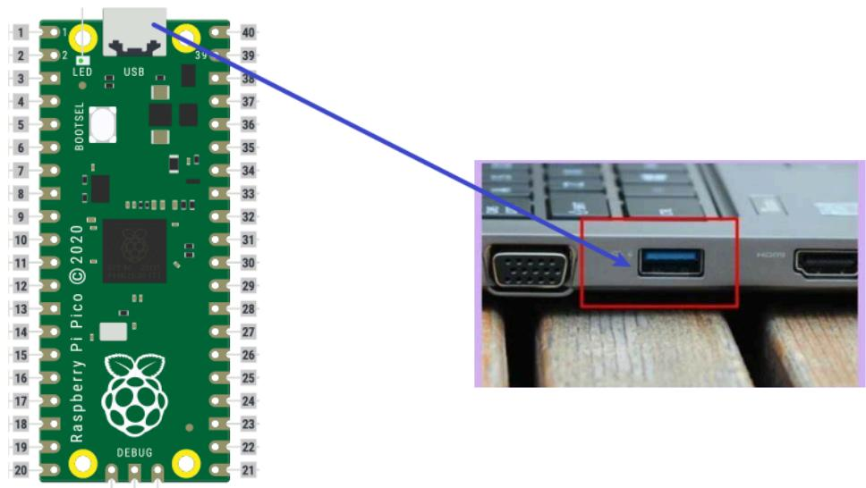
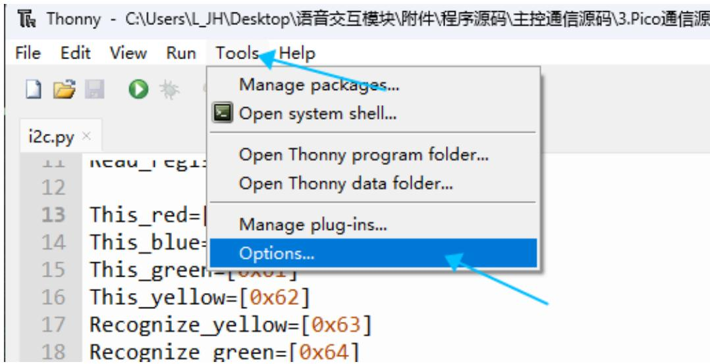
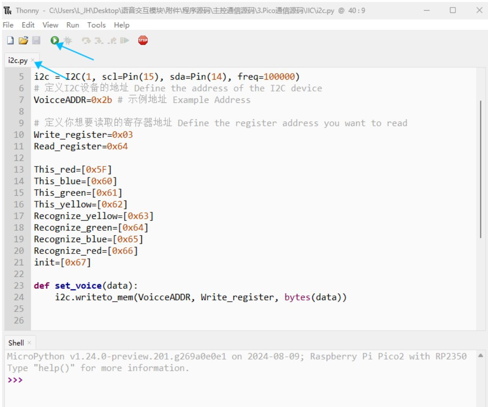

注意：语音交互模块需要烧录出厂固件，语音芯片到手之后没有刷过固件的则不需要

# 1.实验准备

Pico主板  
语音交互模块   
杜邦线

# 2.接线示意图

<table><tr><td>Pico</td><td>语音交互模块</td></tr><tr><td>14</td><td>SDA</td></tr><tr><td>15</td><td>SCL</td></tr><tr><td>GND</td><td>GND</td></tr><tr><td>5V</td><td>5V</td></tr></table>

注意：

下图是新版本的模块的语音交互模块，需要根据引脚线序来接线，不能根据颜色进行接线



<details>
<summary>text_image</summary>

5V GND TX RX
RX1 TX1 GND 5V
GND SDASCL 5V
</details>

下图是旧版本的接线，根据引脚线序接线



<details>
<summary>text_image</summary>

UART0 TX I2C0 SDA SP10 RX GP0 1
UART0 RX I2C0 SCL SP10 CSn GP1 2
I2C1 SDA SP10 SCK GP2 3
I2C1 SCL SP10 TX GP3 4
UART1 TX I2C0 SDA SP10 RX GP4 5
I2C0 SCL SP10 CSn GP5 6
I2C1 SDA SP10 SCK GP6 7
I2C1 SCL SP10 TX GP7 8
UART1 TX I2C0 SDA SP11 RX GP8 9
I2C0 SCL SP11 CSn GP9 10
I2C1 SDA SP11 SCK GP10 11
I2C1 SCL SP11 TX GP11 12
UART0 TX I2C0 SDA SP11 RX GP12 13
I2C0 SCL SP11 CSn GP13 14
I2C1 SDA SP11 SCK GP14 15
I2C1 SCL SP11 TX GP15 16
I2C0 SDA SP11 RX GP16 17
I2C0 SCL SP11 CSn GP17 18
I2C0 SDA SP11 SDN GP18 19
I2C0 SCL SP11 TX GP19 20
Raspberry Pi Pico © 2020
DEBUG
VDDS
VSYS
ADC_VREF
ADC2
AGND
ADC1 I2C1 SCL
ADC0 I2C1 SDA
RUN
GP28 ADC2
GND GND
GP27 ADC3
GP26 ADC4
GP22
GND
GP21 I2C0 SCL
GP20 I2C0 SDA
GP19 SP10 TX I2C1 SCL
GP18 SP10 SCK I2C1 SDA
GP17 SP10 CSn I2C0 SCL UART0 RX
GP16 SP10 RX I2C0 SDA UART0 TX
</details>

# 3.程序下载

将Pico使用Type-C和电脑进行连接



<details>
<summary>text_image</summary>

LED
USB
BOOTSEL
Pi Pico © 2020
Raspberry Pi Pico
DEBUG
40
39
38
37
36
35
34
33
32
31
30
29
28
27
26
25
24
23
22
21
</details>

打开Thonny软件，点击左上角的Tools，选择Options



<details>
<summary>text_image</summary>

Thonny - C:\Users\L_JH\Desktop\语音交互模块\附件\程序源码\主控通信源码\3.Pico通信源
File Edit View Run Tools Help
i2c.py ×
11 New規1: 
12 
13 This_red=
14 This_blue=
15 This_green=[0x61]
16 This_yellow=[0x62]
17 Recognize_yellow=[0x63]
18 Recognize green=[0x64]
Manage packages...
Open system shell...
Open Thonny program folder...
Open Thonny data folder...
Manage plug-ins...
Options...
</details>

选择interpreter，下方的Port选择对应的串行设备，之后点击ok


<details>
<summary>text_image</summary>

Thonny options
General Interpreter Editor Theme & Font Run & Debug Terminal Shell Assistant
Which interpreter or device should Thonny use for running your code?
MicroPython (Raspberry Pi Pico)
Details
Connect your device to the computer and select corresponding port below
(look for your device name, "USB Serial" or "UART").
If you can't find it, you may need to install proper USB driver first.
Port
USB 串行设备 (COM28)
Install or update firmware
OK Cancel
</details>

终端出现下图表示正确连接上了

Shell ×

打开对应的py文件，点击上方的运行按钮，听到初始化完成，即表示程序正在运行



<details>
<summary>text_image</summary>

i2c.py
5 i2c = I2C(1, scl=Pin(15), sda=Pin(14), freq=100000)
6 # 定义I2C设备的地址 Define the address of the I2C device
7 VoiceADDR=0x2b # 示例地址 Example Address
8
9 # 定义你想要读取的寄存器地址 Define the register address you want to read
10 Write_register=0x03
11 Read_register=0x64
12
13 This_red=[0x5F]
14 This_blue=[0x60]
15 This_green=[0x61]
16 This_yellow=[0x62]
17 Recognize_yellow=[0x63]
18 Recognize_green=[0x64]
19 Recognize_blue=[0x65]
20 Recognize_red=[0x66]
21 init=[0x67]
22 def set_voice(data):
23 i2c.writeto_mem(VoiceADDR, Write_register, bytes(data))
24 Shell
25 MicroPython v1.24.0-preview.201.g269a0e0e1 on 2024-08-09; Raspberry Pi Pico2 with RP2350 Type "help()" for more information.
>>>
</details>

# 4.实现效果

以通过修改程序中得代码来选择播报播报内容如下图

```python
This_red=[0x5F]
This_blue=[0x60]
This_green=[0x61]
This_yellow=[0x62]
Recognize_yellow=[0x63]
Recognize_green=[0x64]
Recognize_blue=[0x65]
Recognize_red=[0x66]
init=[0x67]

def set_voice(data):
    i2c.writeto_mem(VoiceADDR, Write_register, bytes(data))

set_voice(init)
set_voice(init)
time.sleep(0.5) 
```

播报的内容可以根据附件提供的命令词播报词协议列表V3\_中文文件查看协议，

其中第一第二个字节AA FF表示的是协议的帧头，第三个字节FF表示的是播报功能，第四个就是播报内容的ID，这里能看到“初始化完成”是16进制的67，所以程序里给寄存器0x03发送0x67即可播报对应内容。第五个字节是结束帧。

<table><tr><td>84</td><td>这是红色</td><td>命令词</td><td>这是红色</td><td>被</td><td colspan="2">AA 55 FF 5F FB</td><td>AA 55 FF 5F FB</td></tr><tr><td>85</td><td>这是蓝色</td><td>命令词</td><td>这是蓝色</td><td>被</td><td colspan="2">AA 55 FF 60 FB</td><td>AA 55 FF 60 FB</td></tr><tr><td>86</td><td>这是绿色</td><td>命令词</td><td>这是绿色</td><td>被</td><td colspan="2">AA 55 FF 61 FB</td><td>AA 55 FF 61 FB</td></tr><tr><td>87</td><td>这是黄色</td><td>命令词</td><td>这是黄色</td><td>被</td><td colspan="2">AA 55 FF 62 FB</td><td>AA 55 FF 62 FB</td></tr><tr><td>88</td><td>识别到黄色</td><td>命令词</td><td>识别到黄色</td><td>被</td><td colspan="2">AA 55 FF 63 FB</td><td>AA 55 FF 63 FB</td></tr><tr><td>89</td><td>识别到绿色</td><td>命令词</td><td>识别到绿色</td><td>被</td><td colspan="2">AA 55 FF 64 FB</td><td>AA 55 FF 64 FB</td></tr><tr><td>90</td><td>识别到蓝色</td><td>命令词</td><td>识别到蓝色</td><td>被</td><td colspan="2">AA 55 FF 65 FB</td><td>AA 55 FF 65 FB</td></tr><tr><td>91</td><td>识别到红色</td><td>命令词</td><td>识别到红色</td><td>被</td><td colspan="2">AA 55 FF 66 FB</td><td>AA 55 FF 66 FB</td></tr><tr><td>92</td><td>初始化完成</td><td>命令词</td><td>初始化完成</td><td>被</td><td colspan="2">AA 55 FF 67 FB</td><td>AA 55 FF 67 FB</td></tr></table>

点击运行之后能看到终端打印接收到的命令词ID

Shell   
```txt
Read data:0
Read data:0
Read data:0
Read data:0
Read data:0
Read data:0
Read data:0
Read data:0
Read data:0
Read data:0
Read data:0
Read data:0
Read data:0
Read data:0
Read data:0
Read data:0
Read data:0
Read data:0
Read data:0 
```

MicroPython (Raspberry Pi Pico)

当我说出唤醒词唤醒之后，说“关灯”调试助手会回复接收ID：10

Shell   
```txt
Read data:10
Read data:10
Read data:10
Read data:10
Read data:10
Read data:10
Read data:10
Read data:10
Read data:10
Read data:10
Read data:10
Read data:10
Read data:10
Read data:10
Read data:10
Read data:10
Read data:10
Read data: 
```

MicroPython (Raspberry Pi Pico)

这时候可以打开附件的命令词播报词协议列表V3\_中文文件查看“关灯”的协议

<table><tr><td>20</td><td>关灯</td><td>命令词</td><td>好的,已关灯</td><td>主</td><td>AA 55 00 0A FB</td><td>AA 55 00 0A FB</td></tr><tr><td>21</td><td>亮红灯</td><td>命令词</td><td>好的,已亮红灯</td><td>主</td><td>AA 55 00 0B FB</td><td>AA 55 00 0B FB</td></tr></table>

其中第一第二个字节AA FF表示的是协议的帧头，第三个字节表示的是芯片的十个功能词的ID，第四个就是命令词的ID，这里能看到“关灯”是16进制的0A，所以十进制会返回10。第五个字节是结束帧。

说其他的命令词，串口调试助手也会打印相对应得命令词ID，可以自行尝试