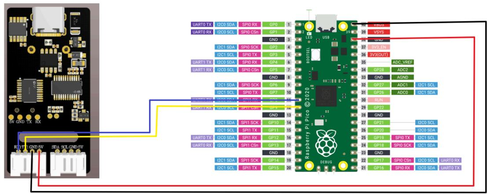
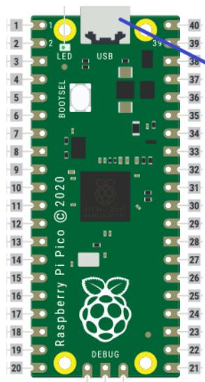
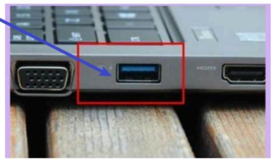
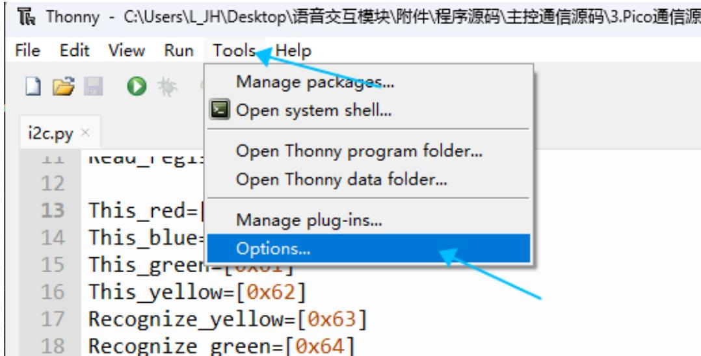
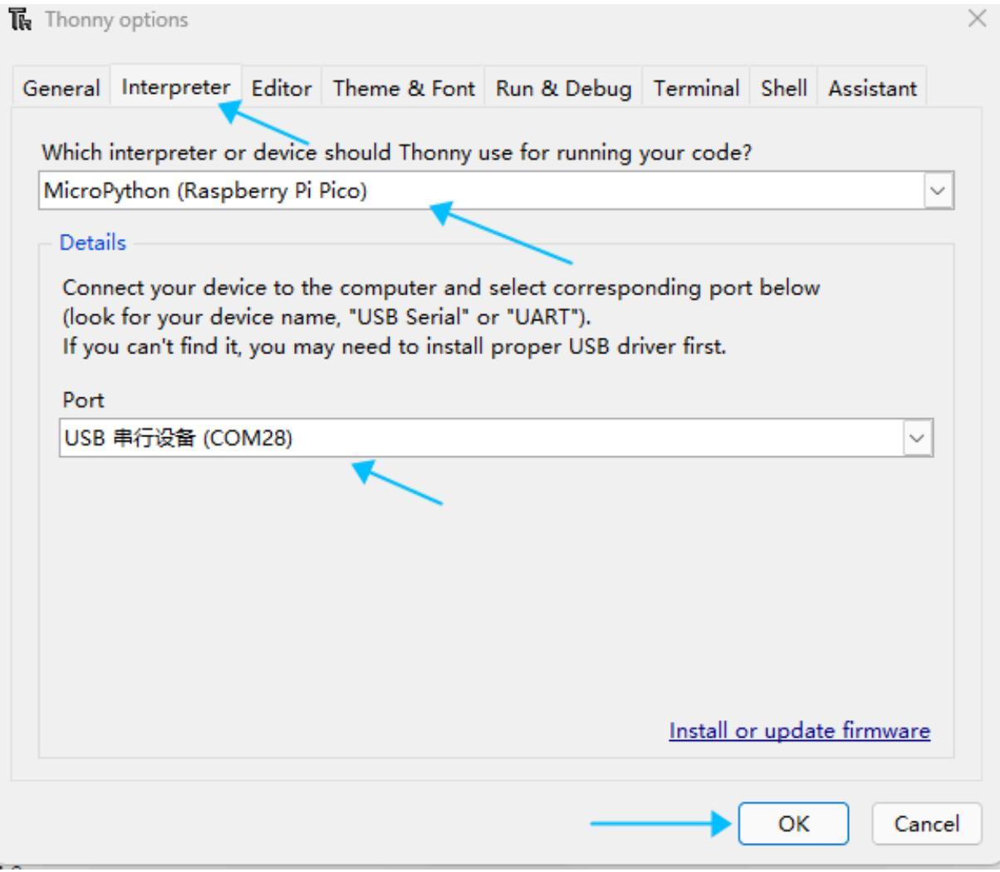
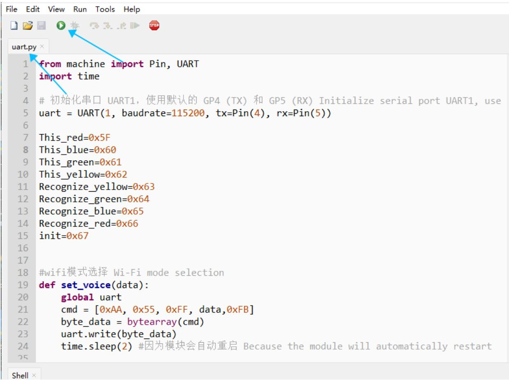

注意：语音交互模块需要烧录出厂固件，语音芯片到手之后没有刷过固件的则不需要

# 1.实验准备

Pico主板  
语音交互模块   
杜邦线

# 2.接线示意图

<table><tr><td>Pico</td><td>语音交互模块</td></tr><tr><td>4</td><td>RX</td></tr><tr><td>5</td><td>TX</td></tr><tr><td>GND</td><td>GND</td></tr><tr><td>5V</td><td>5V</td></tr></table>



<details>
<summary>text_image</summary>

UART0 TX I2C0 SDA SPI0 RX GP0 1
UART0 RX I2C0 SCL SPI0 CSn GP3 2
I2C1 SDA SPI0 SCK GP2 3
I2C1 SCL SPI0 TX GP3 4
UART1 TX I2C0 SDA SPI0 RX GP4 5
UART1 RX I2C0 SCL SPI0 CSn GP5 6
I2C1 SDA SPI0 SCK GP6 7
I2C1 SCL SPI0 TX GP7 8
UART2 TX I2C0 SDA SPI0 RX GP8 9
I2C1 RX SPI0 SCK GP9 10
I2C1 SDA SPI1 SCK GP10 11
I2C1 SCL SPI1 TX GP11 12
UART0 TX I2C0 SDA SPI1 RX GP12 13
I2C0 SCL SPI1 CSn GP13 14
I2C1 SDA SPI1 SCK GP14 15
I2C1 SCL SPI1 TX GP15 16
Raspberry Pi Pico © 2020
DEBUG
USB
ADC_VREF
ADC2
AGND
ADC1 I2C1 SCL
ADC0 I2C1 SDA
GND
RUN
GP27 ADC1
GP26 ADC0
GP22
GND
GND
GP21 I2C0 SCL
GP20 I2C0 SDA
GP19 SPI0 TX I2C1 SCL
GP18 SPI0 SCK I2C1 SDA
GND
GP17 SPI0 CSn I2C0 SCL UART0 RX
GP16 SPI0 RX I2C0 SDA UART0 TX
</details>

# 3.程序下载

将Pico使用Type-C和电脑进行连接



<details>
<summary>text_image</summary>

1
2
3
4
5
6
7
8
9
10
11
12
13
14
15
16
17
18
19
20
LED
BOOTSEL
39
USB
40
39
38
37
36
35
34
33
32
31
30
29
28
27
26
25
24
23
22
21
Raspberry Pi Pico © 2020
DEBUG
</details>



<details>
<summary>natural_image</summary>

Close-up of a computer keyboard with a DTA connector and port labels (no readable text beyond logos)
</details>

打开Thonny软件，点击左上角的Tools，选择Options



<details>
<summary>text_image</summary>

Thonny - C:\Users\L_JH\Desktop\语音交互模块\附件\程序源码\主控通信源码\3.Pico通信源
File Edit View Run Tools Help
i2c.py ×
11 New規1: 
12 
13 This_red=
14 This_blue=
15 This_green=[0x61]
16 This_yellow=[0x62]
17 Recognize_yellow=[0x63]
18 Recognize_green=[0x64]
Manage packages...
Open system shell...
Open Thonny program folder...
Open Thonny data folder...
Manage plug-ins...
Options...
</details>

选择interpreter，下方的Port选择对应的串行设备，之后点击ok



<details>
<summary>text_image</summary>

Thonny options
General Interpreter Editor Theme & Font Run & Debug Terminal Shell Assistant
Which interpreter or device should Thonny use for running your code?
MicroPython (Raspberry Pi Pico)
Details
Connect your device to the computer and select corresponding port below
(look for your device name, "USB Serial" or "UART").
If you can't find it, you may need to install proper USB driver first.
Port
USB 串行设备 (COM28)
Install or update firmware
OK Cancel
</details>

终端出现下图表示正确连接上了

Shell

打开对应的py文件，点击上方的运行按钮，听到初始化完成，即表示程序正在运行



<details>
<summary>text_image</summary>

from machine import Pin, UART
import time

# 初始化串口 UART1，使用默认的 GP4 (TX) 和 GP5 (RX) Initialize serial port UART1, use
uart = UART(1, baudrate=115200, tx=Pin(4), rx=Pin(5))

This_red=0x5F
This_blue=0x60
This_green=0x61
This_yellow=0x62
Recognize_yellow=0x63
Recognize_green=0x64
Recognize_blue=0x65
Recognize_red=0x66
init=0x67

#wifi模式选择 Wi-Fi mode selection
def set_voice(data):
    global uart
    cmd = [0xAA, 0x55, 0xFF, data,0xFB]
    byte_data = bytearray(cmd)
    uart.write(byte_data)
    time.sleep(2) #因为模块会自动重启 Because the module will automatically restart
</details>

# 4.实现效果

以通过修改程序中得代码来选择播报播报内容如下图

```asm
This_red=0x5F
This_blue=0x60
This_green=0x61
This_yellow=0x62
Recognize_yellow=0x63
Recognize_green=0x64
Recognize_blue=0x65
Recognize_red=0x66
init=0x67

#wifi模式选择 Wi-Fi mode selection
def set_voice(data):
    global uart
    cmd = [0xAA, 0x55, 0xFF, data, 0xFB]
    byte_data = bytearray(cmd)
    uart.write(byte_data)
    time.sleep(2) #因为模块会自动重启 Because the module will automatically restart

try:
    set voice(init)
    while 1:
    if want any(); 
```

播报的内容可以根据附件提供的命令词播报词协议列表V3\_中文文件查看协议，

其中第一第二个字节AA FF表示的是协议的帧头，第三个字节FF表示的是播报功能，第四个就是播报内容的ID，这里能看到“初始化完成”是16进制的67，所以程序里给寄存器0x03发送0x67即可播报对应内容。第五个字节是结束帧。

<table><tr><td>84</td><td>这是红色</td><td>命令词</td><td>这是红色</td><td>被</td><td>AA 55 FF 5F FB</td><td>AA 55 FF 5F FB</td></tr><tr><td>85</td><td>这是蓝色</td><td>命令词</td><td>这是蓝色</td><td>被</td><td>AA 55 FF 60 FB</td><td>AA 55 FF 60 FB</td></tr><tr><td>86</td><td>这是绿色</td><td>命令词</td><td>这是绿色</td><td>被</td><td>AA 55 FF 61 FB</td><td>AA 55 FF 61 FB</td></tr><tr><td>87</td><td>这是黄色</td><td>命令词</td><td>这是黄色</td><td>被</td><td>AA 55 FF 62 FB</td><td>AA 55 FF 62 FB</td></tr><tr><td>88</td><td>识别到黄色</td><td>命令词</td><td>识别到黄色</td><td>被</td><td>AA 55 FF 63 FB</td><td>AA 55 FF 63 FB</td></tr><tr><td>89</td><td>识别到绿色</td><td>命令词</td><td>识别到绿色</td><td>被</td><td>AA 55 FF 64 FB</td><td>AA 55 FF 64 FB</td></tr><tr><td>90</td><td>识别到蓝色</td><td>命令词</td><td>识别到蓝色</td><td>被</td><td>AA 55 FF 65 FB</td><td>AA 55 FF 65 FB</td></tr><tr><td>91</td><td>识别到红色</td><td>命令词</td><td>识别到红色</td><td>被</td><td>AA 55 FF 66 FB</td><td>AA 55 FF 66 FB</td></tr><tr><td>92</td><td>初始化完成</td><td>命令词</td><td>初始化完成</td><td>被</td><td>AA 55 FF 67 FB</td><td>AA 55 FF 67 FB</td></tr></table>

点击运行之后，当我说出唤醒词唤醒之后，说“关灯”调试助手会回复接收0A

```txt
MicroPython v1.24.0-preview.201.g269a0e0e1 on 2024-08-09; Raspberry Pi Pico2 with RP2350 Type "help()" for more information.
>>> %Run -c $EDITOR_CONTENT
Received: 00
Received: 0a 
```

这时候可以打开附件的命令词播报词协议列表V3\_中文文件查看“关灯”的协议

<table><tr><td>20</td><td>关灯</td><td>命令词</td><td>好的,已关灯</td><td>主</td><td>AA 55 00 0A FB</td><td>AA 55 00 0A FB</td></tr><tr><td>21</td><td>亮红灯</td><td>命令词</td><td>好的,已亮红灯</td><td>主</td><td>AA 55 00 0B FB</td><td>AA 55 00 0B FB</td></tr></table>

其中第一第二个字节AA FF表示的是协议的帧头，第三个字节表示的是芯片的十个功能词的ID，第四个就是命令词的ID，这里能看到“关灯”是16进制的0A。第五个字节是结束帧。

说其他的命令词，串口调试助手也会打印相对应得命令词ID，可以自行尝试