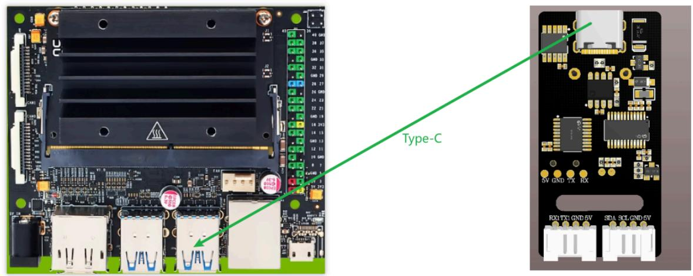
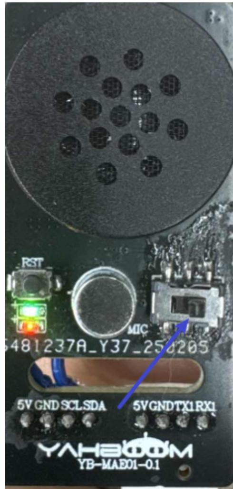

注意：语音交互模块需要烧录出厂固件，语音芯片到手之后没有刷过固件的则不需要

# 1.实验准备

Jetson nano主板  
语音交互模块   
Type-C

# 2.接线示意图

使用type-c接线接到主板上。



<details>
<summary>text_image</summary>

Type-C
5V GND 1X RX
RX/TX GND 5V SDA SCL GND 6V
</details>

将模块滑动模块拨到靠右位置，使用stc固件的串口，



<details>
<summary>text_image</summary>

RST
MIC
481237A_Y37_258205
5V GND SCLSDA
5VGNDTX1RX1
YAH600M
YB-MAE01-0.1
</details>

终端输入，出现ttyUSB0设备表示正常识别到了（正常都是ttyUSB0,也有可能是其他设备号）

```txt
1s /dev/ttyUSB* 
```

```batch
jetson@jetson-desktop:~$ ls /dev/ttyUSB*
/dev/ttyUSB0
jetson@jetson-desktop:~$ 
```

# 3.实现效果

以通过修改程序中得代码来选择播报播报内容如下图

```ini
#播报词 Active broadcast content
This_red=0x60
This_green=0x61
This_yellow=0x62
Recognize_yellow=0x63
Recognize_green=0x64
Recognize_blue=0x65
Recognize_red=0x66
init=0x67 
```

```python
void_write(init)
time.sleep(0.005)
while 1:
    speech_read() 
```

播报的内容可以根据附件提供的命令词播报词协议列表V3\_中文文件查看协议，

其中第一第二个字节AA FF表示的是协议的帧头，第三个字节FF表示的是播报功能，第四个就是播报内容的ID，这里能看到“初始化完成”是16进制的67，所以程序里给寄存器0x03发送0x67即可播报对应内容。第五个字节是结束帧。

<table><tr><td>84</td><td>这是红色</td><td>命令词</td><td>这是红色</td><td>被</td><td>AA 55 FF 5F FB</td><td>AA 55 FF 5F FB</td></tr><tr><td>85</td><td>这是蓝色</td><td>命令词</td><td>这是蓝色</td><td>被</td><td>AA 55 FF 60 FB</td><td>AA 55 FF 60 FB</td></tr><tr><td>86</td><td>这是绿色</td><td>命令词</td><td>这是绿色</td><td>被</td><td>AA 55 FF 61 FB</td><td>AA 55 FF 61 FB</td></tr><tr><td>87</td><td>这是黄色</td><td>命令词</td><td>这是黄色</td><td>被</td><td>AA 55 FF 62 FB</td><td>AA 55 FF 62 FB</td></tr><tr><td>88</td><td>识别到黄色</td><td>命令词</td><td>识别到黄色</td><td>被</td><td>AA 55 FF 63 FB</td><td>AA 55 FF 63 FB</td></tr><tr><td>89</td><td>识别到绿色</td><td>命令词</td><td>识别到绿色</td><td>被</td><td>AA 55 FF 64 FB</td><td>AA 55 FF 64 FB</td></tr><tr><td>90</td><td>识别到蓝色</td><td>命令词</td><td>识别到蓝色</td><td>被</td><td>AA 55 FF 65 FB</td><td>AA 55 FF 65 FB</td></tr><tr><td>91</td><td>识别到红色</td><td>命令词</td><td>识别到红色</td><td>被</td><td>AA 55 FF 66 FB</td><td>AA 55 FF 66 FB</td></tr><tr><td>92</td><td>初始化完成</td><td>命令词</td><td>初始化完成</td><td>被</td><td>AA 55 FF 67 FB</td><td>AA 55 FF 67 FB</td></tr></table>

终端输入以下指令运行程序，听到初始化完成，即表示程序正在运行

```batch
python3 uart_test.py 
```

```batch
jetson@jetson-desktop:~$ python3 uart_test.py
Speech Serial Opened! Baudrate=115200
Read ID: 0 
```

当我说出唤醒词唤醒之后，说“关灯”调试助手会回复接收10

```txt
jetson@jetson-desktop:~$ python3 uart_test.py
Speech Serial Opened! Baudrate=115200
Read_ID: 0
Read_ID: 10
Read_ID: 4 
```

这时候可以打开附件的命令词播报词协议列表V3\_中文文件查看“关灯”的协议

<table><tr><td>20</td><td>关灯</td><td>命令词</td><td>好的,已关灯</td><td>主</td><td>AA 55 00 0A FB</td><td>AA 55 00 0A FB</td></tr><tr><td>21</td><td>亮红灯</td><td>命令词</td><td>好的,已亮红灯</td><td>主</td><td>AA 55 00 0B FB</td><td>AA 55 00 0B FB</td></tr></table>

其中第一第二个字节AA FF表示的是协议的帧头，第三个字节表示的是芯片的十个功能词的ID，第四个就是命令词的ID，这里能看到“关灯”是16进制的0A，十进制是10。第五个字节是结束帧。

说其他的命令词，串口调试助手也会打印相对应得命令词ID，可以自行尝试