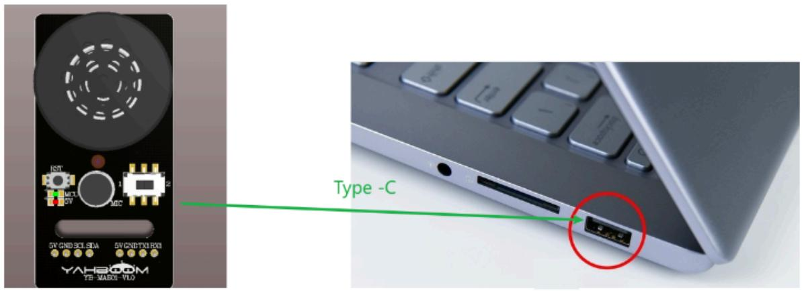
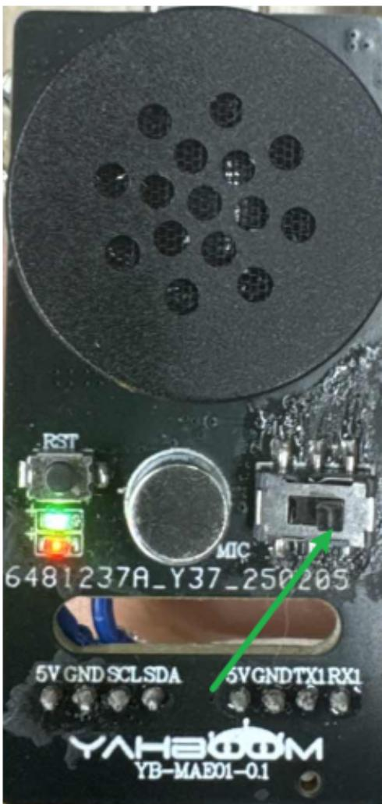
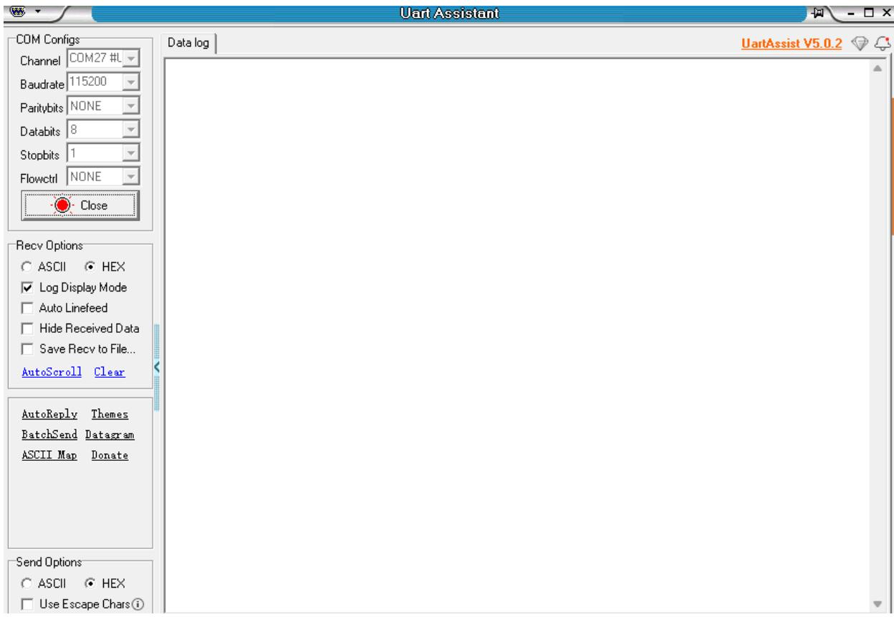
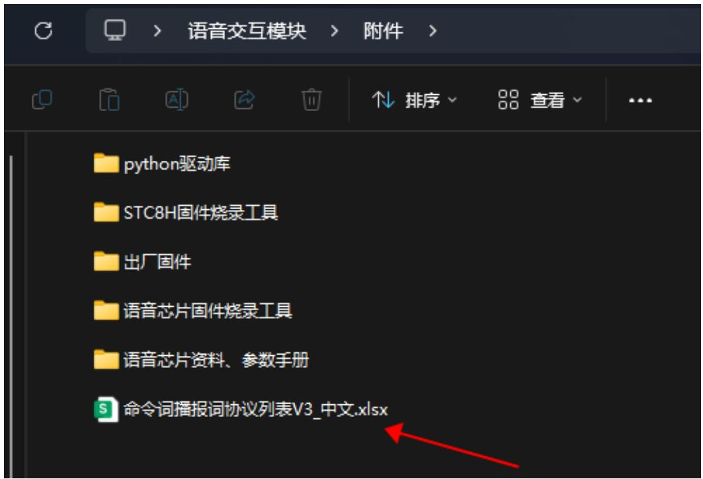
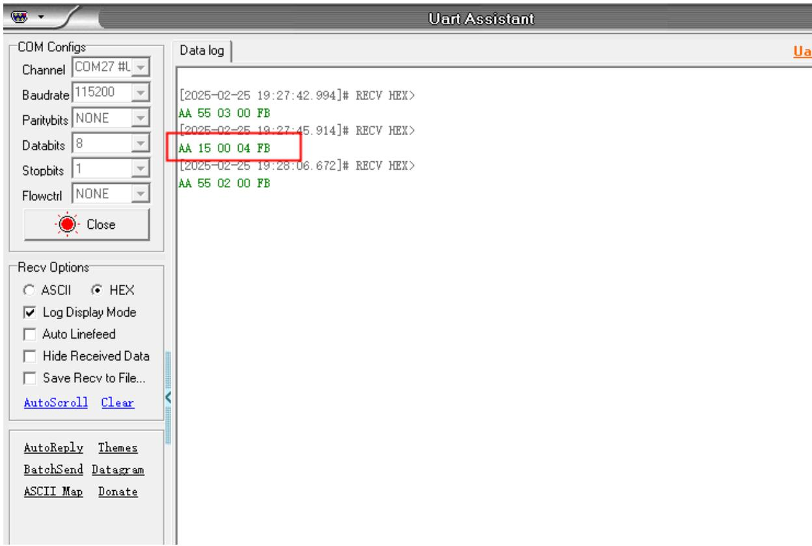
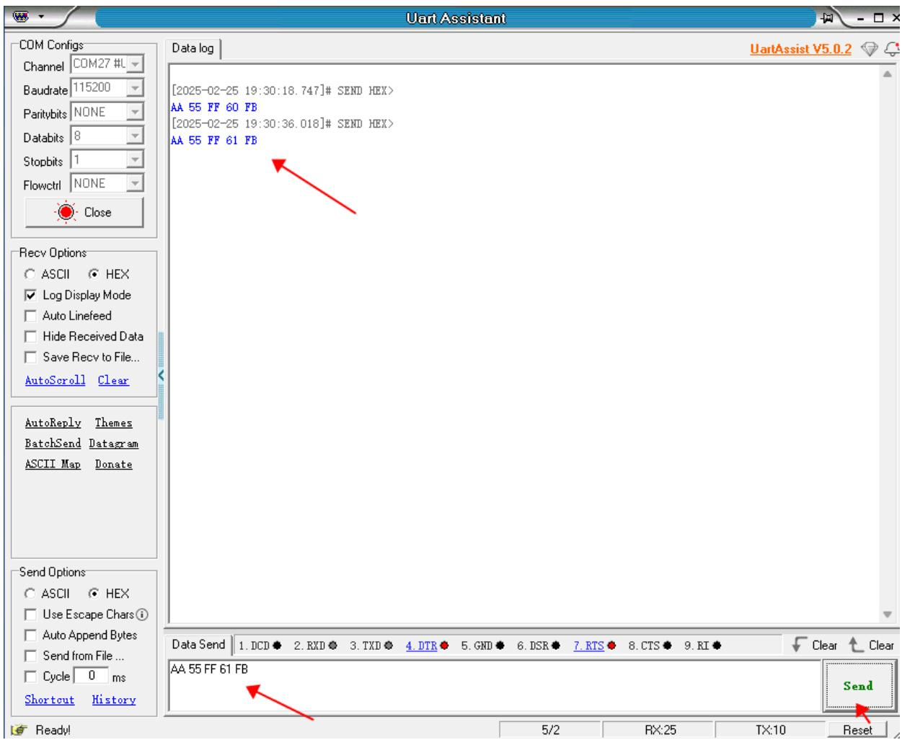

# 1. 设备连接

text_image

IST
MCT
TV
1
2
3
5V CND SCL SDA
5V CND TXI RXI
YAH800M
YS: MARKS YLO
Type -C

# 2. 滑动模块移动到STC8串口模式

text_image

RST
MIC
6481237A_Y37_250205
5V GND SCLSDA
5V GNDTX1 RX1
YAH800M
YB-MAE01-0.1

# 3. 打开串口调试助手

\- 打开Uart Assistant，选择对应的串口号，以及波特率为115200，

text_image

Uart Assistant
COM Configs
Channel COM27 #L
Baudrate 115200
Paritybits NONE
Databits 8
Stopbits 1
Flowctrl NONE
Close
Data log
UartAssist V5.0.2
Recv Options
ASCII HEX
Log Display Mode
Auto Linefeed
Hide Received Data
Save Recv to File...
AutoScroll Clear
AutoReply Themes
BatchSend Datagram
ASCII Map Donate
Send Options
ASCII HEX
Use Escape Chars

\- 打开附件中的命令词播报词协议列表V3\_中文文件

text_image

语音交互模块 > 附件 >
python驱动库
STC8H固件烧录工具
出厂固件
语音芯片固件烧录工具
语音芯片资料、参数手册
命令词播报词协议列表V3_中文.xlsx

\- 当我们说出“小车前进”的时候，串口调试助手会打印出对应的协议

text_image

Uart Assistant
COM Configs
Channel COM27 #L
Baudrate 115200
Paritybits NONE
Databits 8
Stopbits 1
Flowctrl NONE
Close
Data log
[2025-02-25 19:27:42.994]# RECV HEX>
AA 55 03 00 FB
[2025-02-25 19:27:45.914]# RECV HEX>
AA 15 00 04 FB
[2025-02-25 19:28:06.672]# RECV HEX>
AA 55 02 00 FB
Recv Options
ASCII ⚫ HEX
Log Display Mode
Auto Linefeed
Hide Received Data
Save Recv to File...
AutoScroll Clear
AutoReply Themes
BatchSend Datagram
ASCII Map Donate

<table><tr><td>11</td><td>小车停止</td><td>命令词</td><td>好的,已停止</td><td>主</td><td>AA 55 00 01 FB</td><td>AA 55 00 01 FB</td></tr><tr><td>12</td><td>停车</td><td>命令词</td><td>好的,已停止</td><td>主</td><td>AA 55 00 01 FB</td><td>AA 55 00 01 FB</td></tr><tr><td>13</td><td>小车休眠</td><td>命令词</td><td>好的,已休眠</td><td>主</td><td>AA 55 00 03 FB</td><td>AA 55 00 03 FB</td></tr><tr><td>14</td><td>小车前进</td><td>命令词</td><td>好的,正在前进</td><td>主</td><td>AA 55 00 04 FB</td><td>AA 55 00 04 FB</td></tr><tr><td>15</td><td>小车后退</td><td>命令词</td><td>好的,正在后退</td><td>主</td><td>AA 55 00 05 FB</td><td>AA 55 00 05 FB</td></tr><tr><td>16</td><td>小车左转</td><td>命令词</td><td>好的,正在向左转</td><td>主</td><td>AA 55 00 06 FB</td><td>AA 55 00 06 FB</td></tr><tr><td>17</td><td>小车右转</td><td>命令词</td><td>好的,正在向右转</td><td>主</td><td>AA 55 00 07 FB</td><td>AA 55 00 07 FB</td></tr><tr><td>18</td><td>小车左旋</td><td>命令词</td><td>好的,正在左旋转</td><td>主</td><td>AA 55 00 08 FB</td><td>AA 55 00 08 FB</td></tr><tr><td>19</td><td>小车右旋</td><td>命令词</td><td>好的,正在右旋转</td><td>主</td><td>AA 55 00 09 FB</td><td>AA 55 00 09 FB</td></tr></table>

\- 根据命令词播报词协议列表V3\_中文文件输入对应指令，语音模块播报对应协议的文字

<table><tr><td>84</td><td>这是红色</td><td>命令词</td><td>这是红色</td><td>被</td><td>AA 55 FF 5F FB</td><td>AA 55 FF 01 FB</td></tr><tr><td>85</td><td>这是蓝色</td><td>命令词</td><td>这是蓝色</td><td>被</td><td>AA 55 FF 60 FB</td><td>AA 55 FF 02 FB</td></tr><tr><td>86</td><td>这是绿色</td><td>命令词</td><td>这是绿色</td><td>被</td><td>AA 55 FF 61 FB</td><td>AA 55 FF 03 FB</td></tr><tr><td>87</td><td>这是黄色</td><td>命令词</td><td>这是黄色</td><td>被</td><td>AA 55 FF 62 FB</td><td>AA 55 FF 04 FB</td></tr><tr><td>88</td><td>识别到黄色</td><td>命令词</td><td>识别到黄色</td><td>被</td><td>AA 55 FF 63 FB</td><td>AA 55 FF 06 FB</td></tr><tr><td>89</td><td>识别到绿色</td><td>命令词</td><td>识别到绿色</td><td>被</td><td>AA 55 FF 64 FB</td><td>AA 55 FF 07 FB</td></tr><tr><td>90</td><td>识别到蓝色</td><td>命令词</td><td>识别到蓝色</td><td>被</td><td>AA 55 FF 65 FB</td><td>AA 55 FF 08 FB</td></tr><tr><td>91</td><td>识别到红色</td><td>命令词</td><td>识别到红色</td><td>被</td><td>AA 55 FF 66 FB</td><td>AA 55 FF 09 FB</td></tr><tr><td>92</td><td>初始化完成</td><td>命令词</td><td>初始化完成</td><td>被</td><td>AA 55 FF 67 FB</td><td>AA 55 FF 0A FB</td></tr><tr><td>93</td><td>第一个要排序的颜色是</td><td>命令词</td><td>第一个要排序的颜色是</td><td>被</td><td>AA 55 FF 68 FB</td><td>AA 55 FF 0B FB</td></tr><tr><td>94</td><td>第二个要排序的颜色是</td><td>命令词</td><td>第二个要排序的颜色是</td><td>被</td><td>AA 55 FF 69 FB</td><td>AA 55 FF 0C FB</td></tr><tr><td>95</td><td>第三个要排序的颜色是</td><td>命令词</td><td>第三个要排序的颜色是</td><td>被</td><td>AA 55 FF 6A FB</td><td>AA 55 FF 0D FB</td></tr><tr><td>96</td><td>第四个要排序的颜色是</td><td>命令词</td><td>第四个要排序的颜色是</td><td>被</td><td>AA 55 FF 6B FB</td><td>AA 55 FF 0E FB</td></tr><tr><td>97</td><td>这是易拉罐属于可回收垃圾</td><td>命令词</td><td>这是易拉罐属于可回收垃圾</td><td>被</td><td>AA 55 FF 6C FB</td><td>AA 55 FF 5E FB</td></tr></table>

text_image

Uart Assistant
COM Configs
Channel COM27 #L
Baudrate 115200
Paritybits NONE
Databits 8
Stopbits 1
Flowctrl NONE
Close
Data log
[2025-02-25 19:30:18.747]# SEND HEX>
AA 55 FF 60 FB
[2025-02-25 19:30:36.018]# SEND HEX>
AA 55 FF 61 FB
Recv Options
ASCII HEX
Log Display Mode
Auto Linefeed
Hide Received Data
Save Recv to File...
AutoScroll Clear
AutoReply Themes
BatchSend Datagram
ASCII Map Donate
Send Options
ASCII HEX
Use Escape Chars①
Auto Append Bytes
Send from File ...
Cycle 0 ms
Shortcut History
Data Send 1. DCD 2. RXD 3. TXD 4. DTR 5. GND 6. DSR 7. RTS 8. CTS 9. RI
AA 55 FF 61 FB
Send
Ready!
5/2 RX:25 TX:10 Reset

可以听到语音模块正常播报。