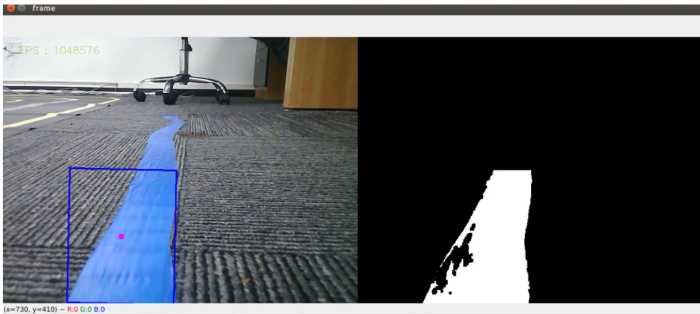

# 3、语音控制小车巡线自动驾驶

本节课程需要结合Rosmaster-X3小车硬件，这里只做代码解析。首先，我们看下内置的语音指令，

<table><tr><td>指令词</td><td>语音识别模块结果</td></tr><tr><td>关闭巡线</td><td>22</td></tr><tr><td>巡红线</td><td>23</td></tr><tr><td>巡绿线</td><td>24</td></tr><tr><td>巡蓝线</td><td>25</td></tr><tr><td>巡黄线</td><td>26</td></tr></table>

# 1、程序启动

终端输入，

#启动小车底盘

```txt
ros2 run yahboomcar_bringup Mcnamu_driver_X3 
```

#启动语音巡线程序

```txt
ros2 run yahboomcar_voice_ctrl Voice_Ctrl_follow_line_a1_x3 
```

#启动手柄控制节点

```txt
ros2 run yahboomcar_ctrl yahboom_joy_x3 
```

```txt
ros2 run joy joy_node 
```

把小车的摄像头往下掰，让它可以看到线，然后先唤醒模块（“你好，小亚”），得到回复后，以巡蓝线为例，可以对它说”巡蓝线“，



<details>
<summary>text_image</summary>

frame
TPS : 1048576
(x=730, y=410) ~ R:0 G:0 B:0
</details>

按下手柄的R2键即可开始巡线。

# 2、核心代码

代码路径：  
\~/driver\_ws/src/yahboomcar\_voice\_ctrl/yahboomcar\_voice\_ctrl/Voice\_Ctrl\_follow\_line\_a1\_X3.py   
```python
def process(self, rgb_img, action):
    binary = []
    rgb_img = cv.resize(rgb_img, (640, 480))
    if self.img_flip == True: rgb_img = cv.flip(rgb_img, 1)
    #这里开始接收语音命令以及发布指令和加载hsv的值
    self.command_result = self.spe.speech_read()
    self.spe(void_write(self.command_result)
    if self.command_result == 23:
    self.model = "color_follow_line"
    print("red follow line")
    #红色HSV
    self.hsv_range = [(0, 84, 131), (180, 253, 255)]
#以下部分就是把hsv的值传进去，图像处理，得到一个self.circle的值，最后传入self.execute的函数，计算速度
if self.model == "color_follow_line":
rgb_img, binary, self.circle = self.color.line_follow(rgb_img, self.hsv_range)
if len(self.circle) != 0:
threading.Thread(target=self.execute, args=(self.circle[0], self.circle[2])).start() 
```