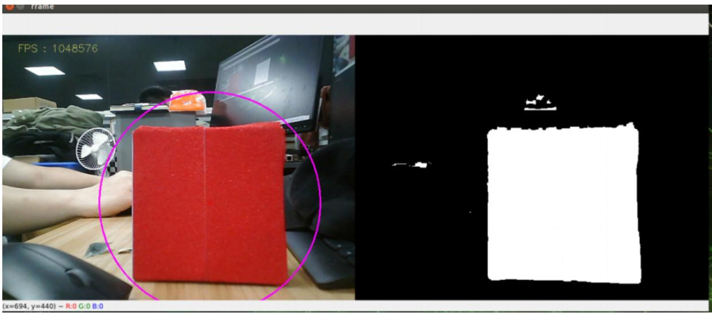

# 4、语音控制小车颜色追踪

本节课程需要结合Rosmaster-X3小车硬件，这里只做代码解析。首先，我们看下内置的语音指令，

<table><tr><td>功能词</td><td>语音识别模块结果</td><td>语音播报内容</td></tr><tr><td>开始追踪黄色</td><td>72</td><td>好的,开始追踪黄色</td></tr><tr><td>开始追踪红色</td><td>73</td><td>好的,开始追踪红色</td></tr><tr><td>开始追踪绿色</td><td>74</td><td>好的,开始追踪绿色</td></tr><tr><td>开始追踪蓝色</td><td>75</td><td>好的,开始追踪蓝色</td></tr><tr><td>取消追踪</td><td>76</td><td>好的,取消追踪</td></tr></table>

# 1、程序启动

终端输入，

#启动手柄控制节点

```txt
ros2 run yahboomcar_ctrl yahboom_joy_X3
ros2 run joy joy_node 
```

#启动语音控制颜色追踪节点

```txt
ros2 run yahboomcar_voice_ctrl Voice_Ctrl_colorHSV
ros2 run yahboomcar_voice_ctrl Voice_Ctrl_colorTracker 
```

#启动小车底盘

```batch
ros2 run yahboomcar_voice_ctrl Voice_Ctrl_Mcnamu_driver_X3 
```

#启动深度相机，获取深度图像

```txt
ros2 launch astra_camera astra.launch.xml 
```



<details>
<summary>natural_image</summary>

Two-panel image: left shows a red foam block on a desk with a fan, right displays a black-and-white 3D scan (no text or symbols)
</details>

以追踪红色为例，唤醒模块后，对它说”开始追踪红色“，按下遥控上的R2键，程序接收到指令后，开始处理图像，然后计算红色物体的中心坐标，发布物体的中心坐标；结合深度相机提供的深度信息，计算速度，最后发布出去驱动小车。

# 2、核心代码

代码路径：\~/driver\_ws/src/yahboomcar\_voice\_ctrl/yahboomcar\_voice\_ctrl/Voice\_Ctrl\_colorHSV.py

这部分主要解析语音指令，以及图像处理，最后发布中心坐标，

#定义一个发布者，发布检测物体的中心坐标  
```python
self.pub_position = self.create_publisher(Position, "/Current_point", 10)
# 导入语音驱动库
from Speech_Lib import Speech
# 创建语音控制对象
self.spe = Speech()
# 以下是获取指令，然后对识别结果进行判断，加载相对应的HSV的值
command_result = self.spe.speech_read()
self.spe(void_write(command_result)
if command_result == 73 :
self.model = "color_follow_line"
print("tracker red")
self.hsv_range = [(0, 175, 149), (180, 253, 255)]
# 处理图像，计算检测物体的中心坐标，进入execute函数，发布中心坐标
rgb_img, binary, self.circle = self.color.object_follow(rgb_img, self.hsv_range)
if self.circle[2] != 0: threading.Thread(
    target=self.execute, args=(self.circle[0], self.circle[1],
    self.circle[2])).start()
if self.point_pose[0] != 0 and self.point_pose[1] != 0: threading.Thread(
    target=self.execute, args=(self.point_pose[0],
    self.point_pose[1], self.point_pose[2]).start() 
```

代码路径：

\~/driver\_ws/src/yahboomcar\_voice\_ctrl/yahboomcar\_voice\_ctrl/Voice\_Ctrl\_colorTracker.py

这部分接收中心坐标的话题数据和深度数据，然后计算出速度，发布给底盘，

#定义一个订阅者，订阅深度信息  
```python
self.sub_depth = self.create_subscription(Image, "/camera/depth/image_raw", self.depth_img_Callback, 1)
# 定义一个订阅者，订阅中心坐标信息
self.sub_position =
self.create_subscription(Position, "/Current_point", self.positionCallback, 1)
# 回调者函数
def positionCallback(self, msg) # 获取中心坐标值
def depth_img_Callback(self, msg) # 获取深度信息
# 传入中心坐标的X值以及深度信息，计算出速度发布给底盘
def execute(self, point_x, dist) 
```