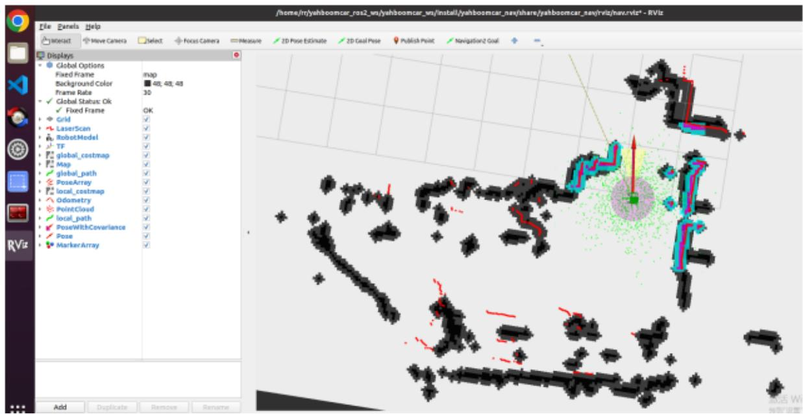
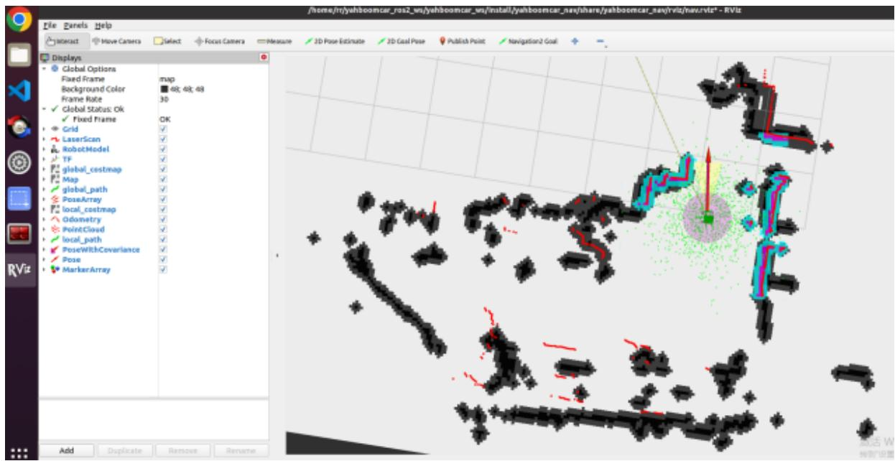

# 5、语音控制多点导航

本节课程需要结合Rosmaster-X3小车硬件，这里只做代码解析。首先，我们看下内置的语音指令，

<table><tr><td>功能词</td><td>语音识别模块结果</td><td>语音播报内容</td></tr><tr><td>导航去一号位</td><td>19</td><td>好的,正在去一号位</td></tr><tr><td>导航去二号位</td><td>20</td><td>好的,正在去二号位</td></tr><tr><td>导航去三号位</td><td>21</td><td>好的,正在去三号位</td></tr><tr><td>导航去四号位</td><td>32</td><td>好的,正在去四号位</td></tr><tr><td>回到原点</td><td>33</td><td>好的,正在回到原点</td></tr></table>

# 1、程序启动

# 1.1、标定目标点

终端输入，

```txt
ros2 launch yahboomcar_nav laser_bringup_launch.py
ros2 launch yahboomcar_nav display_nav_launch.py
ros2 launch yahboomcar_nav navigation_teb_launch.py 
```

在虚拟机的rviz界面中点击【2D Pose Estimate】，然后对比小车的位姿在地图上给小车标一个初始的位姿；

标完后的显示如下：



<details>
<summary>text_image</summary>

/home/In/yahboomcar_rus2_wx/yahboomcar_wx/install/yahboomcar_nay/thare/yahboomcar_say/viz/nav.viz* - RViz
File Panels Help
Select Move Camera Select Forest Camera Measure 2D Pose Estimate 2D Goal Pose Publish Point Navigation2 Goal
Displays
Global Options
Fixed Frame Background Color Frame Rate
Global Status Ok Fixed Frame Grid LaserScan RobotModel TF global_costmap Map global_path PoseArray local_costmap Odometry PointCloud local_path PoseWithCovariance Pose MarkerArray
Add Duplicate Remove Rename
Add Duplicate Remove Rename
</details>

对比雷达扫描点和障碍物的重合情况，可以多次给小车设置初始的位姿，直到雷达扫描点和障碍物大致重合；

终端输入，

```batch
ros2 topic echo /goal_pose 
```

点击【2D Goal Pose】，设置第一个导航目标点，这时候小车开始导航了，终端会打印出话题数据：

```yaml
root@ubuntu:~/yahboomcar_ros2_ws/yahboomcar_ws# ros2 topic echo /goal_pose header:
    stamp:
    sec: 1682416565
    nanosec: 174762965
    frame_id: map
pose:
    position:
    x: -7.258232593536377
    y: -2.095078229904175
    z: 0.0
orientation:
    x: 0.0
    y: 0.0
    z: -0.3184907749129588
    w: 0.9479259603446585 
```

# 1.2、目标点位置写入程序

编辑voice\_Ctrl\_send\_mark.py文件，该文件位于：

\~/driver\_ws/src/yahboomcar\_voice\_ctrl/yahboomcar\_voice\_ctrl/voice\_Ctrl\_send\_mark.py

修改第一个导航点的位姿为终端中打印的：

```ini
pose.pose.position.x = 2.15381097794
pose.pose.position.y = -5.02386903763
pose.pose.orientation.z = 0.726492681307
pose.pose.orientation.w = 0.687174202082 
```

其他几个点的标志结果也按照以上步骤在rviz中标定好位置，记录位姿点的坐标。然后修改到对应的位置。

# 1.3、语音导航

终端输入，

```txt
ros2 launch yahboomcar_nav laser_bringup_launch.py
ros2 launch yahboomcar_nav display_nav_launch.py
ros2 launch yahboomcar_nav navigation_teb_launch.py 
```

这时候在虚拟机的rviz界面中点击【2D Pose Estimate】，然后对比小车的位姿在地图上给小车标一个初始的位姿；

标完后的显示如下：



<details>
<summary>text_image</summary>

/home:/iyahboomcar_rss2_wn/yahboomcar_un/install/yahboomcar_nay/share/yahboomcar_nay/rvtz/har.rvtz* - RViz
File Panels Help
Interact Move Camera Select Focus Camera Measure 2D Pose Estimate 2D Coal Pose Publish Point Navigation2 Goal +
Displays
Global Options
Fixed Frame map
Background Color 48; 48; 48
Frame Rate 30
Global Status: Ok
Fixed Frame OK
Grid ✓
LaserScan ✓
RobotModel ✓
TF ✓
global_cestmap ✓
Map ✓
global_path ✓
PoseArray ✓
local_cestmap ✓
Odometry ✓
PointCloud ✓
local_path ✓
PoseWithCoverage ✓
Pose ✓
MarkerArray ✓
Add Duplicate Remove Rename
</details>

对比雷达扫描点和障碍物的重合情况，可以多次给小车设置初始的位姿，直到雷达扫描点和障碍物大致重合；

终端输入，

```txt
ros2 run yahboomcar_voice_ctrl voice_Ctrl_send_mark 
```

对小车上的语音模块说 ”你好，小亚“ 唤醒语音模块，听到语音模块反馈播报 ”在的“ 后，继续说 ”导航去一号位“ ；语音模块会反馈播报”好的，正在去1号位“，同时小车开始导航到一号位。其它位置的导航按同样方法使用即可。

# 2、代码解析

#导入语音库   
```python
from Speech_Lib import Speech
#创建目标点话题发布者
self.pub_goal = self.create_publisher(PoseStamped, "/goal_pose", 1)
def voice_pub_goal(self):
    self.pose.header.frame_id = 'map'
    #获取语音指令
    speech_r = self.spe.speech_read()
    # print("----speech_r = ",speech_r)
    if speech_r == 19:
    print("goal to one")
    self.spe(void_write(speech_r)
    self.pose.header.stamp = Clock().now().to_msg()
    self.pose.pose.position.x = -7.1171722412109375
    self.pose.pose.position.y = -3.8613715171813965
    self.pose.pose.orientation.z = -0.6484729569092691
    self.pose.pose.orientation.w = 0.7612376922862854
    #发布目标点话题数据
    self.pub_goal.publish(self.pose)
elif speech_r == 20:
    print("goal to two")
    self.spe(void_write(speech_r)
    self.pose.header.stamp = Clock().now().to_msg()
    self.pose.pose.position.x = -5.434411525726318
    self.pose.pose.position.y = -3.575838088989258 
```

```python
self.pose.pose.orientation.z = 0.041131907433507836
self.pose.pose.orientation.w = 0.9991537250047569
self.pub_goal.publish(self.pose) 
```