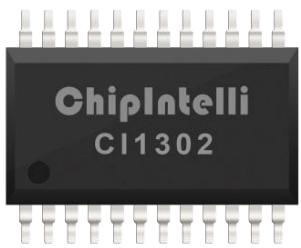
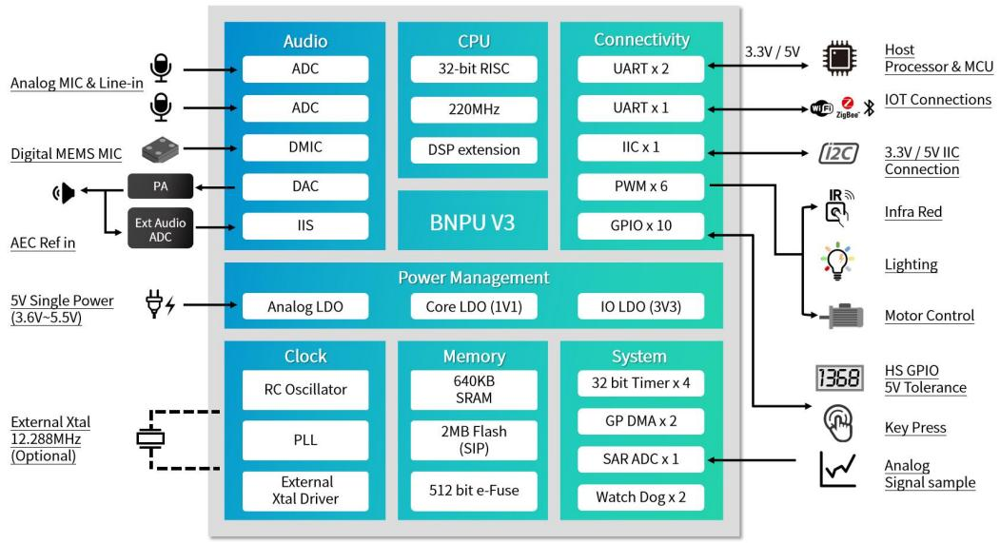
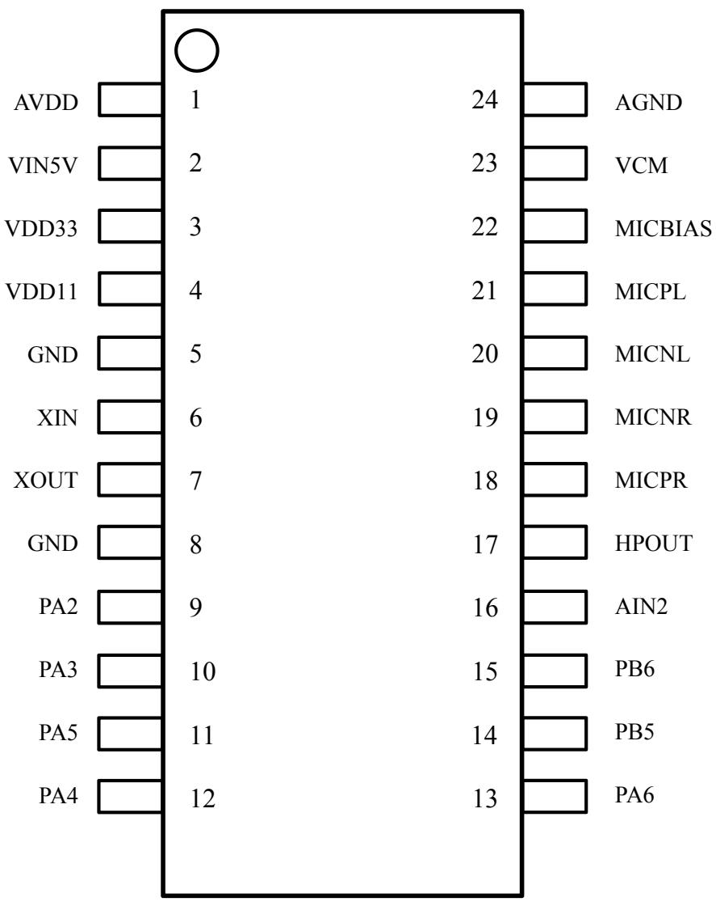
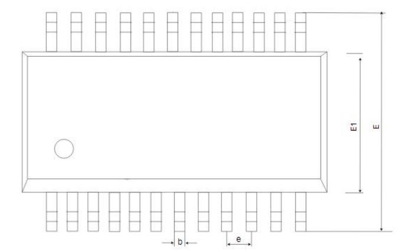
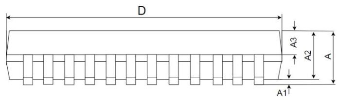
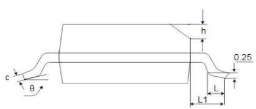
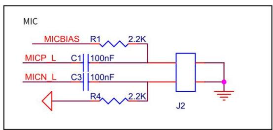
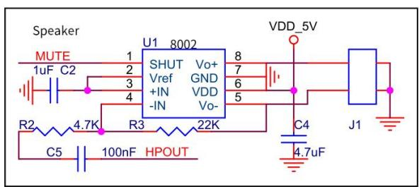
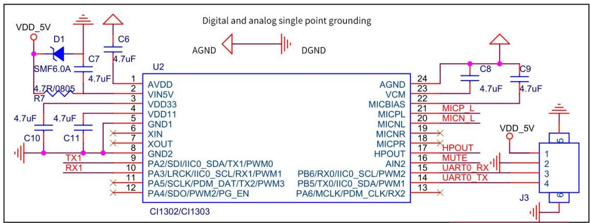

# CI1302 数据手册

# 高性能神经网络智能语音芯片

SSOP24 长 8.6mm 宽 6mm 高 1.64mm

text_image

ChipIntelli
CI1302

# • 脑神经网络处理器（BNPU）

– BNPU V3，支持 DNN\TDNN\RNN\CNN 等神经网络及并行矢量运算，可实现语音识别、声纹识别、命令词自学习、语音检测及深度学习降噪等功能

# • CPU 和存储器

– CPU 主频可达 220 MHz  
– 内置 2MBytes Flash 存储器  
– 内置 640KBytes SRAM  
– 内置 512bit eFuse，可用于应用加密

# • Audio Codec

– 高性能低功耗 audio ADC，SNR ≥ 95dB  
– 低功耗 audio DAC，SNR ≥ 95dB

# • 音频接口

– 1路 IIS接口，支持主从可配  
– 1路双通道 PDM接口

# • ADC 和 PWM

– 内置 1 通道 12bit SAR ADC  
– 支持 6路 PWM接口

• GPIO   
– 10 个高速 GPIO，响应速率可达 20MHz  
– 其中 7 个 GPIO支持 5V 输入

# • 复位和电源管理

– 内置电源管理单元 PMU  
– PMU 输入电压范围: 3.6V 到 5.5V   
– 内置上电复位（POR）  
– 内置电压检测 (PVD)

# • 时钟

– 内置 RC 振荡器，也支持外接晶体振荡器；开发者可根据不同应用方案选择采用内置 RC或者外接晶体作为芯片时钟源

# • 通讯接口

– 1 路 IIC 接口  
– 3路 UART接口，支持 5V通讯，支持最高3Mbps 速率

# • 定时器和看门狗

– 内置 4 组 32 位定时器和 2 组看门狗

# 目录

# 1 概述. 3

1.1 功能描述. 3  
1.2 芯片规格 ... 4

# 2 引脚图和功能描述. 6

2.1 引脚图 . 6  
2.2 管脚描述 ..  
2.3 复用功能 .. . 9

# 3 电气特性. ..10

4 封装信息. .12  
5 订购信息. .12   
6 应用方案. .14

6.1 应用参考电路图.. . 14   
6.2 应用其它注意事项 .15

# 1 概述

# 1.1 功能描述

CI1302 是启英泰伦研发的新一代高性能神经网络智能语音芯片，集成了启英泰伦自研的脑神经网络处理器 BNPU V3 和 CPU 内核，系统主频可达 220MHz，内置高达 640KByte 的 SRAM，集成 PMU 电源管理单元和 RC振荡器，集成双通道高性能低功耗 Audio Codec 和多路 UART、IIC、IIS、PWM、GPIO、PDM 等外围控制接口。芯片仅需少量电阻电容等外围器件就可以实现各类智能语音产品硬件方案，性价比极高。

CI1302使用工业级设计标准，具有较高的环境可靠性，芯片工作温度范围在-40°C 到+85°C 之间，符合 MSL3级湿敏等级，符合 IEC61000-4-2 的 4KV接触放电试验标准，符合FCC电磁兼容标准，符合 ROHS和 REACH 环保标准。

CI1302 采用了启英泰伦的 3 代 BNPU 技术，该技术支持 DNN\TDNN\RNN\CNN 等神经网络及并行矢量运算，可实现语音识别、声纹识别、命令词自学习、语音检测及深度学习降噪等功能，具备强劲的回声消除和环境噪声抑制能力。该芯片方案还支持汉语、英语、日语等多种全球语言，可广泛应用于家电、照明、玩具、可穿戴设备、工业、汽车等产品领域，实现语音交互及控制和各类智能语音方案应用。CI1302 因 Flash 容量的原因如支持声纹识别，则不支持语音识别，如想既支持声纹识别又支持语音识别，请用 CI1303 或 CI1306 芯片。

# 1.2 芯片规格

CI1302芯片功能框图如下图所示：

```mermaid
graph TD
    A["Analog MIC & Line-in"] --> B["Audio"]
    C["Digital MEMS MIC"] --> D["PA"]
    E["AEC Ref in"] --> F["Ext Audio ADC"]
    G["5V Single Power (3.6V~5.5V)"] --> H["Power Management"]
    I["External Xtal 12.288MHz (Optional)"] --> J["Clock"]
    K["External Xtal"] --> L["External Xtal Driver"]
    M["CPU"] --> N["32-bit RISC"]
    M --> O["220MHz"]
    M --> P["DSP extension"]
    Q["BNPU V3"] --> R["CPU"]
    Q --> S["Connectivity"]
    T["Power Management"] --> U["Core LDO (1V1)"]
    T --> V["IO LDO (3V3)"]
    W["Clock"] --> X["RC Oscillator"]
    W --> Y["PLL"]
    W --> Z["External Xtal Driver"]
    AA["Memory"] --> AB["640KB SRAM"]
    AA --> AC["2MB Flash (SIP)"]
    AA --> AD["512 bit e-Fuse"]
    AE["System"] --> AF["32 bit Timer x 4"]
    AE --> AG["GP DMA x 2"]
    AE --> AH["SAR ADC x 1"]
    AE --> AI["Watch Dog x 2"]
    AJ["3.3V / 5V"] --> AK["Host Processor & MCU"]
    AJ --> AL["IOT Connections"]
    AJ --> AM["i2C"]
    AJ --> AN["Infra Red"]
    AJ --> AO["Lighting"]
    AJ --> AP["Motor Control"]
    AJ --> AQ["HS GPIO 5V Tolerance"]
    AJ --> AR["Key Press"]
    AJ --> AS["Analog Signal sample"]
```

flowchart

图 1-1 芯片功能框图

# 脑神经网络处理器 BNPU V3

\- 采用 3 代硬件 BNPU技术，支持 DNN\TDNN\RNN\CNN等神经网络及并行矢量运算，可实现语音识别、声纹识别、命令词自学习、语音检测及深度学习降噪等功能

#  CPU

- 32位高性能 CPU，运行频率最高支持 220MHz  
- 32-bit单周期乘法器，支持 DSP扩展加速

# 存储器

- 内置 640KB SRAM  
- 内置 512bit eFuse  
- 内置 2MB Flash

# 音频接口

- 内置高性能低功耗 Audio Codec 模块，支持双路 ADC 采样和单路 DAC播放  
- 支持 Automatic Level Control (ALC)功能  
- 支持 8kHz/16kHz/24kHz/32kHz/44.1kHz/48kHz 采样率  
- 支持一路 IIS音频扩展通路  
- 支持一路 PDM接口，可对接单个或两个数字 MEMS麦克风

# 电源管理单元 PMU

- 内置 3 个高性能 LDO，无需外加电源芯片，外围仅需少量阻容器件  
- 支持 5V供电直接输入，供电范围最小支持 3.6V 输入，最大支持 5.5V 输入

#  时钟

\- 内置 RC振荡器，也支持外接晶体振荡器；开发者可根据不同应用方案选择采用内置RC或者外接晶体作为芯片时钟源

# SAR ADC

\- 1 路 12bit SAR ADC 输入通道，采样频率可达 1MHz

# 外设和定时器

- 3 路 UART接口，最高可支持 3M波特率  
- 1 路 IIC接口，可以外接 IIC器件进行扩展  
- 6 路 PWM接口，灯控和电机类应用可直接驱动  
- 内置 4 组 32-bit timer  
- 内置 1 组独立看门狗（IWDG）  
- 内置 1 组窗口看门狗（WWDG）

#  GPIO

- 支持 10个 GPIO 口，可以作为主控 IC 使用  
- 每个 GPIO口可配置中断功能，支持上下拉可配置  
- 部分 GPIO支持宽压 5V电平信号直接通信，无需外接电平转换

# 软件开发支持

\- 提供完整软件开发包、应用方案示例和语音开发平台在线制作固件等功能，详情请访问：https://aiplatform.chipintelli.com

# 固件烧录和保护

\- 支持 UART升级和固件保护

# EMC 和 ESD

- 良好 EMC设计，支持 FCC 标准  
- 内部 ESD增强设计，可通过 4KV 接触放电试验

# ROHS 和 REACH

\- 采用环保材料，支持通过 ROHS和 REACH测试

# 封装和工作温度范围

- 封装形式：SSOP24，尺寸为长 8.6mm，宽 6mm，高 1.64mm  
- 工作环境温度：-40℃ 到 85℃

# 2 引脚图和功能描述

# 2.1 引脚图

text_image

AVDD 1 24 AGND
VIN5V 2 23 VCM
VDD33 3 22 MICBIAS
VDD11 4 21 MICPL
GND 5 20 MICNL
XIN 6 19 MICNR
XOUT 7 18 MICPR
GND 8 17 HPOUT
PA2 9 16 AIN2
PA3 10 15 PB6
PA5 11 14 PB5
PA4 12 13 PA6

图 2-1 CI1302 SSOP24 引脚图

# 2.2 管脚描述

表 2-1 管脚描述

<table><tr><td>管脚号</td><td>管脚名称</td><td>类型</td><td>I0 5V耐压</td><td>I0上电默认状态</td><td>管脚复用和功能描述</td></tr><tr><td>1</td><td>AVDD</td><td>P</td><td>-</td><td>-</td><td>3.3V模拟LDO输出管脚,同时也是模拟供电输入管脚,外接4.7uF电容</td></tr><tr><td>2</td><td>VIN5V</td><td>P</td><td>-</td><td>-</td><td>VIN5V是PMU电源输入引脚。正常工作输入电压范围为3.6V-5.5V。外部连接一个4.7uf输入电容器。该引脚的最大输入电压为6.5V。请注意该引脚需要添加过压和浪涌保护装置,例如TVS和4.7欧姆电阻,以防止浪涌冲击</td></tr><tr><td>3</td><td>VDD33</td><td>P</td><td>-</td><td>-</td><td>3.3VLDO输出管脚,外接4.7uF电容</td></tr><tr><td>4</td><td>VDD11</td><td>P</td><td>-</td><td>-</td><td>1.1VLDO输出管脚,同时也是内核供电输入管脚,外接4.7uF电容</td></tr><tr><td>5</td><td>GND</td><td>P</td><td>-</td><td>-</td><td>Ground</td></tr><tr><td>6</td><td>XIN</td><td>I</td><td>-</td><td>-</td><td>1.外部晶振管脚XIN(上电默认状态)(正常应用无需外接晶振)2.GPIO PA03.PWM5</td></tr><tr><td>7</td><td>XOUT</td><td>O</td><td>-</td><td>-</td><td>1.外部晶振管脚XOUT(上电默认状态)(正常应用无需外接晶振)2.GPIO PA1</td></tr><tr><td>8</td><td>GND</td><td>P</td><td>-</td><td>-</td><td>Ground</td></tr><tr><td>9</td><td>PA2</td><td>IO</td><td>√</td><td>IN,T+D</td><td>1.GPIO PA2(上电默认状态)2.IIS_SDI3.IIC_SDA4.UART1_TX5.PWM0</td></tr><tr><td>10</td><td>PA3</td><td>IO</td><td>√</td><td>IN,T+D</td><td>1.GPIO PA3(上电默认状态)2.IIS_LRCLK3.IIC_SCL4.UART1_RX15.PWM1</td></tr><tr><td>11</td><td>PA5</td><td>IO</td><td>√</td><td>IN,T+D</td><td>1.GPIO PA5(上电默认状态)2.IIS_SCLK3.PDM_DAT4.UART2_TX5.PWM3</td></tr><tr><td>12</td><td>PA4</td><td>IO</td><td>√</td><td>IN,T+U</td><td>1.GPIO PA4(上电默认状态)/PG_EN(根据上电时电平状态判断是否进行编程,高电平时启动编程功能)2.IIS_SDO3.PWM2</td></tr><tr><td>13</td><td>PA6</td><td>IO</td><td>√</td><td>IN,T+D</td><td>1.GPIO PA6(上电默认状态)2.IIS_MCLK3.PDM_CLK4.UART2_RX5. PWM4</td></tr><tr><td>14</td><td>PB5</td><td>IO</td><td>√</td><td>IN, T+U</td><td>1. GPIO PB5(上电默认状态)2. UART0 TX3. IIC_SDA4. PWM1</td></tr><tr><td>15</td><td>PB6</td><td>IO</td><td>√</td><td>IN, T+U</td><td>1. GPIO PB6(上电默认状态)2. UART0_RX3. IIC_SCL4. PWM2</td></tr><tr><td>16</td><td>AIN2</td><td>IO</td><td>-</td><td>IN, T+U</td><td>1. GPIO PC4(上电默认状态)2. PWM03. SAR ADC input channel 2</td></tr><tr><td>17</td><td>HPOUT</td><td>O</td><td>-</td><td>-</td><td>DAC output</td></tr><tr><td>18</td><td>MICPR</td><td>I</td><td>-</td><td>-</td><td>Right Microphone P input</td></tr><tr><td>19</td><td>MICNR</td><td>I</td><td>-</td><td>-</td><td>Right Microphone N input</td></tr><tr><td>20</td><td>MICNL</td><td>I</td><td>-</td><td>-</td><td>Left Microphone N input</td></tr><tr><td>21</td><td>MICPL</td><td>I</td><td>-</td><td>-</td><td>Left Microphone P input</td></tr><tr><td>22</td><td>MICBIAS</td><td>O</td><td>-</td><td>-</td><td>Microphone bias output</td></tr><tr><td>23</td><td>VCM</td><td>O</td><td>-</td><td>-</td><td>VCM Output</td></tr><tr><td>24</td><td>AGND</td><td>P</td><td>-</td><td>-</td><td>Analog ground</td></tr></table>

符号定义：

I 输入

O 输出

IO 双向

P 电源和地

T+D 三态下拉

T+U 三态上拉

OUT 上电默认输出

IN 上电默认输入

所有IO支持驱动能力可配，上下拉电阻可配。

# 2.3 复用功能

表 2-2 IO 复用功能

<table><tr><td>Pin Name</td><td>Function1</td><td>Function2</td><td>Function3</td><td>Function4</td><td>Function5</td><td>Analog Function</td><td>Specific Function</td></tr><tr><td>XIN</td><td>PA0</td><td>PWM5</td><td>-</td><td>-</td><td>-</td><td>XIN</td><td></td></tr><tr><td>XOUT</td><td>PA1</td><td>-</td><td>-</td><td>-</td><td>-</td><td>XOUT</td><td></td></tr><tr><td>PA2</td><td>PA2</td><td>IIS_SDI</td><td>IIC_SDA</td><td>UART1_TX</td><td>PWM0</td><td>-</td><td></td></tr><tr><td>PA3</td><td>PA3</td><td>IIS_LRCLK</td><td>IIC_SCL</td><td>UART1_RX</td><td>PWM1</td><td>-</td><td></td></tr><tr><td>PA4</td><td>PA4</td><td>IIS_SDO</td><td>-</td><td>-</td><td>PWM2</td><td>-</td><td>PG_EN Note1</td></tr><tr><td>PA5</td><td>PA5</td><td>IIS_SCLK</td><td>PDM_DAT</td><td>UART2_TX</td><td>PWM3</td><td>-</td><td></td></tr><tr><td>PA6</td><td>PA6</td><td>IIS_MCLK</td><td>PDM_CLK</td><td>UART2_RX</td><td>PWM4</td><td>-</td><td></td></tr><tr><td>PB5</td><td>PB5</td><td>UART0_TX</td><td>IIC_SDA</td><td>PWM1</td><td>-</td><td>-</td><td></td></tr><tr><td>PB6</td><td>PB6</td><td>UART0_RX</td><td>IIC_SCL</td><td>PWM2</td><td>-</td><td>-</td><td></td></tr><tr><td>AIN2</td><td>PC4</td><td>-</td><td>-</td><td>PWM0</td><td>-</td><td>AIN2</td><td></td></tr></table>

Note1：芯片 12脚 PA4（PG\_EN）内部默认上拉，当上电判断为高时，芯片上电时检测到 UART0上有升级信号即可自动进入升级模式，这时可使用配套的升级工具对芯片内部的 Nor Flash进行编程。未检测到 UART0 上有升级信号将进入正常工作模式。

# 3 电气特性

表 3-1 电气特性表

<table><tr><td>符号</td><td>描述</td><td>最小值</td><td>典型值</td><td>最大值</td><td>单位</td></tr><tr><td>VIN5V</td><td>PMU输入管脚电压,一般为5V</td><td>3.6</td><td>5</td><td>5.5</td><td>V</td></tr><tr><td>AVDD</td><td>模拟和Codec供电电压</td><td>2.97</td><td>3.3</td><td>3.63</td><td>V</td></tr><tr><td>VDD33</td><td>芯片IO供电电压</td><td>2.97</td><td>3.3</td><td>3.63</td><td>V</td></tr><tr><td>VDD11</td><td>芯片内核供电电压</td><td>0.99</td><td>1.1</td><td>1.22</td><td>V</td></tr><tr><td> $V_{IH}$ </td><td>输入高电压, $3.0V \leqslant VDD33 \leqslant 3.6V$ </td><td> $0.7 \times VDD33$ </td><td>-</td><td>-</td><td>V</td></tr><tr><td> $V_{IL}$ </td><td>输入低电压, $3.0V \leqslant VDD33 \leqslant 3.6V$ </td><td>-</td><td>-</td><td> $0.3 \times VDD33$ </td><td>V</td></tr><tr><td> $V_{OL}$ </td><td>输出低电压  $@I_{OL}=12mA$ </td><td>-</td><td>-</td><td>0.4</td><td>V</td></tr><tr><td> $V_{OH}$ </td><td>输出高电压  $@I_{OH}=20mA$ </td><td>2.4</td><td>-</td><td>-</td><td>V</td></tr><tr><td> $I_{5VIO}$ </td><td>IO(5V耐压)输出3.3V时驱动电流</td><td>5</td><td>-</td><td>23</td><td>mA</td></tr><tr><td> $I_{33VIO}$ </td><td>IO(3.3V耐压)输出3.3V时驱动电流</td><td>12</td><td>-</td><td>26</td><td>mA</td></tr><tr><td>Σ IVDD</td><td>芯片所有IO总电流之和</td><td>-</td><td>-</td><td>180</td><td>mA</td></tr><tr><td>Pde</td><td>采用5V供电,芯片1.1V采用外部DC-DC芯片供电,正常识别时5V输入的总功耗(环境温度TA=25°C)</td><td>70</td><td>-</td><td>150</td><td>mW</td></tr><tr><td>Pdi</td><td>采用5V给芯片供电,芯片采用内部PMU,正常识别时5V输入的总功耗(环境温度TA=25°C)</td><td>145</td><td>-</td><td>250</td><td>mW</td></tr><tr><td rowspan="3">RC振荡器精度Note1</td><td>TA=-40 to 85°C</td><td>-4</td><td>-</td><td>+3</td><td>%</td></tr><tr><td>TA=-20 to 85°C</td><td>-3</td><td>-</td><td>+3</td><td>%</td></tr><tr><td>TA=-10 to 70°C</td><td>-2.5</td><td>-</td><td>+2.5</td><td>%</td></tr><tr><td rowspan="2">TANote2Note3</td><td>芯片采用外部晶振可适应的工作环境温度</td><td>-40</td><td>-</td><td>+85</td><td>°C</td></tr><tr><td>芯片采用内部RC振荡器可适应的工作环境温度</td><td>-10</td><td>-</td><td>+70</td><td>°C</td></tr><tr><td> $T_{ST}$ </td><td>芯片储存环境温度</td><td>-55</td><td>-</td><td>+150</td><td>°C</td></tr></table>

Note1：芯片内置的 RC振荡器会随环境温度变化产生一定的温漂。该时钟温漂可能对需要高精度时钟的应用，或者与上位机串口通信的准确率带来影响。

Note2：应用方案需要高精度时钟的，或者需要进行串口通信且环境温度范围超过-10到 70℃的，建议采用外部晶振作为时钟源，工作环境温度可以达到或超过工业标准规格。如采用内部 RC 振荡器作为时钟源，串口通信波特率必须小于或等于 115200bps，同时与上位机串口波特率之间总偏差不得超过 4%，以保证良好通信。工作环境温度为-10 到 70℃的，配合的上位机串口波特率偏差在该温区须不超过±1.5%。如工作环境温度为-20到 85℃的，上位机串口波特率偏差在该温区须不超过±1%。

Note3：当上位机为免晶振设计时，需要尽量减小通讯误差。启英泰伦可提供串口波特率自适应方案，该方案需要在串口协议中增加一个握手指令，并且上位机保证在收到该握手指令的 50ms 内会按照协议要求回复。增加该自适应方案后，产品可以用于工作环境温度为-20到 85℃的场景。

# 4 封装信息

text_image

E1
E
b
e

text_image

D
A3
A2
A
A1

text_image

c
θ
h
0.25
L
L1

COMMON DIMENSIONS 

<table><tr><td rowspan="2">SYMBOL</td><td colspan="3">UNIT: MILLIMETER</td></tr><tr><td>MIN</td><td>NOM</td><td>MAX</td></tr><tr><td>A</td><td>-</td><td>-</td><td>1.75</td></tr><tr><td>A1</td><td>0.10</td><td>0.15</td><td>0.25</td></tr><tr><td>A2</td><td>1.30</td><td>1.48</td><td>1.50</td></tr><tr><td>A3</td><td>0.6</td><td>0.65</td><td>0.70</td></tr><tr><td>b</td><td>0.23</td><td>-</td><td>0.31</td></tr><tr><td>c</td><td>0.20</td><td>-</td><td>0.24</td></tr><tr><td>D</td><td>8.55</td><td>8.6</td><td>8.75</td></tr><tr><td>E</td><td>5.80</td><td>6.00</td><td>6.20</td></tr><tr><td>E1</td><td>3.80</td><td>3.90</td><td>4.00</td></tr><tr><td>e</td><td colspan="3">0.635BSC</td></tr><tr><td>h</td><td>0.30</td><td>-</td><td>0.50</td></tr><tr><td>L</td><td>0.50</td><td>-</td><td>0.80</td></tr><tr><td>L1</td><td colspan="3">1.05REF</td></tr><tr><td>θ</td><td>0</td><td>-</td><td>8°</td></tr></table>

# 5 订购信息

表 5-1 订购信息表

<table><tr><td>Orderable Device</td><td>Flash</td><td>Status</td><td>Package Type</td><td>Pins</td><td>Package Qty</td><td>Eco Plan</td><td>MSL Peak Temp</td><td>Op Temp (°C)</td></tr><tr><td>CI1302</td><td>2MByte</td><td>MP</td><td>SSOP24/Tube</td><td>24</td><td>50</td><td>RoHS &amp; Green</td><td>Level-3 260C-UNLIM</td><td>-40 to 85</td></tr></table>

# 6 应用方案

# 6.1 应用参考电路图

CI1302 芯片外围仅需要少量器件就可以支持各类语音应用。针对语音部分，该芯片可以支持单麦克风差分输入或单麦克风单端输入，也可以选择是否需要 AEC回声消除功能。用户可以根据设计的应用方案功能、功耗和成本要求选择合适的电路，下面对该芯片一个最简单的应用参考电路图做具体描述。

text_image

MIC
MICBIAS R1 2.2K
MICP_L C1 100nF
MICN_L C3 100nF
R4 2.2K
J2

text_image

Speaker
MUTE
1uF C2
U1 8002
1 SHUT Vo+
Vref GND
+IN VDD
-IN Vo-
R2 4.7K R3 22K
C5 100nF HPOUT
VDD_5V
8
7
6
5
C4
4.7uF
J1

text_image

Digital and analog single point grounding
VDD_5V
D1
SMF6.0A
4.7R/0805
R7
4.7uF
C10
C11
TX1
RX1
1
2
3
4
5
6
7
8
9
10
11
12
U2
AVDD
VIN5V
VDD33
VDD11
GND1
XIN
XOUT
GND2
PA2/SDI/IIC0_SDA/TX1/PWM0
PA3/LRCK/IIC0_SCL/RX1/PWM1
PA5/SCLK/PDM_DAT/TX2/PWM3
PA4/SDO/PWM2/PG_EN
CI1302/CI1303
AGND
VCM
MICBIAS
MICPL
MICNL
MICNR
MICPR
HPOUT
AIN2
PB6/RX0/IIC0_SCL/PWM2
PB5/TX0/IIC0_SDA/PWM1
PA6/MCLK/PDM_CLK/RX2
AGND
VCM
MICBIAS
MICPL
MICNL
MICNR
MICPR
HPOUT
AIN2
PB6/RX0/IIC0_SCL/PWM2
PB5/TX0/IIC0_SDA/PWM1
PA6/MCLK/PDM_CLK/RX2
AGND
VCM
MICBIAS
MICPL
MICNL
MICNR
MICPR
HPOUT
AIN2
PB6/RXO/IIC0_SCL/PWM2
PB5/TX0/IIC0_SDA/PWM1
PA6/MCLK/PDM_CLK/RX2

图 6-1 CI1302 最简单方案的应用参考电路图

上图为 CI1302一个支持单麦克风差分输入和功放输出的最简应用方案电路图。该芯片可以采用 5V 直接供电，用户可按照上图中对应的外围器件规格来进行设计。

原理图设计时如果要考虑板级在线升级功能，可以将 UART0引脚引出，以方便 PCB板贴片完成后通过 UART0 对主芯片内部的 Flash 进行固件升级。芯片的 PA4（PG\_EN）引脚内部带上拉，上电默认为升级模式，开机后要检测外部 UART0 口发来的升级信号，如果有则直接启动升级。芯片默认的开机时间因为增加了升级模式的检测而延长，大概约 850mS；如果用户对开机时间有很高的要求，可以将 PA4 脚引出，增加两个 2.2KΩ的下拉电阻到地，两个2.2KΩ电阻连接的中间增加一个测试点，此时芯片开机为正常模式，开机时间大概约 350mS，可以缩短开机时间。如果此时要在线升级可以通过外部给两个 2.2KΩ电阻连接的中间测试点供高电平，将 PA4引脚拉高，再通过 UART0 升级。

该芯片方案可选用差分麦克风设计或单端麦克风设计，推荐采用上图中的差分麦克风设计。如果用户对成本有要求，可以将上图中麦克风部分修改为单端麦克风设计，可以比差分麦克风少使用一些被动器件，但该方式仅推荐应用在麦克风线长小于 20 厘米的场合中，否则会因为线太长，抗干扰效果不够，导致语音识别效果没有差分麦克风设计的方式好。上图中功放采用的是 AB类的功放，推荐采用 8002功放芯片，用户也可以按照方案的要求自行选择功放芯片，如果不需要功放功能时也可以去掉该部分电路以降低成本。用户如果有 AEC回声消除功能的需求，可以利用一个麦克风输入通道来接 AEC的模拟信号输入。

用户如果对方案的功耗没有特殊要求时，建议直接采用芯片内部的 PMU供电，如果有功耗要求，可以采用增加外部 DCDC芯片给芯片 1.1V 供电，以降低功耗。芯片的 UART口均支持 5V通信，上图中的 UART0口是接的 3.3V信号，如果要接 5V，在 UART0的 RX和 TX管脚外围增加连接到 5V的上拉电阻即可，不用额外增加电压转换电路。

# 6.2 应用其它注意事项

1. 芯片内置的 RC 振荡器因半导体技术原理，在高温和低温环境会产生一定的温漂，用户的应用场景的工作温度范围如果为-40到 85℃的，推荐电路方案采用外接晶振。另外，如果应用场景中需要高精度 PWM输出（频率精度误差要求小于±2%）或高速串口通信（波特率大于 115200bps），也推荐采用外接晶振。  
2. 如果应用场景的工作温度范围在-10到 70℃，且仅和上位机进行低速串口通信（波特率小于或等于 115200bps），该类电路方案可以直接采用芯片内置的 RC振荡器（上位机频偏 ≤ ±1.5%）。当上位机为免晶振设计时，需要尽量减小通讯误差。启英泰伦可提供串口波特率自适应方案，该方案需要在串口协议中增加一个握手指令，并且上位机保证在收到该握手指令的 50ms内会按照协议要求回复。增加该自适应方案后，产品可以用于工作环境温度为-20到 85℃的场景。  
3. 如果应用场景对 RC 振荡器的频率精度无要求，可采用芯片内置的 RC 振荡器。  
4. 芯片集成了 PMU管理单元，PMU包含三个 LDO，分别给芯片提供 3.3V 和 1.1V 电压，如对功耗无特殊要求，方案无需外部电源芯片，外供 5V电源纹波需小于 300mV。  
5. 芯片采用无铅环保工艺制造，SMT焊接时请按照无铅标准设置炉温和时间等参数。  
6. 芯片取用、包装时需注意静电影响，建议采用抗静电材料隔离。  
7. CI1303芯片支持大容量神经网络模型，具备更好的降噪效果并支持 OTA升级功能，CI1302芯片暂不支持 OTA升级功能。

 启英泰伦保留说明书的更改权，恕不另行通知！客户在下单前应获取最新版本资料，并验证相关信息是否完整和最新。

. 任何半导体产品特定条件下都有一定的失效或发生故障的可能，买方有责任在使用本产品进行系统设计和整机制造时遵守安全标准并采取安全措施，以避免潜在失败风险可能造成人身伤害或财产损失情况的发生！

产品提升永无止境，我司将竭诚为客户提供更优秀的产品！