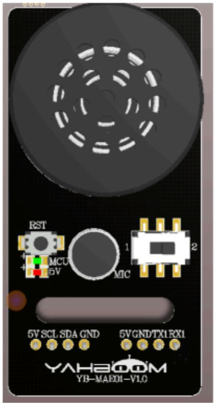
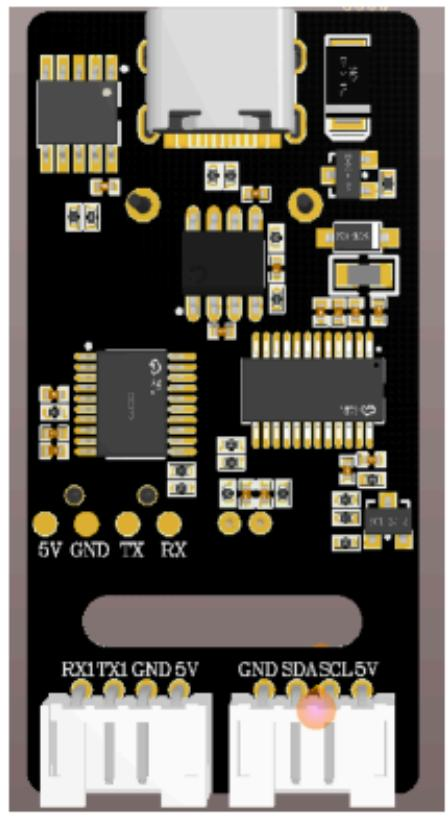

text_image

RST
MCU
5V
MIC
5V SCL SDA GND
5VGND/TX1 RX1
YAH200M
YB-MAEXI-V1.0

text_image

5V GND TX RX
RX1TX1 GND 5V GND SDA SCL 5V

<table><tr><td>产品尺寸</td><td>48.1*24.1*14.3mm</td><td>产品重量</td><td>10g</td></tr><tr><td>语音芯片型号</td><td>CI1302</td><td>IIC接口、串口接口</td><td>1个</td></tr><tr><td>Type-C串口</td><td>1个</td><td>工作电压</td><td>5V</td></tr><tr><td>CPU主频</td><td>可达220MHz</td><td>RAM容量</td><td>640KByte</td></tr><tr><td>FLASH容量</td><td>2MByte</td><td>工作温度</td><td>常温</td></tr></table>